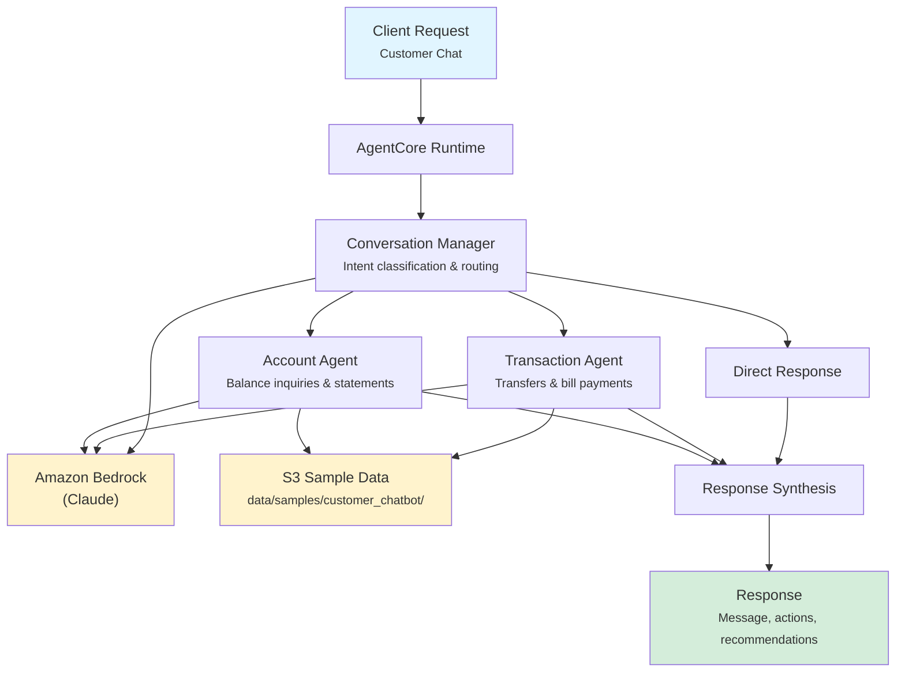

# Customer Chatbot

AI-powered conversational banking chatbot providing 24/7 customer self-service through multi-turn conversation management, account operations, and transaction processing.

## Overview

The Customer Chatbot manages natural-language banking interactions by classifying customer intent, routing to specialized agents for account queries or transactions, and synthesizing responses in a conversational tone. It supports balance inquiries, fund transfers, bill payments, transaction history lookups, and general banking questions.

## Business Value

- **24/7 Availability** -- Automated chatbot handles common banking requests outside business hours
- **Reduced Call Volume** -- Self-service for balance checks, transfers, and bill payments deflects calls from contact centers
- **Faster Resolutions** -- Intent classification and parallel agent execution deliver answers in seconds
- **Personalized Interactions** -- Context-aware responses based on customer profile and account data
- **Seamless Escalation** -- Complex requests are identified and routed to human agents with full context

## Architecture



### Directory Structure

```
use_cases/customer_chatbot/
├── README.md
└── src/
    ├── __init__.py                              # Framework router
    ├── strands/
    │   ├── __init__.py
    │   ├── config.py                            # Chatbot settings
    │   ├── models.py                            # ChatRequest / ChatResponse
    │   ├── orchestrator.py                      # CustomerChatbotOrchestrator
    │   └── agents/
    │       ├── conversation_manager.py          # ConversationManager agent
    │       ├── account_agent.py                 # AccountAgent agent
    │       └── transaction_agent.py             # TransactionAgent agent
    └── langchain_langgraph/                     # LangGraph implementation (same structure)
```

## Agentic Design

The `CustomerChatbotOrchestrator` extends `StrandsOrchestrator` and implements a **routing + parallel** pattern:

1. **Intent Routing** -- The `intent_type` field routes to the appropriate agents: `full` runs all three in parallel; `general` invokes only the Conversation Manager; `account_inquiry` invokes the Account Agent; `transfer`, `bill_payment`, and `transaction_history` invoke the Transaction Agent.
2. **Parallel Execution** -- For full assessments, all three agents run concurrently via `asyncio.gather()`.
3. **Synthesis** -- A supervisor LLM call produces a customer-facing response with actions taken and follow-up recommendations.

## Agents

### Conversation Manager

| Field | Detail |
|-------|--------|
| **Class** | `ConversationManager(StrandsAgent)` |
| **Role** | Manages multi-turn conversations, classifies intent, routes to specialists |
| **Data** | Customer profile via `s3_retriever_tool` |
| **Produces** | Intent classification (GENERAL/ACCOUNT_INQUIRY/TRANSFER/BILL_PAYMENT/TRANSACTION_HISTORY), urgency level, routing recommendation, context summary |

### Account Agent

| Field | Detail |
|-------|--------|
| **Class** | `AccountAgent(StrandsAgent)` |
| **Role** | Handles balance inquiries, statement generation, profile updates, account status |
| **Data** | Customer profile via `s3_retriever_tool` |
| **Produces** | Account summary (balances, status), actions taken, relevant details, recommendations |

### Transaction Agent

| Field | Detail |
|-------|--------|
| **Class** | `TransactionAgent(StrandsAgent)` |
| **Role** | Processes fund transfers, bill payments, transaction history lookups, payment tracking |
| **Data** | Customer profile via `s3_retriever_tool` |
| **Produces** | Transaction summary (type, amount, status), validation results, confirmation details |

## Data and Tools

- **Tool:** `s3_retriever_tool` -- Retrieves customer data from S3 by customer ID and data type
- **S3 Path:** `data/samples/customer_chatbot/{customer_id}/`
- **Data Files:** `profile.json` (account info, balances, preferences, transaction history)

## Request / Response

### Request (`ChatRequest`)

```python
class ChatRequest(BaseModel):
    customer_id: str                               # e.g. "CUST001"
    intent_type: IntentType = "full"               # full | general | account_inquiry | transfer | bill_payment | transaction_history
    message_context: str | None = None
```

### Response (`ChatResponse`)

```python
class ChatResponse(BaseModel):
    customer_id: str
    conversation_id: str                           # UUID
    timestamp: datetime
    response_message: str                          # Customer-facing message
    actions_taken: list[ActionDetail] | None       # action_type, description, status, details
    recommendations: list[str]                     # Follow-up recommendations
    summary: str                                   # Executive summary
    raw_analysis: dict
```

**Action Types:** `balance_check`, `statement_request`, `transfer_initiated`, `bill_paid`, `profile_updated`, `info_provided`

## Quick Start

```bash
# Deploy to AgentCore
USE_CASE_ID=customer_chatbot ./scripts/deploy/full/deploy_agentcore.sh

# Test
./scripts/use_cases/customer_chatbot/test/test_agentcore.sh
```

## Sample Data

| Customer ID | Account Type | Description |
|-------------|--------------|-------------|
| `CUST001` | Premium Checking | Multi-account customer with checking, savings, and credit card |

## Related Documentation

- [Platform Overview](../../docs/foundations/README.md)
- [Architecture Patterns](../../docs/foundations/architecture/architecture_patterns.md)
- [Deployment Guide](../../docs/foundations/deployment/deployment_patterns.md)
