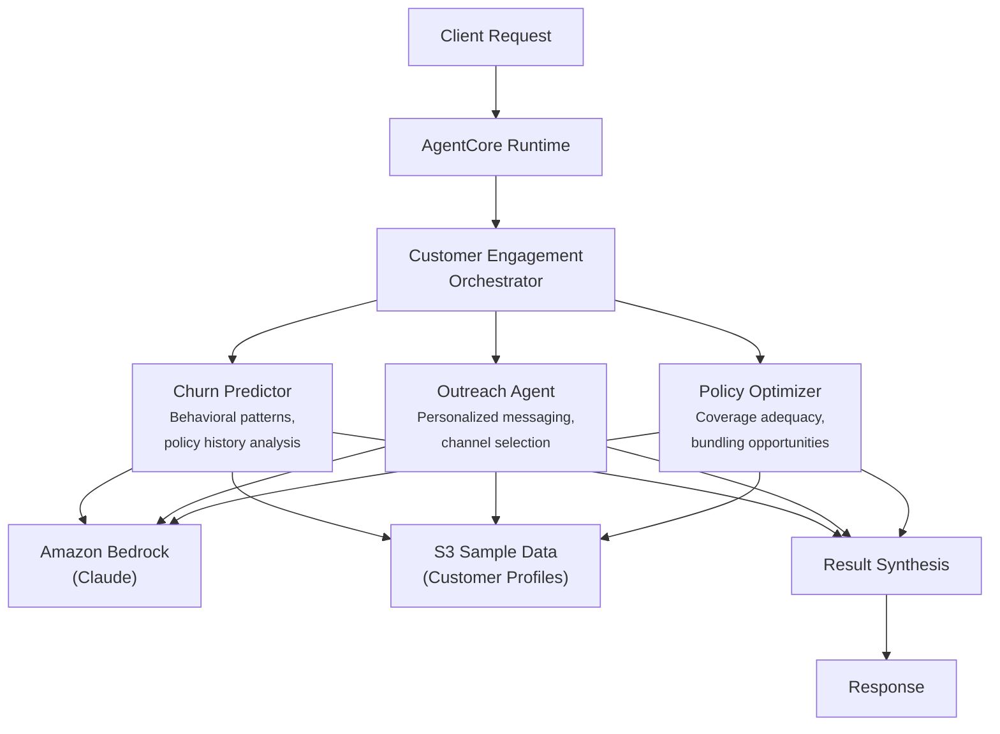

# Customer Engagement

AI-powered customer engagement system that predicts churn risk, generates personalized outreach strategies, and recommends policy optimizations for insurance retention teams.

## Overview

The Customer Engagement use case coordinates three specialist agents to improve policyholder retention. It analyzes behavioral signals and policy history to predict churn probability, designs targeted outreach campaigns with optimal channel and timing selection, and identifies policy adjustments (bundling, coverage changes, discounts) that increase customer lifetime value.

## Business Value

- **Proactive retention** -- Early churn risk identification enables intervention before customers lapse
- **Personalized outreach** -- Channel, timing, and messaging recommendations tailored to each customer's profile and preferences
- **Revenue protection** -- Policy bundling and coverage optimization reduce churn while increasing premium volume
- **Resource allocation** -- Risk-scored prioritization ensures retention teams focus on highest-impact customers
- **Measurable ROI** -- Estimated savings calculations and retention probability forecasts support business cases

## Architecture



### Directory Structure

```
use_cases/customer_engagement/
├── README.md
└── src/
    ├── __init__.py                              # Framework router + registry
    ├── strands/
    │   ├── __init__.py
    │   ├── config.py                            # CustomerEngagementSettings
    │   ├── models.py                            # EngagementRequest / EngagementResponse
    │   ├── orchestrator.py                      # CustomerEngagementOrchestrator
    │   └── agents/
    │       ├── __init__.py
    │       ├── churn_predictor.py
    │       ├── outreach_agent.py
    │       └── policy_optimizer.py
    └── langchain_langgraph/
        ├── __init__.py
        ├── config.py
        ├── models.py
        ├── orchestrator.py
        └── agents/
            ├── __init__.py
            ├── churn_predictor.py
            ├── outreach_agent.py
            └── policy_optimizer.py
```

## Agentic Design

The `CustomerEngagementOrchestrator` extends `StrandsOrchestrator` and uses a **parallel fan-out / synthesize** pattern:

1. **Fan-out** -- For `full` assessments, all three agents run in parallel via `asyncio.gather` (async) or `run_parallel` (sync), each independently retrieving customer data from S3.
2. **Targeted modes** -- `churn_prediction_only`, `outreach_only`, and `policy_optimization_only` run individual agents for focused analysis.
3. **Synthesis** -- Agent results are assembled into section-labeled markdown (Churn Prediction, Outreach Strategy, Policy Optimization). The orchestrator LLM produces a final summary with overall churn risk, recommended retention strategy, priority actions, expected retention probability, and cost-benefit analysis.

## Agents

### Churn Predictor
- **Role**: Predicts customer churn risk by analyzing behavioral patterns, policy history, claims frequency, payment regularity, and engagement metrics
- **Data**: Customer profile and history from S3 (`data_type='profile'`)
- **Produces**: Risk level (low/moderate/high/critical), churn probability (0-1), risk factors, behavioral signals, retention window (days)
- **Tool**: `s3_retriever_tool`

### Outreach Agent
- **Role**: Generates personalized retention outreach strategies with optimal channel, timing, and messaging
- **Data**: Customer profile from S3
- **Produces**: Recommended channel (email/phone/SMS/in_app/mail), secondary channels, messaging theme, talking points, optimal timing, personalization elements
- **Tool**: `s3_retriever_tool`

### Policy Optimizer
- **Role**: Recommends policy adjustments to improve customer value and reduce churn likelihood
- **Data**: Customer profile and policy data from S3
- **Produces**: Recommended actions (renew/upgrade/bundle/discount/adjust_coverage), coverage adjustments, bundling opportunities, estimated annual savings, value improvements
- **Tool**: `s3_retriever_tool`

## Data & Tools

| Resource | Description |
|----------|-------------|
| `s3_retriever_tool` | Retrieves customer profiles, policy data, and engagement history from S3 |
| S3 path | `data/samples/customer_engagement/{customer_id}/profile.json` |

## Request / Response

**`EngagementRequest`**
| Field | Type | Description |
|-------|------|-------------|
| `customer_id` | `str` | Customer identifier (e.g., `POLICY001`) |
| `assessment_type` | `AssessmentType` | `full`, `churn_prediction_only`, `outreach_only`, `policy_optimization_only` |
| `additional_context` | `str \| None` | Optional context |

**`EngagementResponse`**
| Field | Type | Description |
|-------|------|-------------|
| `customer_id` | `str` | Customer identifier |
| `engagement_id` | `str` | Unique engagement assessment UUID |
| `timestamp` | `datetime` | Assessment timestamp |
| `churn_prediction` | `ChurnPrediction \| None` | Risk level, probability, risk factors, retention window |
| `outreach_plan` | `OutreachPlan \| None` | Channel, messaging theme, talking points, timing |
| `policy_recommendations` | `PolicyRecommendations \| None` | Actions, bundling, estimated savings |
| `summary` | `str` | Executive summary |
| `raw_analysis` | `dict` | Raw output from each agent |

**Example Request:**
```json
{
  "customer_id": "POLICY001",
  "assessment_type": "full"
}
```

**Example Response:**
```json
{
  "customer_id": "POLICY001",
  "engagement_id": "uuid",
  "timestamp": "2026-03-25T00:00:00Z",
  "churn_prediction": {
    "risk_level": "moderate",
    "churn_probability": 0.45,
    "risk_factors": ["declining engagement score", "recent claims"],
    "behavioral_signals": ["reduced app logins", "skipped last email"],
    "retention_window_days": 90
  },
  "outreach_plan": {
    "recommended_channel": "email",
    "messaging_theme": "loyalty appreciation",
    "talking_points": ["tenure recognition", "bundling savings opportunity"],
    "optimal_timing": "mid-week morning"
  },
  "policy_recommendations": {
    "recommended_actions": ["bundle", "discount"],
    "bundling_opportunities": ["auto + home multi-policy discount"],
    "estimated_savings": 350.00
  },
  "summary": "Moderate churn risk. Recommend proactive outreach with bundling discount offer."
}
```

## Quick Start

```bash
USE_CASE_ID=customer_engagement FRAMEWORK=strands AWS_REGION=us-east-1 \
  ./applications/fsi_foundry/scripts/deploy/full/deploy_agentcore.sh
```

## Sample Data

| Customer ID | Risk Profile | Description |
|-------------|--------------|-------------|
| POLICY001 | Active Customer | Comprehensive auto + home, 5yr tenure |

## Related Documentation

- [Platform Overview](../../docs/foundations/README.md)
- [Architecture Patterns](../../docs/foundations/architecture/architecture_patterns.md)
- [Deployment Guide](../../docs/foundations/deployment/deployment_patterns.md)
- [Implementation Details](../../docs/use_cases/customer_engagement/implementation.md)
