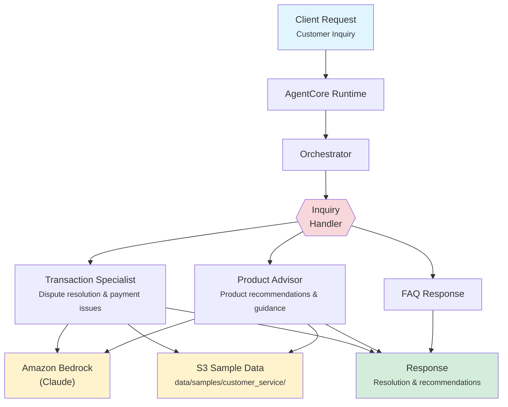

# Customer Service

AI-powered customer service resolution for banking, combining inquiry handling, transaction investigation, and product advisory to deliver comprehensive support in a single interaction.

## Overview

The Customer Service application routes incoming banking inquiries to specialized agents that classify issues, investigate transaction disputes, and recommend products. The orchestrator synthesizes agent outputs into a unified resolution with clear next steps, priority levels, and follow-up actions.

## Business Value

- **Faster Resolution** -- Parallel agent execution reduces average handling time for complex inquiries
- **Consistent Quality** -- Standardized workflows ensure every inquiry follows bank policies and procedures
- **Cross-Sell Opportunities** -- Product advisory agent surfaces relevant product recommendations during service interactions
- **Reduced Escalations** -- AI-driven dispute investigation and FAQ handling resolves more issues at first contact
- **Scalable Support** -- Handle peak volumes without proportional staffing increases

## Architecture



### Directory Structure

```
use_cases/customer_service/
├── README.md
└── src/
    ├── __init__.py                              # Framework router
    ├── strands/
    │   ├── __init__.py
    │   ├── config.py                            # Service settings
    │   ├── models.py                            # ServiceRequest / ServiceResponse
    │   ├── orchestrator.py                      # CustomerServiceOrchestrator
    │   └── agents/
    │       ├── inquiry_handler.py               # InquiryHandler agent
    │       ├── transaction_specialist.py        # TransactionSpecialist agent
    │       └── product_advisor.py               # ProductAdvisor agent
    └── langchain_langgraph/                     # LangGraph implementation (same structure)
```

## Agentic Design

The `CustomerServiceOrchestrator` extends `StrandsOrchestrator` and implements a **routing + parallel** pattern:

1. **Routing** -- The `inquiry_type` field determines which agents are invoked: `full` runs all three in parallel; `general`, `transaction_dispute`, and `product_inquiry` route to a single specialist; `service_request` runs the Inquiry Handler and Transaction Specialist in parallel.
2. **Parallel Execution** -- For full assessments, all three agents run concurrently via `asyncio.gather()`.
3. **Synthesis** -- A supervisor LLM call produces a resolution status (RESOLVED/PENDING/ESCALATED), priority level, actions taken, follow-up requirements, and product recommendations.

## Agents

### Inquiry Handler

| Field | Detail |
|-------|--------|
| **Class** | `InquiryHandler(StrandsAgent)` |
| **Role** | Classifies customer inquiries by type and urgency, routes to specialists, handles FAQs |
| **Data** | Customer profile, service history via `s3_retriever_tool` |
| **Produces** | Inquiry classification, priority level (LOW/MEDIUM/HIGH/URGENT), routing recommendation, estimated resolution timeframe |

### Transaction Specialist

| Field | Detail |
|-------|--------|
| **Class** | `TransactionSpecialist(StrandsAgent)` |
| **Role** | Investigates transaction disputes, assesses refund eligibility, resolves payment issues |
| **Data** | Customer profile, transaction history via `s3_retriever_tool` |
| **Produces** | Transaction analysis, dispute classification, refund eligibility, resolution recommendation |

### Product Advisor

| Field | Detail |
|-------|--------|
| **Class** | `ProductAdvisor(StrandsAgent)` |
| **Role** | Analyzes customer profiles and recommends suitable banking products |
| **Data** | Customer profile, product catalog via `s3_retriever_tool` |
| **Produces** | Customer needs analysis, ranked product recommendations, feature comparisons, personalized guidance |

## Data and Tools

- **Tool:** `s3_retriever_tool` -- Retrieves customer data from S3 by customer ID and data type
- **S3 Path:** `data/samples/customer_service/{customer_id}/`
- **Data Files:** `profile.json` (account info, products, history)

## Request / Response

### Request (`ServiceRequest`)

```python
class ServiceRequest(BaseModel):
    customer_id: str                               # e.g. "CUST001"
    inquiry_type: InquiryType = "full"             # full | general | transaction_dispute | product_inquiry | service_request
    additional_context: str | None = None
```

### Response (`ServiceResponse`)

```python
class ServiceResponse(BaseModel):
    customer_id: str
    service_id: str                                # UUID
    timestamp: datetime
    resolution: ResolutionDetail | None            # status, priority, actions_taken, follow_up_required, notes
    recommendations: list[str]                     # Product/service recommendations
    summary: str                                   # Executive summary
    raw_analysis: dict
```

## Quick Start

```bash
# Deploy to AgentCore
USE_CASE_ID=customer_service ./scripts/deploy/full/deploy_agentcore.sh

# Test
./scripts/use_cases/customer_service/test/test_agentcore.sh
```

## Sample Data

| Customer ID | Profile | Description |
|-------------|---------|-------------|
| `CUST001` | Premium Checking | Established customer with multiple products |

## Related Documentation

- [Platform Overview](../../docs/foundations/README.md)
- [Architecture Patterns](../../docs/foundations/architecture/architecture_patterns.md)
- [Deployment Guide](../../docs/foundations/deployment/deployment_patterns.md)
