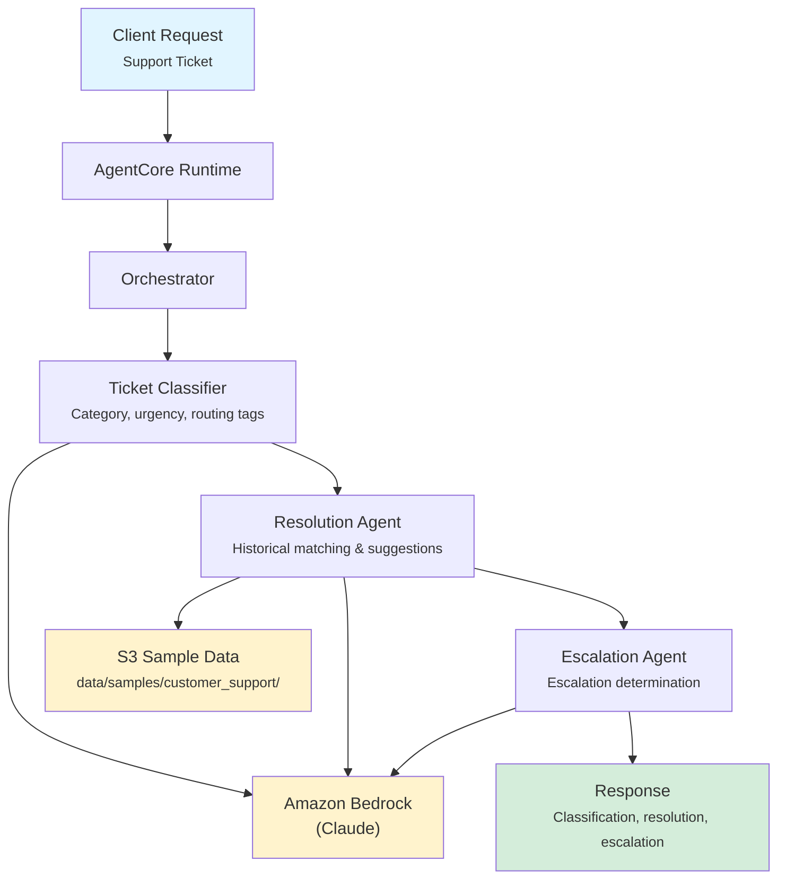

# Customer Support

AI-powered support ticket management for banking that classifies incoming tickets, suggests resolutions from historical cases, and determines when human escalation is needed.

## Overview

The Customer Support application processes support tickets through three coordinated agents: a classifier that categorizes and prioritizes tickets, a resolution agent that draws on historical cases and knowledge base articles to suggest fixes, and an escalation agent that evaluates whether human intervention is required. The orchestrator synthesizes these into a single actionable support response.

## Business Value

- **Faster Triage** -- Automated ticket classification eliminates manual sorting and routing delays
- **Higher First-Contact Resolution** -- AI-suggested resolutions with confidence scores help agents resolve issues faster
- **Smarter Escalation** -- Data-driven escalation decisions reduce unnecessary escalations while catching critical issues
- **Consistent SLAs** -- Urgency-based prioritization ensures high-impact tickets are addressed first
- **Knowledge Reuse** -- Resolution agent leverages historical cases to surface proven solutions

## Architecture



### Directory Structure

```
use_cases/customer_support/
├── README.md
└── src/
    ├── __init__.py                              # Framework router
    ├── strands/
    │   ├── __init__.py
    │   ├── config.py                            # Support settings
    │   ├── models.py                            # SupportRequest / SupportResponse
    │   ├── orchestrator.py                      # CustomerSupportOrchestrator
    │   └── agents/
    │       ├── ticket_classifier.py             # TicketClassifier agent
    │       ├── resolution_agent.py              # ResolutionAgent agent
    │       └── escalation_agent.py              # EscalationAgent agent
    └── langchain_langgraph/                     # LangGraph implementation (same structure)
```

## Agentic Design

The `CustomerSupportOrchestrator` extends `StrandsOrchestrator` and implements a **parallel fan-out** pattern:

1. **Routing by Ticket Type** -- `full` and `billing`/`account` types run all three agents in parallel; `general` and `technical` types run only the Ticket Classifier and Resolution Agent.
2. **Parallel Execution** -- Selected agents run concurrently via `asyncio.gather()`.
3. **Synthesis** -- A supervisor LLM call produces a ticket category, urgency assessment, recommended resolution with confidence level, and escalation decision (NOT_NEEDED/RECOMMENDED/REQUIRED).

## Agents

### Ticket Classifier

| Field | Detail |
|-------|--------|
| **Class** | `TicketClassifier(StrandsAgent)` |
| **Role** | Classifies tickets by category, urgency, and required expertise |
| **Data** | Customer profile via `s3_retriever_tool` |
| **Produces** | Category (GENERAL/BILLING/TECHNICAL/ACCOUNT), urgency (LOW/MEDIUM/HIGH/CRITICAL), required expertise areas, routing tags |

### Resolution Agent

| Field | Detail |
|-------|--------|
| **Class** | `ResolutionAgent(StrandsAgent)` |
| **Role** | Suggests resolutions based on historical cases and knowledge base |
| **Data** | Customer profile via `s3_retriever_tool` |
| **Produces** | Suggested resolution text, confidence score (0.0-1.0), similar case IDs, step-by-step resolution instructions, knowledge base references |

### Escalation Agent

| Field | Detail |
|-------|--------|
| **Class** | `EscalationAgent(StrandsAgent)` |
| **Role** | Evaluates whether a ticket requires human agent escalation |
| **Data** | Customer profile via `s3_retriever_tool` |
| **Produces** | Escalation status (NOT_NEEDED/RECOMMENDED/REQUIRED), reason, recommended team, priority override |

## Data and Tools

- **Tool:** `s3_retriever_tool` -- Retrieves customer data from S3 by customer ID and data type
- **S3 Path:** `data/samples/customer_support/{customer_id}/`
- **Data Files:** `profile.json` (account info, ticket history, products)

## Request / Response

### Request (`SupportRequest`)

```python
class SupportRequest(BaseModel):
    customer_id: str                               # e.g. "CUST001"
    ticket_type: TicketType = "full"               # full | general | billing | technical | account
    additional_context: str | None = None
```

### Response (`SupportResponse`)

```python
class SupportResponse(BaseModel):
    customer_id: str
    ticket_id: str                                 # UUID
    timestamp: datetime
    classification: TicketClassification | None    # category, urgency, required_expertise, tags
    resolution: ResolutionSuggestion | None        # suggested_resolution, confidence, similar_cases, steps, kb_refs
    escalation: EscalationDecision | None          # status, reason, recommended_team, priority_override
    summary: str                                   # Executive summary
    raw_analysis: dict
```

## Quick Start

```bash
# Deploy to AgentCore
USE_CASE_ID=customer_support ./scripts/deploy/full/deploy_agentcore.sh

# Test
./scripts/use_cases/customer_support/test/test_agentcore.sh
```

## Sample Data

| Customer ID | Profile | Description |
|-------------|---------|-------------|
| `CUST001` | Premium Checking | Active customer with recent billing, technical, and account tickets |

## Related Documentation

- [Platform Overview](../../docs/foundations/README.md)
- [Architecture Patterns](../../docs/foundations/architecture/architecture_patterns.md)
- [Deployment Guide](../../docs/foundations/deployment/deployment_patterns.md)
