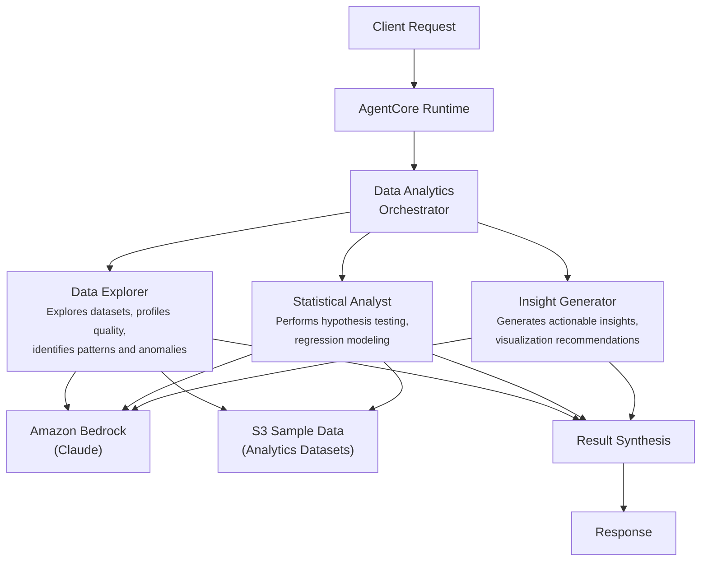

# Data Analytics

AI-powered multi-agent system for capital markets data analysis -- data exploration, statistical analysis, and actionable insight generation.

## Overview

The Data Analytics use case coordinates three specialist agents through a `DataAnalyticsOrchestrator` to help capital markets analysts derive insights faster from financial datasets. It profiles data quality, performs rigorous statistical analysis, and translates findings into business-relevant conclusions with visualization recommendations.

## Business Value

- **Accelerated analysis** -- Parallel data exploration, statistics, and insight generation compress days of analyst work
- **Data quality assurance** -- Automated profiling catches completeness, consistency, and accuracy issues before decisions are made
- **Statistical rigor** -- Hypothesis testing and regression modeling with significance levels, effect sizes, and confidence intervals
- **Actionable output** -- Insights tagged with confidence levels and paired with specific visualization recommendations
- **Repeatable methodology** -- Consistent analytical framework across datasets and teams

## Architecture



### Directory Structure

```
use_cases/data_analytics/
├── README.md
└── src/
    ├── __init__.py                              # Framework router + registry
    ├── strands/
    │   ├── __init__.py
    │   ├── config.py                            # DataAnalyticsSettings
    │   ├── models.py                            # AnalyticsRequest / AnalyticsResponse
    │   ├── orchestrator.py                      # DataAnalyticsOrchestrator
    │   └── agents/
    │       ├── __init__.py
    │       ├── data_explorer.py
    │       ├── statistical_analyst.py
    │       └── insight_generator.py
    └── langchain_langgraph/
        ├── __init__.py
        ├── config.py
        ├── models.py
        ├── orchestrator.py
        └── agents/
            ├── __init__.py
            ├── data_explorer.py
            ├── statistical_analyst.py
            └── insight_generator.py
```

## Agentic Design

The `DataAnalyticsOrchestrator` extends `StrandsOrchestrator` and uses a **parallel fan-out / synthesize** pattern:

1. **Fan-out** -- For `full` assessments, all three agents run via `asyncio.gather`, each independently retrieving entity data from S3.
2. **Targeted modes** -- `data_exploration` runs the explorer alone; `statistical_analysis` pairs explorer + statistician; `insight_generation` pairs statistician + insight generator.
3. **Synthesis** -- Agent results are assembled into section-labeled markdown and fed to the orchestrator LLM, which produces a structured JSON summary with data quality classification, patterns, statistical findings, and recommendations.

## Agents

### Data Explorer
- **Role**: Explores datasets to understand structure, distributions, and quality; detects patterns, correlations, and anomalies
- **Data**: Entity profile from S3 (`data_type='profile'`)
- **Produces**: Data quality assessment (completeness, consistency, accuracy), patterns and trends, outlier detection, recommended analytical approaches
- **Tool**: `s3_retriever_tool`

### Statistical Analyst
- **Role**: Performs rigorous statistical analysis including hypothesis testing, regression modeling, and significance evaluation
- **Data**: Entity profile from S3
- **Produces**: Test results with p-values, regression model summaries, effect sizes and confidence intervals, model diagnostics
- **Tool**: `s3_retriever_tool`

### Insight Generator
- **Role**: Translates analytical findings into business-relevant conclusions with confidence-scored insights
- **Data**: Entity profile from S3
- **Produces**: Key insights with confidence levels, business implications, visualization suggestions (charts, dashboards, heatmaps), areas for further investigation
- **Tool**: `s3_retriever_tool`

## Data & Tools

| Resource | Description |
|----------|-------------|
| `s3_retriever_tool` | Retrieves dataset profiles and data from S3 |
| S3 path | `data/samples/data_analytics/{entity_id}/profile.json` |

## Request / Response

**`AnalyticsRequest`**
| Field | Type | Description |
|-------|------|-------------|
| `entity_id` | `str` | Dataset/entity identifier (e.g., `ASSET001`) |
| `assessment_type` | `AssessmentType` | `full`, `data_exploration`, `statistical_analysis`, `insight_generation` |
| `additional_context` | `str \| None` | Optional context |

**`AnalyticsResponse`**
| Field | Type | Description |
|-------|------|-------------|
| `entity_id` | `str` | Dataset/entity identifier |
| `analytics_id` | `str` | Unique assessment UUID |
| `timestamp` | `datetime` | Assessment timestamp |
| `analytics_detail` | `AnalyticsDetail \| None` | Data quality, patterns, statistical findings, visualization suggestions, coverage % |
| `recommendations` | `list[str]` | Analytical recommendations |
| `summary` | `str` | Executive summary |
| `raw_analysis` | `dict` | Raw output from each agent |

**Example Request:**
```json
{
  "entity_id": "ASSET001",
  "assessment_type": "full",
  "additional_context": "Focus on volatility patterns"
}
```

**Example Response:**
```json
{
  "entity_id": "ASSET001",
  "analytics_id": "uuid",
  "timestamp": "2026-03-25T00:00:00Z",
  "analytics_detail": {
    "data_quality": "high",
    "insight_confidence": "high",
    "patterns_identified": ["Mean-reverting volatility pattern in tech sector"],
    "statistical_findings": ["Significant correlation between VIX and sector returns (p<0.01)"],
    "visualization_suggestions": ["Rolling volatility heatmap", "Correlation matrix"],
    "data_coverage_pct": 98.5
  },
  "recommendations": ["Monitor volatility clustering for position sizing"],
  "summary": "High-quality dataset with strong statistical patterns identified..."
}
```

## Quick Start

```bash
USE_CASE_ID=data_analytics FRAMEWORK=strands AWS_REGION=us-east-1 \
  ./applications/fsi_foundry/scripts/deploy/full/deploy_agentcore.sh
```

## Sample Data

| Entity ID | Description |
|-----------|-------------|
| ASSET001 | US Equity Sector Performance Dataset -- Technology sector, daily data 2020-2024 |

## Related Documentation

- [Platform Overview](../../docs/foundations/README.md)
- [Architecture Patterns](../../docs/foundations/architecture/architecture_patterns.md)
- [Deployment Guide](../../docs/foundations/deployment/deployment_patterns.md)
- [Implementation Details](../../docs/use_cases/data_analytics/implementation.md)
