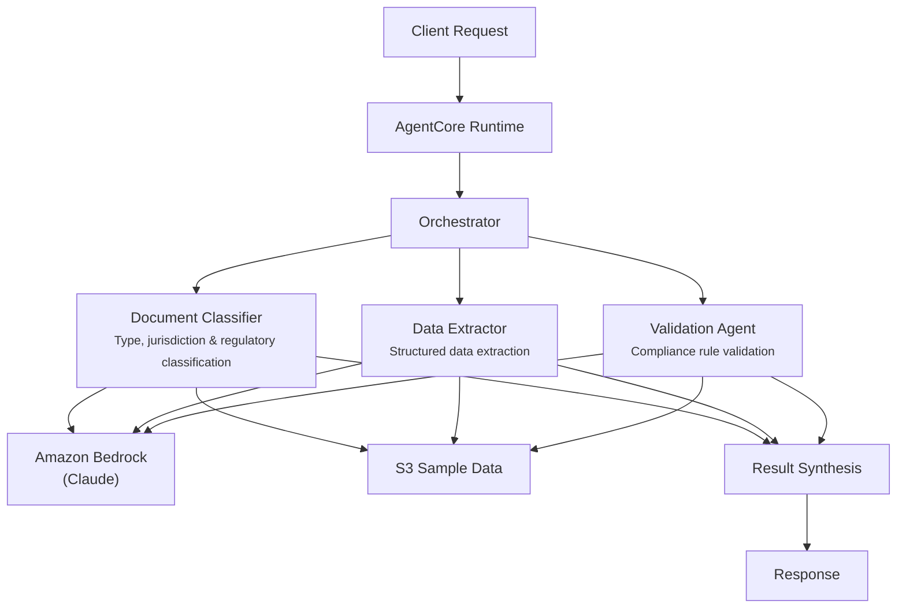

# Document Processing

## Overview

The Document Processing use case automates the classification, data extraction, and compliance validation of financial documents. It handles loan applications, KYC documents, financial statements, regulatory filings, and contracts -- classifying each by type and jurisdiction, extracting structured fields, and validating against regulatory rules to surface compliance issues.

## Business Value

- **Accelerated intake** -- documents classified and fields extracted in seconds, reducing manual processing backlogs
- **Compliance assurance** -- automated validation against regulatory rules catches missing fields and inconsistencies before human review
- **Structured output** -- unstructured documents transformed into standardized key-value pairs for downstream systems
- **Jurisdiction awareness** -- classification includes regulatory framework mapping for multi-jurisdictional operations
- **Reduced error rates** -- parallel agent cross-checks improve extraction accuracy over single-pass approaches

## Architecture



### Directory Structure

```
use_cases/document_processing/
├── README.md
└── src/
    └── strands/
        ├── __init__.py
        ├── config.py          # DocumentProcessingSettings
        ├── models.py          # Pydantic request/response models
        ├── orchestrator.py    # DocumentProcessingOrchestrator + run_document_processing()
        └── agents/
            ├── __init__.py
            ├── document_classifier.py
            ├── data_extractor.py
            └── validation_agent.py
```

## Agentic Design

The orchestrator uses a **parallel fan-out** pattern. In `full` mode, all three agents run concurrently via `asyncio.gather`. Targeted modes (`classification_only`, `extraction_only`, `validation_only`) invoke a single agent. The orchestrator synthesizes combined results into a structured JSON summary with classification, extraction completeness, and validation status.

## Agents

| Agent | Role | Data Used | Output |
|-------|------|-----------|--------|
| **Document Classifier** | Classifies documents by type (loan application, KYC, financial statement, regulatory filing, contract), identifies jurisdiction and regulatory relevance | Document profile via `s3_retriever_tool` | Document type with confidence score, jurisdiction, applicable regulations |
| **Data Extractor** | Extracts structured data from unstructured financial documents including entities, amounts, dates, and reference numbers | Document profile via `s3_retriever_tool` | Key-value fields, named entities, financial amounts, dates, completeness assessment |
| **Validation Agent** | Validates extracted data against regulatory rules and business logic, cross-references with existing records | Document profile via `s3_retriever_tool` | Validation status (VALID/INVALID/REVIEW_REQUIRED), passed/failed checks, notes |

## Data and Tools

- **Tool:** `s3_retriever_tool` -- retrieves document profiles and content from S3
- **S3 data prefix:** `samples/document_processing/`
- **Model:** Claude Sonnet (via Amazon Bedrock), temperature 0.1, max 8192 tokens
- **Config thresholds:** `classification_confidence_threshold=0.85`, `extraction_accuracy_threshold=0.90`, `max_document_size_mb=50`

## Request / Response

**Request** -- `ProcessingRequest`:

| Field | Type | Description |
|-------|------|-------------|
| `document_id` | `str` | Document identifier (e.g., `DOC001`) |
| `processing_type` | `ProcessingType` | `full`, `classification_only`, `extraction_only`, `validation_only` |
| `additional_context` | `str \| None` | Optional context |

**Response** -- `ProcessingResponse`:

| Field | Type | Description |
|-------|------|-------------|
| `document_id` | `str` | Document identifier |
| `processing_id` | `str` | Unique processing UUID |
| `timestamp` | `datetime` | Processing timestamp |
| `classification` | `DocumentClassification \| None` | Document type, confidence, jurisdiction, regulatory relevance |
| `extracted_data` | `ExtractedData \| None` | Fields dict, entities, amounts, dates |
| `validation_result` | `ValidationResult \| None` | Status, checks passed/failed, notes |
| `summary` | `str` | Processing summary |
| `raw_analysis` | `dict` | Raw agent output |

## Quick Start

```bash
# Deploy to AgentCore
USE_CASE_ID=document_processing ./scripts/deploy/full/deploy_agentcore.sh

# Test the deployment
./scripts/use_cases/document_processing/test/test_agentcore.sh
```

## Sample Data

Located at `data/samples/document_processing/`

| Document ID | Type | Description |
|-------------|------|-------------|
| DOC001 | Loan Application | Commercial loan application for Acme Corporation Ltd -- 12-page PDF, $5M business expansion loan, 5-year term, US jurisdiction |

## Related Documentation

- [FSI Foundry Overview](../../../README.md)
- [Architecture Patterns](../../docs/foundations/architecture/architecture_patterns.md)
- [Deployment Guide](../../docs/foundations/deployment/deployment_patterns.md)
- [Implementation Details](../../docs/use_cases/document_processing/implementation.md)
