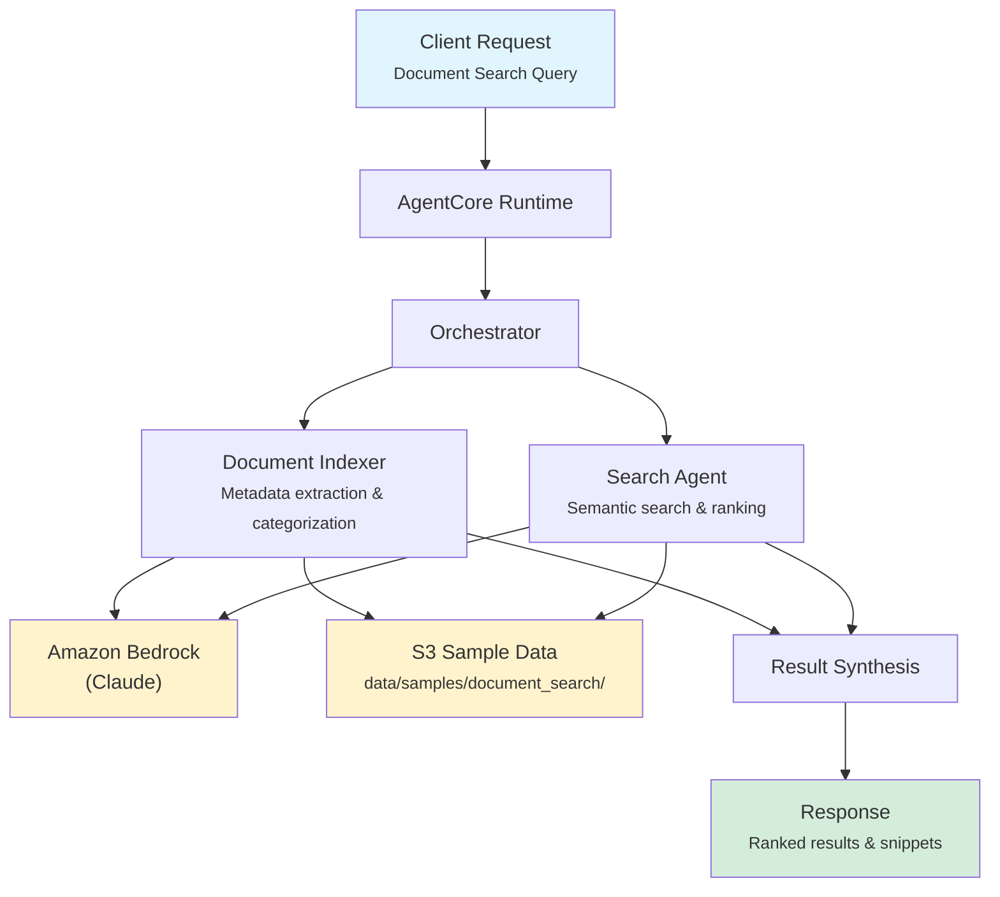

# Document Search

AI-powered document retrieval for banking operations, combining intelligent indexing with semantic search to help staff quickly locate policies, procedures, compliance documents, and regulations.

## Overview

The Document Search application indexes banking documents by extracting metadata (type, category, tags, effective date) and then performs semantic search across the corpus to return ranked, relevant results with contextual snippets. It supports filtering by document type and status to ensure staff find current, authoritative documents.

## Business Value

- **Faster Document Retrieval** -- Semantic search finds relevant documents in seconds versus manual browsing
- **Improved Compliance** -- Staff can quickly locate current policies and regulations when needed for audits or decisions
- **Reduced Risk** -- Active/archived/superseded status tracking prevents reliance on outdated documents
- **Cross-Reference Discovery** -- Automatic identification of related documents surfaces connections staff might miss
- **Operational Efficiency** -- Banking operations teams spend less time searching and more time acting

## Architecture



### Directory Structure

```
use_cases/document_search/
├── README.md
└── src/
    ├── __init__.py                              # Framework router
    ├── strands/
    │   ├── __init__.py
    │   ├── config.py                            # Document search settings (document_ids list)
    │   ├── models.py                            # SearchRequest / SearchResponse
    │   ├── orchestrator.py                      # DocumentSearchOrchestrator
    │   └── agents/
    │       ├── document_indexer.py              # DocumentIndexer agent
    │       └── search_agent.py                  # SearchAgent agent
    └── langchain_langgraph/                     # LangGraph implementation (same structure)
```

## Agentic Design

The `DocumentSearchOrchestrator` extends `StrandsOrchestrator` and implements a **parallel fan-out** pattern:

1. **Parallel Indexing and Search** -- The Document Indexer and Search Agent always run concurrently via `asyncio.gather()`, regardless of document type filter.
2. **Document Type Filtering** -- When a specific `document_type` is requested, the type filter is appended to the agent input text.
3. **Config-Driven Document IDs** -- Both agents read the list of document IDs from `config.py` settings and iterate over them with the `s3_retriever_tool`.
4. **Synthesis** -- A supervisor LLM call ranks and deduplicates results, producing a final summary with total documents found, relevance scores, and refinement suggestions.

## Agents

### Document Indexer

| Field | Detail |
|-------|--------|
| **Class** | `DocumentIndexer(StrandsAgent)` |
| **Role** | Indexes and categorizes banking documents, extracting metadata and cross-references |
| **Data** | Document data via `s3_retriever_tool` (iterates over configured document IDs) |
| **Produces** | Document ID, title, type, category, tags, effective date, version, status, related documents, content summary |

### Search Agent

| Field | Detail |
|-------|--------|
| **Class** | `SearchAgent(StrandsAgent)` |
| **Role** | Performs semantic search across the document corpus, returning ranked results |
| **Data** | Document data via `s3_retriever_tool` (iterates over configured document IDs) |
| **Produces** | Ranked document list with relevance scores, contextual snippets, metadata, search summary, related search suggestions |

## Data and Tools

- **Tool:** `s3_retriever_tool` -- Retrieves document data from S3 by document ID
- **S3 Path:** `data/samples/document_search/{document_id}/`
- **Data Files:** `profile.json` (document title, content, metadata, category)

## Request / Response

### Request (`SearchRequest`)

```python
class SearchRequest(BaseModel):
    query: str                                     # e.g. "anti-money laundering requirements"
    document_type: DocumentType = "full"            # full | policy | procedure | compliance | regulation | guideline
    additional_context: str | None = None
```

### Response (`SearchResponse`)

```python
class SearchResponse(BaseModel):
    query: str
    search_id: str                                 # UUID
    timestamp: datetime
    results: list[SearchResult]                    # document_id, title, snippet, relevance, document_type, status
    relevance_scores: list[float]
    summary: str                                   # Executive summary of search results
    raw_analysis: dict
```

**Document Statuses:** `active`, `archived`, `draft`, `superseded`

## Quick Start

```bash
# Deploy to AgentCore
USE_CASE_ID=document_search ./scripts/deploy/full/deploy_agentcore.sh

# Test
./scripts/use_cases/document_search/test/test_agentcore.sh
```

## Sample Data

| Document ID | Type | Description |
|-------------|------|-------------|
| `DOC001` | Policy | Anti-Money Laundering Policy |

## Related Documentation

- [Platform Overview](../../docs/foundations/README.md)
- [Architecture Patterns](../../docs/foundations/architecture/architecture_patterns.md)
- [Deployment Guide](../../docs/foundations/deployment/deployment_patterns.md)
