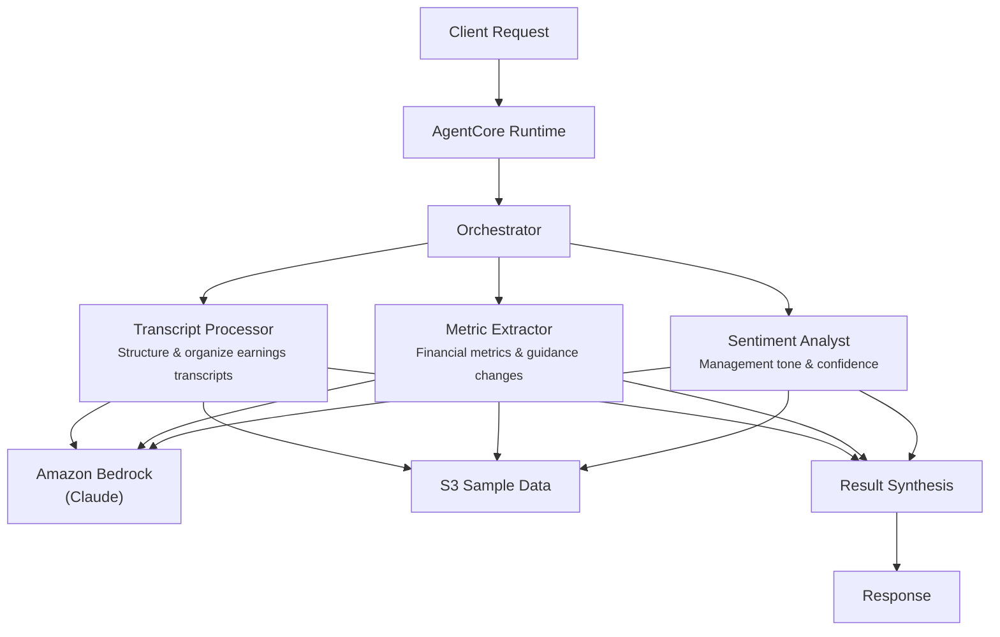

# Earnings Summarization

## Overview

The Earnings Summarization use case analyzes earnings calls for capital markets professionals by coordinating transcript processing, financial metric extraction, and management sentiment analysis. It structures raw transcripts, extracts key financial metrics with guidance changes, and assesses management tone -- producing actionable investment insights for portfolio managers and analysts.

## Business Value

- **Rapid analysis** -- parallel processing compresses hours of manual earnings call review into minutes
- **Metric precision** -- automated extraction of revenue, EPS, margins, growth rates, and guidance changes with consensus comparison
- **Sentiment objectivity** -- five-level sentiment rating provides consistent, bias-free assessment of management tone
- **Investment-ready output** -- structured response includes investment implications and notable management quotes for immediate use
- **Comprehensive coverage** -- distinguishes between prepared remarks and Q&A, tracking sentiment shifts between sections

## Architecture



### Directory Structure

```
use_cases/earnings_summarization/
├── README.md
└── src/
    └── strands/
        ├── __init__.py
        ├── config.py          # EarningsSummarizationSettings
        ├── models.py          # Pydantic request/response models
        ├── orchestrator.py    # EarningsSummarizationOrchestrator + run_earnings_summarization()
        └── agents/
            ├── __init__.py
            ├── transcript_processor.py
            ├── metric_extractor.py
            └── sentiment_analyst.py
```

## Agentic Design

The orchestrator uses a **parallel fan-out** pattern. In `full` mode, all three agents execute concurrently via `asyncio.gather`. Individual modes (`transcript_only`, `metrics_only`, `sentiment_only`) invoke a single agent. The orchestrator synthesizes results through a structured prompt that produces JSON with sentiment rating, key metrics, guidance changes, notable quotes, risks, and investment implications.

## Agents

| Agent | Role | Data Used | Output |
|-------|------|-----------|--------|
| **Transcript Processor** | Structures raw earnings call transcripts into organized sections; identifies prepared remarks vs Q&A; extracts key discussion topics by business segment | Entity profile via `s3_retriever_tool` | Structured transcript with sections, speakers, key topics, segment breakdowns |
| **Metric Extractor** | Extracts key financial metrics (revenue, EPS, margins, growth rates); identifies guidance changes and forward-looking statements; compares against consensus estimates | Entity profile via `s3_retriever_tool` | Structured metrics with categories, values, YoY changes, guidance updates, beats/misses |
| **Sentiment Analyst** | Analyzes management tone and confidence levels; detects sentiment shifts between prepared remarks and Q&A; compares against prior quarter calls | Entity profile via `s3_retriever_tool` | Sentiment rating, confidence assessment, tone shifts, notable language patterns |

## Data and Tools

- **Tool:** `s3_retriever_tool` -- retrieves earnings call entity profiles and transcript data from S3
- **S3 data prefix:** `samples/earnings_summarization/`
- **Model:** Claude Sonnet (via Amazon Bedrock), temperature 0.1, max 8192 tokens
- **Config thresholds:** `sentiment_confidence_threshold=0.80`, `metric_extraction_confidence=0.85`, `max_transcript_length=100000`

## Request / Response

**Request** -- `SummarizationRequest`:

| Field | Type | Description |
|-------|------|-------------|
| `entity_id` | `str` | Earnings call identifier (e.g., `EARN001`) |
| `summarization_type` | `SummarizationType` | `full`, `transcript_only`, `metrics_only`, `sentiment_only` |
| `additional_context` | `str \| None` | Optional context |

**Response** -- `SummarizationResponse`:

| Field | Type | Description |
|-------|------|-------------|
| `entity_id` | `str` | Entity identifier |
| `summarization_id` | `str` | Unique summarization UUID |
| `timestamp` | `datetime` | Summarization timestamp |
| `earnings_overview` | `EarningsOverview \| None` | Sentiment rating, key metrics dict, guidance changes, notable quotes, risks identified |
| `recommendations` | `list[str]` | Investment implications |
| `summary` | `str` | Executive summary |
| `raw_analysis` | `dict` | Raw agent output |

## Quick Start

```bash
# Deploy to AgentCore
USE_CASE_ID=earnings_summarization ./scripts/deploy/full/deploy_agentcore.sh

# Test the deployment
./scripts/use_cases/earnings_summarization/test/test_agentcore.sh
```

## Sample Data

Located at `data/samples/earnings_summarization/`

| Entity ID | Company | Ticker | Quarter | Description |
|-----------|---------|--------|---------|-------------|
| EARN001 | TechGrowth Inc | TGRO | Q4 2024 | Technology sector, revenue $2.8B, EPS $1.45 (consensus $1.38), gross margin 62%, operating margin 28%, 18% YoY growth, prior quarter sentiment positive |

## Related Documentation

- [FSI Foundry Overview](../../../README.md)
- [Architecture Patterns](../../docs/foundations/architecture/architecture_patterns.md)
- [Deployment Guide](../../docs/foundations/deployment/deployment_patterns.md)
- [Implementation Details](../../docs/use_cases/earnings_summarization/implementation.md)
