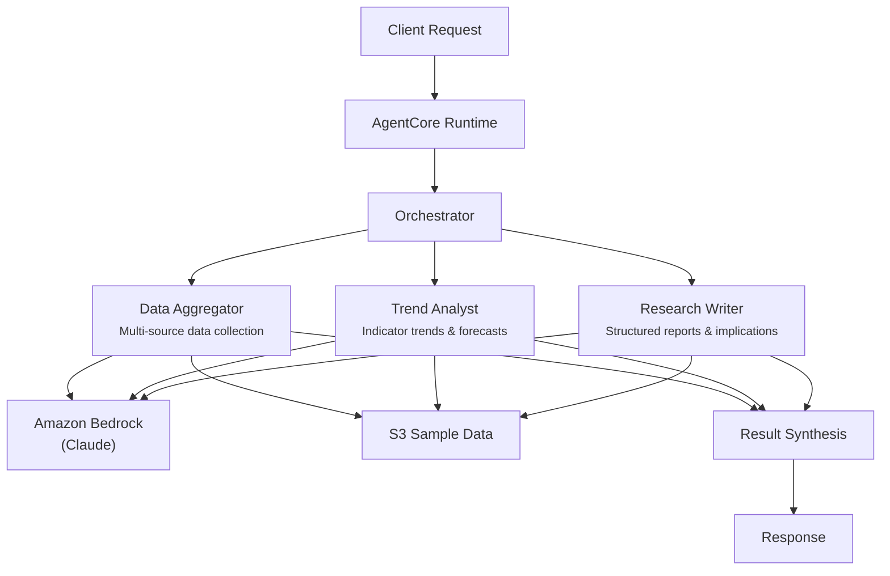

# Economic Research

## Overview

The Economic Research use case produces structured economic research reports by coordinating multi-source data aggregation, indicator trend analysis, and professional research writing. It covers key macroeconomic indicators (GDP, inflation, employment, interest rates, trade balance), identifies correlations and leading/lagging relationships, generates forecasts with confidence levels, and produces actionable investment implications for capital markets analysts and portfolio managers.

## Business Value

- **Multi-source aggregation** -- automated collection and normalization of economic data across government agencies and financial databases
- **Trend detection** -- identifies correlations, leading/lagging indicator relationships, and inflection points across macroeconomic datasets
- **Forecast generation** -- produces forecasts with confidence levels and explicit time horizons for investment planning
- **Investment-ready output** -- structured research reports with actionable recommendations and clear investment implications
- **Flexible scope** -- supports full research, data-only, trend-only, report-only, or indicator-focused modes

## Architecture



### Directory Structure

```
use_cases/economic_research/
├── README.md
└── src/
    └── strands/
        ├── __init__.py
        ├── config.py          # EconomicResearchSettings
        ├── models.py          # Pydantic request/response models
        ├── orchestrator.py    # EconomicResearchOrchestrator + run_economic_research()
        └── agents/
            ├── __init__.py
            ├── data_aggregator.py
            ├── trend_analyst.py
            └── research_writer.py
```

## Agentic Design

The orchestrator uses a **parallel fan-out** pattern with five modes. In `full` mode, all three agents execute concurrently via `asyncio.gather`. In `indicator_focus` mode, the data aggregator and trend analyst run in parallel (without research writer). Individual modes (`data_aggregation`, `trend_analysis`, `report_generation`) invoke a single agent. The orchestrator synthesizes results through a structured prompt that produces JSON with economic overview, primary indicator, trend direction, key findings, and recommendations.

## Agents

| Agent | Role | Data Used | Output |
|-------|------|-----------|--------|
| **Data Aggregator** | Aggregates economic data from multiple sources (BEA, BLS, Fed, Treasury); normalizes datasets across formats and time periods; identifies data quality issues | Entity profile via `s3_retriever_tool` | Structured data summaries, normalized datasets, data quality notes |
| **Trend Analyst** | Identifies trends across key indicators (GDP, inflation, employment, interest rates, trade balance); detects correlations and leading/lagging relationships; generates forecasts; flags inflection points | Entity profile via `s3_retriever_tool` | Trend directions, correlations, forecasts with confidence levels, inflection points |
| **Research Writer** | Generates structured research reports; synthesizes data and trend analysis into coherent narratives; produces actionable insights and investment implications | Entity profile via `s3_retriever_tool` | Formatted research report with investment implications for capital markets analysts |

## Data and Tools

- **Tool:** `s3_retriever_tool` -- retrieves economic research profiles and indicator data from S3
- **S3 data prefix:** `samples/economic_research/`
- **Model:** Claude Sonnet (via Amazon Bedrock), temperature 0.1, max 8192 tokens
- **Config thresholds:** `trend_confidence_threshold=0.75`, `max_data_sources=50`, `report_max_length=10000`

## Request / Response

**Request** -- `ResearchRequest`:

| Field | Type | Description |
|-------|------|-------------|
| `entity_id` | `str` | Research identifier (e.g., `ECON001`) |
| `research_type` | `ResearchType` | `full`, `data_aggregation`, `trend_analysis`, `report_generation`, `indicator_focus` |
| `additional_context` | `str \| None` | Optional context |

**Response** -- `ResearchResponse`:

| Field | Type | Description |
|-------|------|-------------|
| `entity_id` | `str` | Research identifier |
| `research_id` | `str` | Unique research UUID |
| `timestamp` | `datetime` | Research timestamp |
| `economic_overview` | `EconomicOverview \| None` | Primary indicator, trend direction, data sources, key findings, correlations, forecast horizon |
| `recommendations` | `list[str]` | Actionable recommendations |
| `summary` | `str` | Executive summary |
| `raw_analysis` | `dict` | Raw agent output |

## Quick Start

```bash
# Deploy to AgentCore
USE_CASE_ID=economic_research ./scripts/deploy/full/deploy_agentcore.sh

# Test the deployment
./scripts/use_cases/economic_research/test/test_agentcore.sh
```

## Sample Data

Located at `data/samples/economic_research/`

| Entity ID | Topic | Region | Description |
|-----------|-------|--------|-------------|
| ECON001 | US Economic Outlook Q2 2026 | United States | GDP growth 2.3%, inflation 3.1%, unemployment 4.2%, fed funds rate 4.75%, data from BEA/BLS/Fed/Treasury, prior findings on moderating GDP, sticky services inflation, and gradual labor market cooling |

## Related Documentation

- [FSI Foundry Overview](../../../README.md)
- [Architecture Patterns](../../docs/foundations/architecture/architecture_patterns.md)
- [Deployment Guide](../../docs/foundations/deployment/deployment_patterns.md)
- [Implementation Details](../../docs/use_cases/economic_research/implementation.md)
