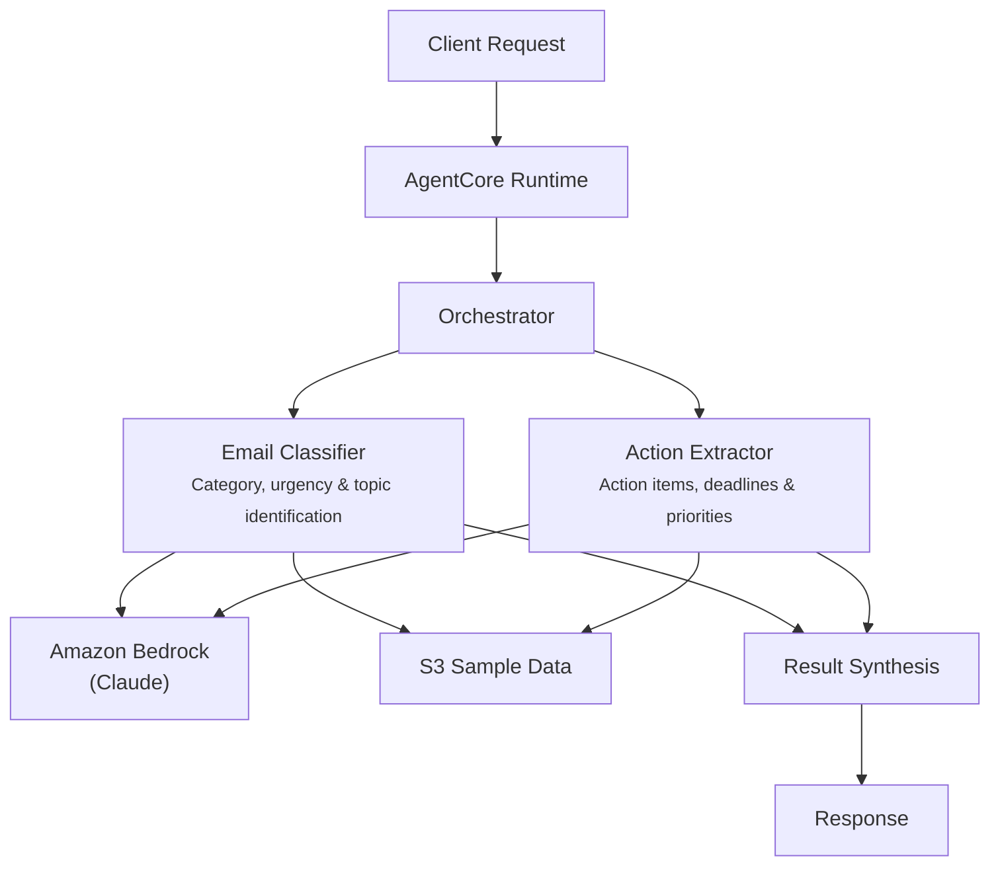

# Email Triage

## Overview

The Email Triage use case automates email processing for capital markets trading desks by coordinating email classification and action extraction. It categorizes incoming emails by type (client requests, trade instructions, compliance alerts, market updates, internal memos, meeting requests), assesses urgency and sender importance, extracts action items with deadlines, and produces prioritized triage summaries for traders and portfolio managers.

## Business Value

- **Faster response times** -- automated urgency assessment and action extraction ensure time-sensitive trade instructions are surfaced immediately
- **Prioritized workflow** -- sender importance scoring and category classification help trading desks focus on high-impact communications first
- **Deadline tracking** -- explicit extraction of deadlines and SLAs prevents missed time-sensitive requests
- **Reduced cognitive load** -- structured triage summaries with recommended responses replace manual email scanning
- **Compliance awareness** -- compliance alerts are automatically flagged and prioritized alongside trade-related communications

## Architecture



### Directory Structure

```
use_cases/email_triage/
├── README.md
└── src/
    └── strands/
        ├── __init__.py
        ├── config.py          # EmailTriageSettings
        ├── models.py          # Pydantic request/response models
        ├── orchestrator.py    # EmailTriageOrchestrator + run_email_triage()
        └── agents/
            ├── __init__.py
            ├── email_classifier.py
            └── action_extractor.py
```

## Agentic Design

The orchestrator uses a **parallel fan-out** pattern with a two-agent design. In `full` mode, both agents execute concurrently via `asyncio.gather`. Individual modes (`classification`, `action_extraction`) invoke a single agent. The orchestrator synthesizes results through a structured prompt that produces JSON with category, urgency, sender importance, topics, actions, deadlines, and prioritization recommendations.

## Agents

| Agent | Role | Data Used | Output |
|-------|------|-----------|--------|
| **Email Classifier** | Classifies emails by content category (6 types), assesses sender importance (0-1 score) based on role/seniority/client relationship, determines urgency level, identifies key topics and workflow relevance | Email profile via `s3_retriever_tool` | Category, urgency level, sender importance score, key topics, workflow relevance |
| **Action Extractor** | Extracts explicit and implicit action items, identifies deadlines and SLAs, captures key information (amounts, securities, counterparties, account numbers), prioritizes by urgency and business impact | Email profile via `s3_retriever_tool` | Action items with assignees, deadlines, key information extracted, priority ranking, suggested next steps |

## Data and Tools

- **Tool:** `s3_retriever_tool` -- retrieves email profiles and content from S3
- **S3 data prefix:** `samples/email_triage/`
- **Model:** Claude Sonnet (via Amazon Bedrock), temperature 0.1, max 8192 tokens
- **Config thresholds:** `urgency_threshold=0.7`, `classification_confidence_threshold=0.8`, `max_actions_per_email=10`

## Request / Response

**Request** -- `TriageRequest`:

| Field | Type | Description |
|-------|------|-------------|
| `entity_id` | `str` | Email or batch identifier (e.g., `EMAIL001`) |
| `triage_type` | `TriageType` | `full`, `classification`, `action_extraction` |
| `additional_context` | `str \| None` | Optional context |

**Response** -- `TriageResponse`:

| Field | Type | Description |
|-------|------|-------------|
| `entity_id` | `str` | Email identifier |
| `triage_id` | `str` | Unique triage UUID |
| `timestamp` | `datetime` | Triage timestamp |
| `classification` | `ClassificationDetail \| None` | Category, urgency, sender importance, topics, actions required, deadlines |
| `recommendations` | `list[str]` | Prioritization recommendations |
| `summary` | `str` | Executive summary |
| `raw_analysis` | `dict` | Raw agent output |

## Quick Start

```bash
# Deploy to AgentCore
USE_CASE_ID=email_triage ./scripts/deploy/full/deploy_agentcore.sh

# Test the deployment
./scripts/use_cases/email_triage/test/test_agentcore.sh
```

## Sample Data

Located at `data/samples/email_triage/`

| Entity ID | Sender Role | Subject | Description |
|-----------|-------------|---------|-------------|
| EMAIL001 | Portfolio Manager | Urgent: Rebalance Request - Tech Sector Exposure | Hedge fund PM requesting 15% tech sector reduction before market close, includes trade instructions attachment, priority indicators: urgent + market close deadline |

## Related Documentation

- [FSI Foundry Overview](../../../README.md)
- [Architecture Patterns](../../docs/foundations/architecture/architecture_patterns.md)
- [Deployment Guide](../../docs/foundations/deployment/deployment_patterns.md)
- [Implementation Details](../../docs/use_cases/email_triage/implementation.md)
