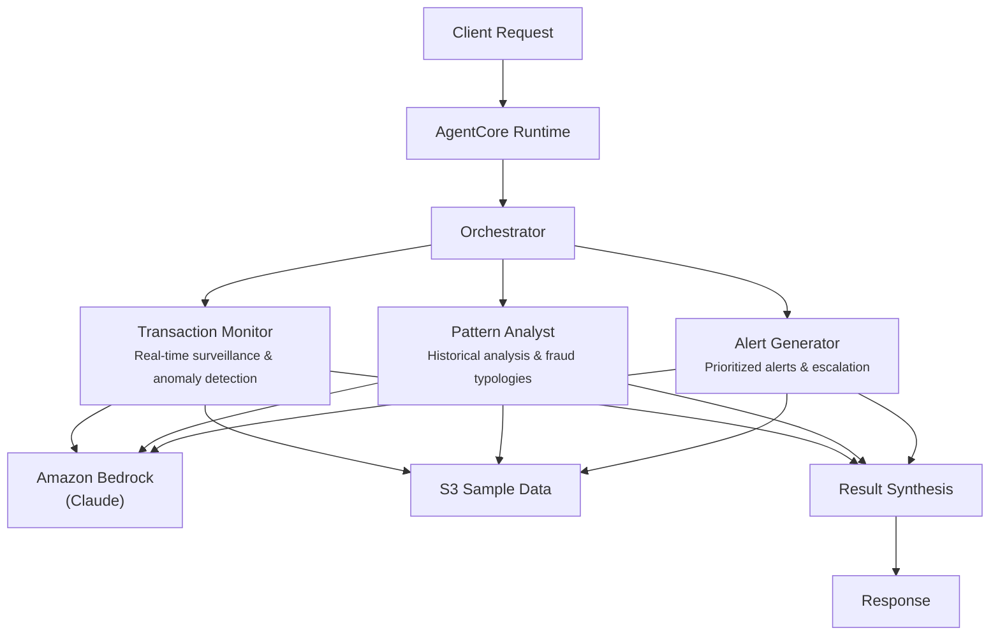

# Fraud Detection

## Overview

The Fraud Detection use case identifies suspicious financial activities through coordinated AI agents that perform real-time transaction monitoring, historical pattern analysis, and prioritized alert generation. It detects structuring attempts, velocity anomalies, geographic inconsistencies, and emerging fraud schemes, producing risk-scored assessments for fraud investigators and compliance officers.

## Business Value

- **Reduced false positives** -- multi-agent cross-referencing of transaction, pattern, and alert signals before escalation
- **Faster detection** -- parallel agent execution compresses hours of manual review into seconds
- **Regulatory compliance** -- automated SAR-ready evidence compilation with severity classification and escalation paths
- **Adaptive coverage** -- pattern analyst identifies emerging fraud typologies beyond static rule-based systems
- **Audit trail** -- every assessment produces structured JSON with raw agent outputs for regulatory examination

## Architecture



### Directory Structure

```
use_cases/fraud_detection/
├── README.md
└── src/
    └── strands/
        ├── __init__.py
        ├── config.py          # FraudDetectionSettings (thresholds, model IDs)
        ├── models.py          # Pydantic request/response models
        ├── orchestrator.py    # FraudDetectionOrchestrator + run_fraud_detection()
        └── agents/
            ├── __init__.py
            ├── transaction_monitor.py
            ├── pattern_analyst.py
            └── alert_generator.py
```

## Agentic Design

The orchestrator uses a **parallel fan-out** pattern. In `full` mode, all three agents execute concurrently via `asyncio.gather` (async) or `run_parallel` (sync). For targeted analysis, a single agent runs in isolation (`transaction_monitoring`, `pattern_analysis`, or `alert_generation` modes). After agent execution, the orchestrator synthesizes all results through a structured prompt that produces JSON with risk scores, alerts, and recommendations.

## Agents

| Agent | Role | Data Used | Output |
|-------|------|-----------|--------|
| **Transaction Monitor** | Real-time surveillance detecting velocity anomalies, geographic inconsistencies, structuring attempts, and round-tripping | Account profile via `s3_retriever_tool` | Risk score (0-100), suspicious transactions, velocity analysis, geographic anomalies |
| **Pattern Analyst** | Historical pattern analysis identifying fraud typologies, behavioral deviations, and emerging schemes | Account profile via `s3_retriever_tool` | Fraud typologies, behavioral deviation scores, pattern correlations, risk indicators |
| **Alert Generator** | Generates prioritized fraud alerts with evidence compilation and escalation recommendations | Account profile via `s3_retriever_tool` | Alerts with severity (INFO/WARNING/HIGH/CRITICAL), evidence, investigation actions |

## Data and Tools

- **Tool:** `s3_retriever_tool` -- retrieves entity profiles and transaction data from S3
- **S3 data prefix:** `samples/fraud_detection/`
- **Model:** Claude Sonnet (via Amazon Bedrock), temperature 0.1, max 8192 tokens
- **Config thresholds:** `risk_threshold_high=75`, `risk_threshold_critical=90`, `alert_retention_days=90`

## Request / Response

**Request** -- `MonitoringRequest`:

| Field | Type | Description |
|-------|------|-------------|
| `customer_id` | `str` | Account identifier (e.g., `ACCT001`) |
| `monitoring_type` | `MonitoringType` | `full`, `transaction_monitoring`, `pattern_analysis`, `alert_generation` |
| `additional_context` | `str \| None` | Optional context for the analysis |

**Response** -- `MonitoringResponse`:

| Field | Type | Description |
|-------|------|-------------|
| `customer_id` | `str` | Account identifier |
| `monitoring_id` | `str` | Unique session UUID |
| `timestamp` | `datetime` | Assessment timestamp |
| `risk_assessment` | `RiskAssessment \| None` | Score (0-100), level (low/medium/high/critical), factors, recommendations |
| `alerts` | `list[FraudAlert]` | Alert ID, severity, description, evidence, recommended actions |
| `summary` | `str` | Executive summary |
| `raw_analysis` | `dict` | Raw output from each agent |

## Quick Start

```bash
# Deploy to AgentCore
USE_CASE_ID=fraud_detection ./scripts/deploy/full/deploy_agentcore.sh

# Test the deployment
./scripts/use_cases/fraud_detection/test/test_agentcore.sh
```

## Sample Data

Located at `data/samples/fraud_detection/`

| Account ID | Type | Risk Profile | Description |
|------------|------|-------------|-------------|
| ACCT001 | Business Checking | Medium | Multiple cash deposits below $10K threshold (structuring confidence 0.85), velocity anomaly over 7-day period, offshore wire transfer of $15K |

## Related Documentation

- [FSI Foundry Overview](../../../README.md)
- [Architecture Patterns](../../docs/foundations/architecture/architecture_patterns.md)
- [Deployment Guide](../../docs/foundations/deployment/deployment_patterns.md)
- [Implementation Details](../../docs/use_cases/fraud_detection/implementation.md)
