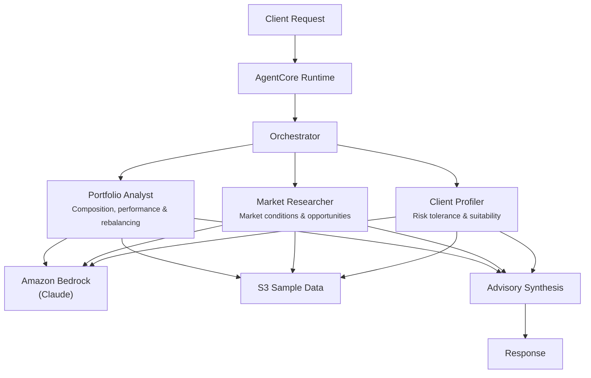

# Investment Advisory

## Overview

The Investment Advisory use case provides AI-powered wealth management support by coordinating portfolio analysis, market research, and client profiling. It evaluates portfolio composition and risk, assesses current market conditions and opportunities, and ensures recommendations align with the client's risk tolerance, goals, and time horizon -- producing fiduciary-compliant investment recommendations.

## Business Value

- **Holistic advisory** -- three specialist agents cover portfolio health, market outlook, and client suitability in a single request
- **Fiduciary alignment** -- client profiler ensures all recommendations are suitable for the client's risk tolerance, goals, and time horizon
- **Market-informed decisions** -- market researcher provides current conditions, sector trends, and risk factors alongside portfolio analysis
- **Rebalancing detection** -- portfolio analyst identifies when holdings drift from target allocation and flags concentration risks
- **Scalable advisory** -- enables advisors to serve more clients with consistent, thorough analysis quality

## Architecture



### Directory Structure

```
use_cases/investment_advisory/
├── README.md
└── src/
    └── strands/
        ├── __init__.py
        ├── config.py          # InvestmentAdvisorySettings
        ├── models.py          # Pydantic request/response models
        ├── orchestrator.py    # InvestmentAdvisoryOrchestrator + run_investment_advisory()
        └── agents/
            ├── __init__.py
            ├── portfolio_analyst.py
            ├── market_researcher.py
            └── client_profiler.py
```

## Agentic Design

The orchestrator uses a **parallel fan-out** pattern with mode-dependent agent selection. In `full` mode, all three agents execute concurrently via `asyncio.gather`. In `portfolio_review`, `market_analysis`, or `client_profiling` modes, a single agent runs. In `rebalancing` mode, the portfolio analyst and client profiler run in parallel (without market researcher). The orchestrator synthesizes results into recommendations covering portfolio risk, market-informed strategies, rebalancing needs, and client-suitable actions.

## Agents

| Agent | Role | Data Used | Output |
|-------|------|-----------|--------|
| **Portfolio Analyst** | Analyzes portfolio composition, diversification, asset allocation, performance metrics (returns, Sharpe ratio, drawdowns), and concentration risks | Client profile and holdings via `s3_retriever_tool` | Risk level (conservative/moderate/aggressive), asset allocation breakdown, performance summary, rebalancing recommendations |
| **Market Researcher** | Analyzes current market conditions, sector trends, rotation opportunities, geopolitical and monetary policy risks, and investment opportunities | Client profile via `s3_retriever_tool` | Market outlook, sector analysis, risk factors, opportunities, forward-looking commentary |
| **Client Profiler** | Assesses risk tolerance, investment objectives, time horizon, liquidity needs, life stage, and suitability of proposed recommendations | Client profile via `s3_retriever_tool` | Risk profile, investment goals, time horizon assessment, suitability analysis, strategy alignment |

## Data and Tools

- **Tool:** `s3_retriever_tool` -- retrieves client profiles and portfolio holdings from S3
- **S3 data prefix:** `samples/investment_advisory/`
- **Model:** Claude Sonnet (via Amazon Bedrock), temperature 0.1, max 8192 tokens
- **Config thresholds:** `risk_tolerance_threshold=0.7`, `rebalancing_trigger_pct=0.05`, `max_analysis_time_seconds=60`

## Request / Response

**Request** -- `AdvisoryRequest`:

| Field | Type | Description |
|-------|------|-------------|
| `client_id` | `str` | Client identifier (e.g., `CLIENT001`) |
| `advisory_type` | `AdvisoryType` | `full`, `portfolio_review`, `market_analysis`, `client_profiling`, `rebalancing` |
| `additional_context` | `str \| None` | Optional context |

**Response** -- `AdvisoryResponse`:

| Field | Type | Description |
|-------|------|-------------|
| `client_id` | `str` | Client identifier |
| `advisory_id` | `str` | Unique advisory UUID |
| `timestamp` | `datetime` | Advisory timestamp |
| `portfolio_analysis` | `PortfolioAnalysis \| None` | Risk level, asset allocation, performance summary, rebalancing needed, concentration risks |
| `recommendations` | `list[str]` | Investment recommendations |
| `summary` | `str` | Executive summary |
| `raw_analysis` | `dict` | Raw agent output |

## Quick Start

```bash
# Deploy to AgentCore
USE_CASE_ID=investment_advisory ./scripts/deploy/full/deploy_agentcore.sh

# Test the deployment
./scripts/use_cases/investment_advisory/test/test_agentcore.sh
```

## Sample Data

Located at `data/samples/investment_advisory/`

| Client ID | Risk Tolerance | Account Value | Description |
|-----------|---------------|---------------|-------------|
| CLIENT001 | Moderate | $750,000 | 15-year horizon, retirement/wealth preservation/income goals, holdings in VTI (40%), BND (25%), VXUS (15%), VNQ (10%), cash (10%), target allocation 55% equities, $50K annual contributions |

## Related Documentation

- [FSI Foundry Overview](../../../README.md)
- [Architecture Patterns](../../docs/foundations/architecture/architecture_patterns.md)
- [Deployment Guide](../../docs/foundations/deployment/deployment_patterns.md)
- [Implementation Details](../../docs/use_cases/investment_advisory/implementation.md)
