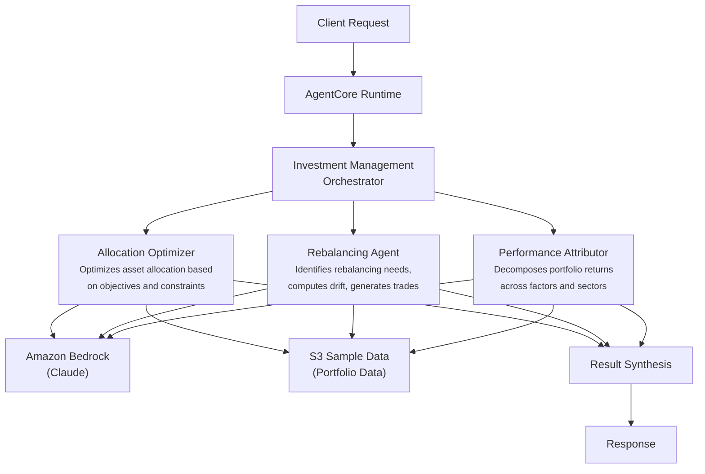

# Investment Management

AI-powered portfolio management system that optimizes asset allocation, identifies rebalancing needs, and performs performance attribution analysis for capital markets institutions.

## Overview

The Investment Management use case coordinates three specialist agents to deliver comprehensive portfolio assessments. It analyzes current allocations against targets, computes drift and trade lists, and decomposes returns across factors and sectors -- giving portfolio managers a single view of portfolio health with actionable recommendations.

## Business Value

- **Faster portfolio reviews** -- Parallel agent execution reduces multi-hour manual analysis to minutes
- **Consistent methodology** -- Standardized Brinson-Fachler attribution and mean-variance optimization across all portfolios
- **Actionable trade lists** -- Automated drift detection with cost-optimized rebalancing recommendations
- **Risk-aware decisions** -- Integrated risk-return profiles, factor exposures, and liquidity constraints in every assessment
- **Audit-ready output** -- Structured JSON responses with full raw analysis for compliance documentation

## Architecture



### Directory Structure

```
use_cases/investment_management/
├── README.md
└── src/
    ├── __init__.py                              # Framework router + registry
    ├── strands/
    │   ├── __init__.py
    │   ├── config.py
    │   ├── models.py                            # ManagementRequest / ManagementResponse
    │   ├── orchestrator.py                      # InvestmentManagementOrchestrator
    │   └── agents/
    │       ├── __init__.py
    │       ├── allocation_optimizer.py
    │       ├── rebalancing_agent.py
    │       └── performance_attributor.py
    └── langchain_langgraph/
        ├── __init__.py
        ├── config.py
        ├── models.py
        ├── orchestrator.py
        └── agents/
            ├── __init__.py
            ├── allocation_optimizer.py
            ├── rebalancing_agent.py
            └── performance_attributor.py
```

## Agentic Design

The `InvestmentManagementOrchestrator` extends `StrandsOrchestrator` and uses a **parallel fan-out / synthesize** pattern:

1. **Fan-out** -- For `full` assessments, all three agents run in parallel via `asyncio.gather` (async) or `run_parallel` (sync), each retrieving portfolio data from S3 independently.
2. **Targeted modes** -- `allocation_optimization`, `rebalancing`, and `performance_attribution` scopes run only the relevant agent(s). The `rebalancing` scope runs both Allocation Optimizer and Rebalancing Agent together.
3. **Synthesis** -- Agent outputs are assembled into a structured prompt using `build_structured_synthesis_prompt` with a defined response schema. The orchestrator LLM produces a final JSON summary with portfolio analysis, recommendations, and executive narrative.

## Agents

### Allocation Optimizer
- **Role**: Optimizes asset allocation against investment objectives, risk constraints, and market outlook
- **Data**: Portfolio profile from S3 (`data_type='profile'`)
- **Produces**: Current vs. target allocation drift, recommended adjustments with risk-return impact, implementation priority
- **Tool**: `s3_retriever_tool`

### Rebalancing Agent
- **Role**: Identifies rebalancing needs by computing drift from target weights and generating trade lists
- **Data**: Portfolio profile and positions from S3
- **Produces**: Drift analysis by asset class, urgency assessment (LOW/MEDIUM/HIGH/CRITICAL), proposed trades with cost estimates, tax-loss harvesting opportunities
- **Tool**: `s3_retriever_tool`

### Performance Attributor
- **Role**: Decomposes portfolio returns using Brinson-Fachler methodology across factors, sectors, and time periods
- **Data**: Portfolio profile and historical returns from S3
- **Produces**: Allocation/selection/interaction effects, factor exposure analysis, benchmark-relative performance, key drivers and detractors
- **Tool**: `s3_retriever_tool`

## Data & Tools

| Resource | Description |
|----------|-------------|
| `s3_retriever_tool` | Retrieves portfolio profiles and history from S3 |
| S3 path | `data/samples/investment_management/{entity_id}/profile.json` |

## Request / Response

**`ManagementRequest`**
| Field | Type | Description |
|-------|------|-------------|
| `entity_id` | `str` | Portfolio identifier (e.g., `PORT001`) |
| `assessment_type` | `AssessmentType` | `full`, `allocation_optimization`, `rebalancing`, `performance_attribution` |
| `additional_context` | `str \| None` | Optional context for the assessment |

**`ManagementResponse`**
| Field | Type | Description |
|-------|------|-------------|
| `entity_id` | `str` | Portfolio identifier |
| `management_id` | `str` | Unique assessment UUID |
| `timestamp` | `datetime` | Assessment timestamp |
| `portfolio_analysis` | `PortfolioAnalysisDetail \| None` | Risk profile, drift %, allocation score, trade recommendations |
| `recommendations` | `list[str]` | Investment recommendations |
| `summary` | `str` | Executive summary |
| `raw_analysis` | `dict` | Raw output from each agent |

**Example Request:**
```json
{
  "entity_id": "PORT001",
  "assessment_type": "full",
  "additional_context": "Focus on Q1 performance drivers"
}
```

**Example Response:**
```json
{
  "entity_id": "PORT001",
  "management_id": "uuid",
  "timestamp": "2026-03-25T09:00:00Z",
  "portfolio_analysis": {
    "risk_profile": "moderate",
    "rebalance_urgency": "medium",
    "drift_pct": 5.2,
    "allocation_score": 0.72,
    "attribution_factors": ["equity overweight", "fixed income underweight"],
    "trade_recommendations": ["Reduce SPY by 5.2%", "Increase AGG by 2.9%"]
  },
  "recommendations": ["Rebalance equity allocation to target", "Review fixed income duration"],
  "summary": "Portfolio shows moderate drift requiring rebalancing..."
}
```

## Quick Start

```bash
USE_CASE_ID=investment_management FRAMEWORK=strands AWS_REGION=us-east-1 \
  ./applications/fsi_foundry/scripts/deploy/full/deploy_agentcore.sh
```

## Sample Data

| Entity ID | Profile | Description |
|-----------|---------|-------------|
| PORT001 | Global Balanced Growth Fund | Multi-asset diversified portfolio |

## Related Documentation

- [Platform Overview](../../docs/foundations/README.md)
- [Architecture Patterns](../../docs/foundations/architecture/architecture_patterns.md)
- [Deployment Guide](../../docs/foundations/deployment/deployment_patterns.md)
- [Implementation Details](../../docs/use_cases/investment_management/implementation.md)
