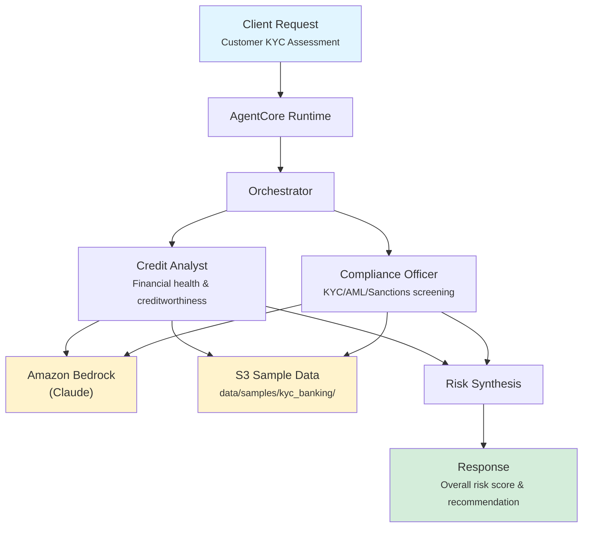

# KYC Risk Assessment

Automated Know Your Customer (KYC) risk assessment for corporate banking onboarding, combining credit risk analysis with regulatory compliance screening to produce actionable risk scores and recommendations.

## Overview

The KYC Risk Assessment application evaluates prospective corporate banking customers by running parallel credit and compliance analyses, then synthesizing a unified risk profile. It scores customers on a 0-100 scale, classifies risk levels, and delivers APPROVE / REJECT / ESCALATE recommendations for onboarding decisions.

## Business Value

- **Accelerate Onboarding** -- Automated risk assessment reduces manual review time from days to minutes
- **Improve Accuracy** -- AI-powered analysis across financial and compliance data surfaces risks human reviewers might miss
- **Ensure Compliance** -- Systematic KYC/AML/sanctions screening meets BSA, FATF, and OFAC regulatory requirements
- **Scale Operations** -- Handle increased customer volumes without proportional staff growth
- **Reduce Risk Exposure** -- Consistent scoring methodology eliminates subjective bias in onboarding decisions

## Architecture



### Directory Structure

```
use_cases/kyc_banking/
├── README.md
└── src/
    ├── __init__.py                        # Framework router
    ├── strands/
    │   ├── __init__.py
    │   ├── config.py                      # KYC-specific settings
    │   ├── models.py                      # AssessmentRequest / AssessmentResponse
    │   ├── orchestrator.py                # KYCOrchestrator
    │   └── agents/
    │       ├── credit_analyst.py          # CreditAnalyst agent
    │       └── compliance_officer.py      # ComplianceOfficer agent
    └── langchain_langgraph/               # LangGraph implementation (same structure)
```

## Agentic Design

The `KYCOrchestrator` extends `StrandsOrchestrator` and implements a **parallel fan-out / synthesize** pattern:

1. **Router** -- Inspects `assessment_type` (full, credit_only, compliance_only) to decide which agents to invoke.
2. **Parallel Execution** -- For `full` assessments, both the Credit Analyst and Compliance Officer run concurrently via `run_parallel()` / `asyncio.gather()`.
3. **Synthesis** -- A supervisor LLM call combines agent outputs into structured JSON with risk scores, compliance status, and an executive recommendation.
4. **Response Mapping** -- The synthesized JSON is parsed into Pydantic response models (`RiskScore`, `ComplianceStatus`).

## Agents

### Credit Analyst

| Field | Detail |
|-------|--------|
| **Class** | `CreditAnalyst(StrandsAgent)` |
| **Role** | Evaluates financial health and creditworthiness of corporate entities |
| **Data** | Customer profile, credit history, transaction history via `s3_retriever_tool` |
| **Produces** | Risk score (0-100), risk level (LOW/MEDIUM/HIGH/CRITICAL), key risk factors, credit limit recommendations |
| **Model** | Amazon Bedrock (Claude), temperature 0.1 |

### Compliance Officer

| Field | Detail |
|-------|--------|
| **Class** | `ComplianceOfficer(StrandsAgent)` |
| **Role** | Performs KYC/AML regulatory compliance assessment |
| **Data** | Customer profile, compliance records, transaction history via `s3_retriever_tool` |
| **Produces** | Compliance status (COMPLIANT/NON_COMPLIANT/REVIEW_REQUIRED), checks passed/failed, regulatory notes, required actions |
| **Model** | Amazon Bedrock (Claude), temperature 0.1 |

## Data and Tools

- **Tool:** `s3_retriever_tool` -- Retrieves customer data from S3 by customer ID and data type
- **S3 Path:** `data/samples/kyc_banking/{customer_id}/`
- **Data Files per Customer:** `profile.json`, `credit_history.json`, `transactions.json`, `compliance.json`

## Request / Response

### Request (`AssessmentRequest`)

```python
class AssessmentRequest(BaseModel):
    customer_id: str                           # e.g. "CUST001"
    assessment_type: AssessmentType = "full"    # full | credit_only | compliance_only
    additional_context: str | None = None
```

### Response (`AssessmentResponse`)

```python
class AssessmentResponse(BaseModel):
    customer_id: str
    assessment_id: str                         # UUID
    timestamp: datetime
    credit_risk: RiskScore | None              # score (0-100), level, factors, recommendations
    compliance: ComplianceStatus | None        # status, checks_passed, checks_failed, regulatory_notes
    summary: str                               # Executive summary with APPROVE/REJECT/ESCALATE
    raw_analysis: dict
```

## Quick Start

```bash
# Deploy to AgentCore
USE_CASE_ID=kyc_banking ./scripts/deploy/full/deploy_agentcore.sh

# Test
./scripts/use_cases/kyc_banking/test/test_agentcore.sh
```

## Sample Data

| Customer ID | Risk Profile | Description |
|-------------|--------------|-------------|
| `CUST001` | Low Risk | Established manufacturing company, clean compliance history |
| `CUST002` | Medium Risk | Tech startup with higher debt ratio |
| `CUST003` | High Risk | Import/export firm with PEP exposure |

## Related Documentation

- [Platform Overview](../../docs/foundations/README.md)
- [Architecture Patterns](../../docs/foundations/architecture/architecture_patterns.md)
- [Deployment Guide](../../docs/foundations/deployment/deployment_patterns.md)
