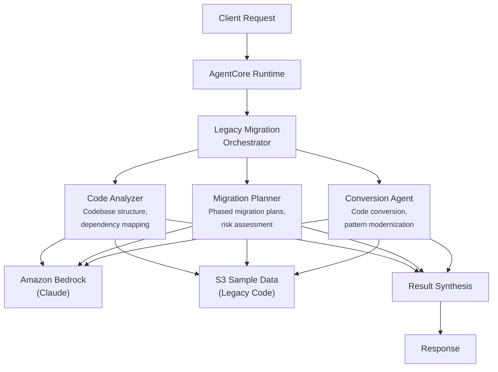

# Legacy Migration

AI-powered legacy system migration analysis that assesses codebases, plans phased migrations, and converts legacy code for financial services institutions.

## Overview

The Legacy Migration use case coordinates three specialist agents to provide comprehensive migration assessments for financial services legacy systems. It analyzes codebase structure and dependencies, develops phased migration plans with risk mitigation strategies, and performs code conversion with confidence scoring -- enabling engineering teams and stakeholders to make informed migration decisions.

## Business Value

- **Risk-aware planning** -- Automated dependency mapping and complexity assessment reduce migration surprises
- **Phased approach** -- Migration plans with rollback strategies minimize business disruption
- **Conversion confidence** -- Automated code conversion with confidence scoring identifies areas needing manual review
- **Cost estimation** -- Effort-day estimates and risk assessments support budget planning and stakeholder alignment
- **Regulatory compliance** -- Financial system-specific considerations ensure migration preserves compliance posture

## Architecture



### Directory Structure

```
use_cases/legacy_migration/
├── README.md
└── src/
    ├── __init__.py                              # Framework router + registry
    ├── strands/
    │   ├── __init__.py
    │   ├── config.py
    │   ├── models.py                            # MigrationRequest / MigrationResponse
    │   ├── orchestrator.py                      # LegacyMigrationOrchestrator
    │   └── agents/
    │       ├── __init__.py
    │       ├── code_analyzer.py
    │       ├── migration_planner.py
    │       └── conversion_agent.py
    └── langchain_langgraph/
        ├── __init__.py
        ├── config.py
        ├── models.py
        ├── orchestrator.py
        └── agents/
            ├── __init__.py
            ├── code_analyzer.py
            ├── migration_planner.py
            └── conversion_agent.py
```

## Agentic Design

The `LegacyMigrationOrchestrator` extends `StrandsOrchestrator` and uses a **parallel fan-out / synthesize** pattern with scope-dependent agent combinations:

1. **Fan-out** -- For `full` scope, all three agents run in parallel via `asyncio.gather` (async) or `run_parallel` (sync).
2. **Targeted modes** -- `code_analysis` runs the code analyzer alone; `planning` pairs code analyzer + migration planner; `conversion` pairs code analyzer + conversion agent. The code analyzer always runs as a prerequisite for other scopes.
3. **Synthesis** -- Agent results are combined using `build_structured_synthesis_prompt` with a schema covering complexity level, languages detected, estimated effort days, conversion confidence, risks, and recommendations. The orchestrator LLM produces the final migration readiness assessment.

## Agents

### Code Analyzer
- **Role**: Analyzes codebase structure, maps dependencies, and assesses complexity for migration planning
- **Data**: Project profile and legacy code from S3 (`data_type='profile'`)
- **Produces**: Languages detected, total files and lines, complexity level (low/medium/high/critical), dependency graph, code patterns identified, migration risks
- **Tool**: `s3_retriever_tool`

### Migration Planner
- **Role**: Develops phased migration plans with risk assessment, dependency ordering, and rollback strategies
- **Data**: Project profile from S3
- **Produces**: Migration phases with timelines, estimated effort in days, risk assessment, dependency execution order, rollback strategy
- **Tool**: `s3_retriever_tool`

### Conversion Agent
- **Role**: Performs code conversion from legacy languages/patterns to modern equivalents with confidence scoring
- **Data**: Project profile and source code from S3
- **Produces**: Files converted count, conversion confidence score (0-1), patterns converted, items needing manual review, target framework
- **Tool**: `s3_retriever_tool`

## Data & Tools

| Resource | Description |
|----------|-------------|
| `s3_retriever_tool` | Retrieves project profiles, legacy codebases, and documentation from S3 |
| S3 path | `data/samples/legacy_migration/{project_id}/profile.json` |

## Request / Response

**`MigrationRequest`**
| Field | Type | Description |
|-------|------|-------------|
| `project_id` | `str` | Project identifier (e.g., `PROJ001`) |
| `migration_scope` | `MigrationScope` | `full`, `code_analysis`, `planning`, `conversion` |
| `additional_context` | `str \| None` | Optional context |

**`MigrationResponse`**
| Field | Type | Description |
|-------|------|-------------|
| `project_id` | `str` | Project identifier |
| `migration_id` | `str` | Unique migration analysis UUID |
| `timestamp` | `datetime` | Analysis timestamp |
| `code_analysis` | `CodeAnalysisResult \| None` | Languages, complexity, dependencies, risks |
| `migration_plan` | `MigrationPlanResult \| None` | Phases, effort days, risk assessment, rollback strategy |
| `conversion_output` | `ConversionResult \| None` | Files converted, confidence score, manual review items |
| `summary` | `str` | Executive summary |
| `raw_analysis` | `dict` | Raw output from each agent |

**Example Request:**
```json
{
  "project_id": "PROJ001",
  "migration_scope": "full"
}
```

**Example Response:**
```json
{
  "project_id": "PROJ001",
  "migration_id": "uuid",
  "timestamp": "2026-03-25T00:00:00Z",
  "code_analysis": {
    "languages_detected": ["COBOL", "JCL", "SQL"],
    "total_files": 1200,
    "total_lines": 450000,
    "complexity_level": "high",
    "dependencies": ["DB2", "CICS", "MQ Series"],
    "risks": ["Tightly coupled batch jobs", "Undocumented business rules"]
  },
  "migration_plan": {
    "estimated_effort_days": 180,
    "risk_assessment": ["Data migration integrity", "Batch job sequencing"],
    "rollback_strategy": "Parallel run with automated comparison for 30 days"
  },
  "conversion_output": {
    "conversion_confidence": 0.72,
    "patterns_converted": ["COBOL PERFORM to Python functions", "COPY to Python imports"],
    "manual_review_needed": ["Complex REDEFINES clauses", "Embedded CICS calls"],
    "target_framework": "Python/FastAPI"
  },
  "summary": "High-complexity COBOL system. 72% automated conversion confidence with 180-day migration estimate."
}
```

## Quick Start

```bash
USE_CASE_ID=legacy_migration FRAMEWORK=strands AWS_REGION=us-east-1 \
  ./applications/fsi_foundry/scripts/deploy/full/deploy_agentcore.sh
```

## Sample Data

| Project ID | Description |
|------------|-------------|
| PROJ001 | Core Banking COBOL System -- 450K LOC, COBOL to Python |

## Related Documentation

- [Platform Overview](../../docs/foundations/README.md)
- [Architecture Patterns](../../docs/foundations/architecture/architecture_patterns.md)
- [Deployment Guide](../../docs/foundations/deployment/deployment_patterns.md)
