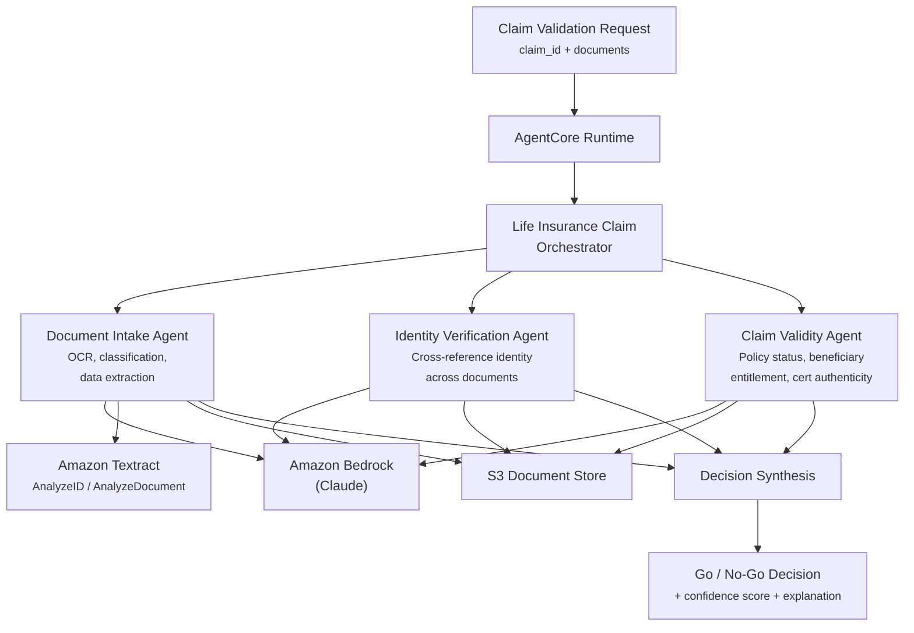

# Life Insurance Claim Validation

AI-powered life insurance claim validation agent that analyzes identity documents, death certificates, and policy records to produce a go/no-go decision on claim processing.

## Overview

The Life Insurance Claim Validation use case coordinates three specialist agents to validate the legitimacy of life insurance claims. It processes identity documents (passports, driver's licenses, government IDs), death certificates, and policy records -- cross-referencing extracted data across all documents to verify claimant identity, confirm policy validity, and detect inconsistencies or potential fraud.

## Business Value

- **Accelerated claim processing** -- Document validation that takes days of manual review compressed to minutes
- **Fraud detection** -- Automated cross-referencing surfaces inconsistencies across identity documents, death certificates, and policy records
- **Consistent adjudication** -- Standardized validation criteria applied uniformly across all claims
- **Compliance assurance** -- Structured audit trail with confidence scoring for regulatory documentation
- **Reduced operational cost** -- Automated first-pass validation frees claims handlers for complex cases

## Architecture



### Directory Structure

```
use_cases/life-insurance-claim/
├── README.md
└── src/
    ├── __init__.py                              # Framework router + registry
    └── strands/
        ├── __init__.py
        ├── config.py                            # Validation thresholds, doc types
        ├── models.py                            # ClaimValidationRequest / Response
        ├── orchestrator.py                      # LifeInsuranceClaimOrchestrator
        ├── tools/
        │   ├── __init__.py
        │   ├── textract_tool.py                 # Amazon Textract AnalyzeID
        │   └── document_analyzer_tool.py        # Bedrock multimodal document analysis
        └── agents/
            ├── __init__.py
            ├── document_intake_agent.py         # Document classification + extraction
            ├── identity_verification_agent.py   # Cross-document identity validation
            └── claim_validity_agent.py          # Policy + beneficiary + cert validation
```

## Agentic Design

The `LifeInsuranceClaimOrchestrator` extends `StrandsOrchestrator` and uses a **sequential fan-out / synthesize** pattern:

1. **Document Intake (first)** -- The Document Intake Agent processes all submitted documents, extracting structured data from identity documents, death certificates, and claim forms using Amazon Textract and Bedrock vision.
2. **Parallel Verification** -- Once intake is complete, the Identity Verification Agent and Claim Validity Agent run in parallel, each using the extracted data.
3. **Decision Synthesis** -- All agent results are synthesized into a final go/no-go decision with confidence scoring and detailed explanation.

## Agents

### Document Intake Agent
- **Role**: Classifies submitted documents and extracts structured data using OCR/vision
- **Tools**: `textract_id_tool`, `document_analyzer_tool`, `s3_retriever_tool`
- **Produces**: Document classifications, extracted fields (names, DOBs, addresses, policy numbers, dates of death), document quality assessment

### Identity Verification Agent
- **Role**: Cross-references extracted identity data across all submitted documents for consistency
- **Data**: Extracted data from Document Intake Agent
- **Produces**: Identity match confidence, discrepancy list, name/DOB/address consistency scores, fraud risk indicators

### Claim Validity Agent
- **Role**: Validates policy status, beneficiary entitlement, and death certificate authenticity
- **Data**: Extracted data from Document Intake Agent + policy lookup
- **Produces**: Policy status (active/lapsed/cancelled), beneficiary entitlement confirmation, death certificate validation, coverage applicability

## Decision Output

The orchestrator synthesizes all agent results into a structured decision:

| Field | Type | Description |
|-------|------|-------------|
| `decision` | `GO / NO_GO / REFER` | Final claim processing decision |
| `confidence_score` | `float (0.0-1.0)` | Overall confidence in the decision |
| `identity_verified` | `bool` | Whether claimant identity is confirmed |
| `policy_valid` | `bool` | Whether the policy is active and covers this claim |
| `death_cert_valid` | `bool` | Whether the death certificate passes validation |
| `risk_flags` | `list[str]` | Any fraud indicators or concerns |
| `explanation` | `str` | Human-readable explanation of the decision |

## Data & Tools

| Resource | Description |
|----------|-------------|
| `textract_id_tool` | Amazon Textract AnalyzeID for identity document extraction |
| `document_analyzer_tool` | Bedrock multimodal vision for document image analysis |
| `s3_retriever_tool` | Retrieves claim documents and policy data from S3 |
| S3 path | `data/samples/life-insurance-claim/{claim_id}/` |

## Request / Response

**`ClaimValidationRequest`**
| Field | Type | Description |
|-------|------|-------------|
| `claim_id` | `str` | Claim identifier (e.g., `CLAIM-LI-001`) |
| `validation_type` | `ValidationType` | `full`, `document_intake_only`, `identity_only`, `policy_only` |
| `additional_context` | `str \| None` | Optional context |

**`ClaimValidationResponse`**
| Field | Type | Description |
|-------|------|-------------|
| `claim_id` | `str` | Claim identifier |
| `validation_id` | `str` | Unique validation UUID |
| `timestamp` | `datetime` | Validation timestamp |
| `decision` | `Decision` | GO / NO_GO / REFER |
| `confidence_score` | `float` | Overall confidence (0.0-1.0) |
| `document_intake` | `DocumentIntakeResult \| None` | Classified documents and extracted data |
| `identity_verification` | `IdentityVerificationResult \| None` | Cross-reference results |
| `claim_validity` | `ClaimValidityResult \| None` | Policy and cert validation |
| `risk_flags` | `list[str]` | Fraud indicators |
| `explanation` | `str` | Decision explanation |
| `raw_analysis` | `dict` | Raw agent output |

## Quick Start

### Demo UI (no AWS required)

```bash
cd use_cases/life-insurance-claim
python3 -m venv .venv
source .venv/bin/activate
pip install streamlit
streamlit run demo_ui.py
```

Open http://localhost:8501 — select a sample claim and click "Run Claim Validation" to see the full agent pipeline simulated with realistic outputs.

To enable live mode (requires AWS credentials with Bedrock + Textract access):
1. Configure AWS SSO: `aws configure sso`
2. Login: `aws sso login --profile your-profile`
3. Set profile: `export AWS_PROFILE=your-profile`
4. Toggle "Use Claude (Live mode)" in the sidebar

### Deploy to AgentCore

```bash
USE_CASE_ID=life-insurance-claim FRAMEWORK=strands AWS_REGION=us-east-1 \
  ./applications/fsi_foundry/scripts/deploy/full/deploy_agentcore.sh
```

## Sample Data

| Claim ID | Scenario | Expected Decision |
|----------|----------|-------------------|
| `CLAIM-LI-001` | Valid claim — all documents consistent, active policy | GO |
| `CLAIM-LI-002` | Name mismatch between ID and policy | REFER |
| `CLAIM-LI-003` | Lapsed policy, expired coverage | NO_GO |

## Related Documentation

- [Platform Overview](../../docs/foundations/README.md)
- [Architecture Patterns](../../docs/foundations/architecture/architecture_patterns.md)
- [Deployment Guide](../../docs/foundations/deployment/deployment_patterns.md)
