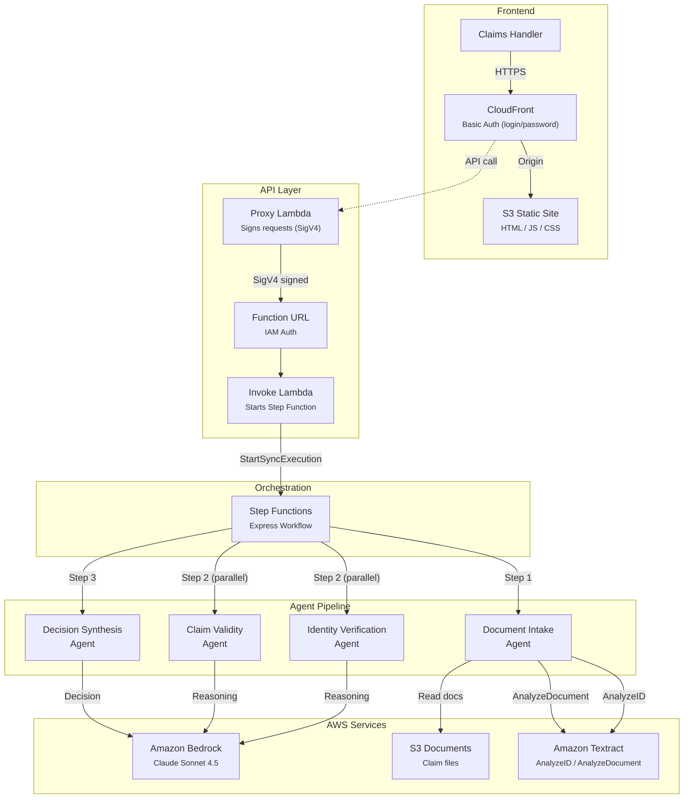
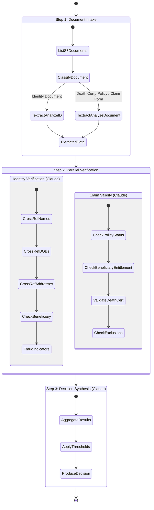
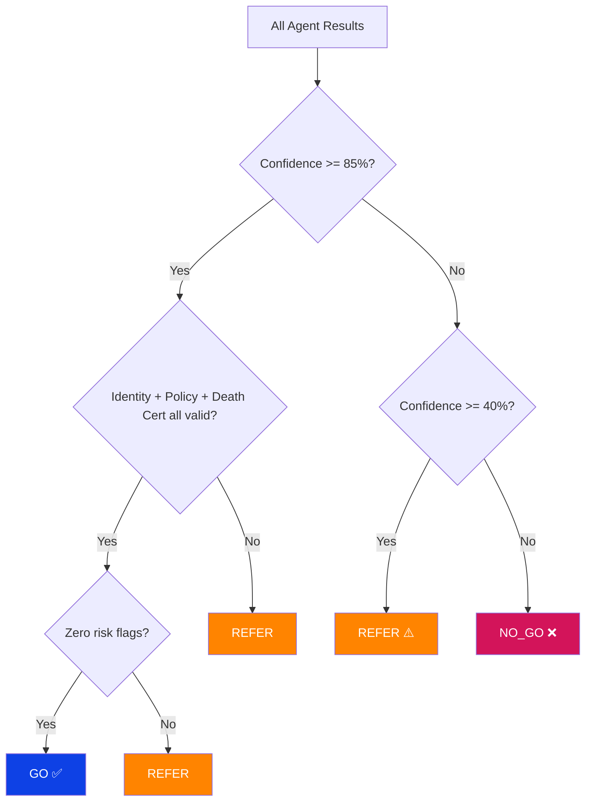
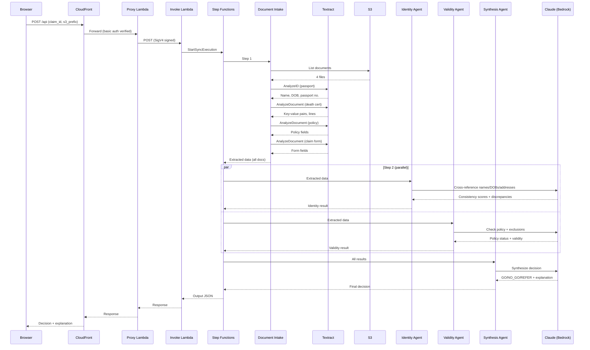

# Life Insurance Claim Validator — Architecture

## Overview

A serverless, AI-powered claims validation system that processes identity documents, death certificates, and policy records to produce a **GO / NO_GO / REFER** decision on life insurance claims. The system uses a multi-agent orchestration pattern where each agent is a specialist responsible for one aspect of validation.

## Architecture Diagram



## Agent Flow (Step Function)



## Decision Logic



## Components

### Frontend (CloudFront + S3)

| Component | Purpose |
|-----------|---------|
| CloudFront Distribution | HTTPS delivery, caching, basic auth enforcement |
| Lambda@Edge | HTTP Basic Auth check on every viewer request |
| S3 Static Site | Single-page HTML/JS application |

**Access**: Protected by HTTP Basic Auth (`cevo` / `claims-demo-2026`)

### API Layer

| Component | Purpose |
|-----------|---------|
| Proxy Lambda (Function URL, no auth) | Called by the frontend; signs requests to the backend |
| Invoke Lambda (Function URL, IAM auth) | Receives signed requests; starts the Step Function synchronously |

**Security**: The backend Function URL requires IAM SigV4 signatures. The proxy Lambda has an IAM role that permits `lambda:InvokeFunctionUrl`. Direct access to the backend URL without valid AWS credentials returns 403.

### Orchestration (Step Functions Express)

Express Workflow chosen because:
- Synchronous execution (response returned to caller)
- Sub-30-second total execution time for most claims
- Visual execution graph in the console for demos
- Pay-per-execution pricing

### Agent Lambdas

| Lambda | Role | AWS Service | Timeout |
|--------|------|-------------|---------|
| `li-claim-document-intake` | OCR + classification | Amazon Textract | 60s |
| `li-claim-identity-verification` | Cross-document identity check | Amazon Bedrock (Claude) | 60s |
| `li-claim-claim-validity` | Policy + exclusion validation | Amazon Bedrock (Claude) | 60s |
| `li-claim-synthesis` | Final GO/NO_GO/REFER decision | Amazon Bedrock (Claude) | 60s |

## Data Flow



## Security Model

| Layer | Protection |
|-------|-----------|
| CloudFront | HTTP Basic Auth (Lambda@Edge) |
| Backend Function URL | AWS IAM (SigV4) — only the proxy Lambda can call it |
| S3 Documents Bucket | Private — only Lambda execution role has access |
| Bedrock | IAM policy — only agent Lambdas can invoke models |
| Textract | IAM policy — only Document Intake Lambda can call |

## Cost Estimate (per validation)

| Service | Usage | Approx. Cost |
|---------|-------|--------------|
| Textract AnalyzeID | 1 page | $0.01 |
| Textract AnalyzeDocument | 3 pages | $0.05 |
| Bedrock Claude Sonnet 4.5 | ~12K input + ~3K output tokens x3 calls | ~$0.15 |
| Step Functions Express | 1 execution (~20s) | < $0.01 |
| Lambda | 4 invocations (~60s total) | < $0.01 |
| **Total per validation** | | **~$0.22** |

## Deployment

```bash
cd infra
python3 -m venv .venv && source .venv/bin/activate
pip install -r requirements.txt

# Deploy
cdk deploy --profile cevo-dev25 --all

# Destroy when done
cdk destroy --profile cevo-dev25 --all
```

### Outputs

| Output | Description |
|--------|-------------|
| `SiteUrl` | CloudFront URL for the demo (requires basic auth) |
| `ProxyApiUrl` | Proxy Lambda URL (called by frontend) |
| `FunctionUrl` | Backend Lambda URL (IAM auth required) |
| `DocsBucketName` | S3 bucket with claim documents |
| `StateMachineArn` | Step Function ARN (viewable in console) |

## Local Development

The Streamlit app (`demo_ui.py`) provides the same functionality locally:

```bash
cd use_cases/life-insurance-claim
source .venv/bin/activate
export AWS_PROFILE=cevo-dev25 AWS_REGION=ap-southeast-2
streamlit run demo_ui.py
```

Toggle "Use Claude (Live mode)" to switch between simulated results and the real Textract + Bedrock pipeline.

## Test Data

| Claim ID | Documents | Expected Decision | Scenario |
|----------|-----------|-------------------|----------|
| CLAIM-LI-001 | Passport, Death Cert, Policy, Claim Form | **GO** | Valid claim — consistent identity, active policy, natural causes |
| CLAIM-LI-002 | Driver's Licence, Death Cert, Policy, Claim Form | **REFER** | Surname mismatch (Thompson vs Thomson), 50% beneficiary share |
| CLAIM-LI-003 | Driver's Licence, Death Cert, Policy, Claim Form | **NO_GO** | Lapsed policy + suicide within exclusion period |
| CLAIM-LI-DEMO | NSW Licence, 1955 Death Cert, Medical Claim Form | **NO_GO** | Three unrelated people, 70-year temporal impossibility |
