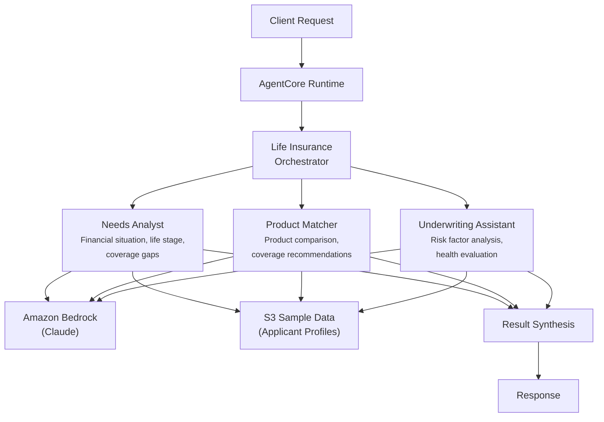

# Life Insurance Agent

AI-powered life insurance advisory system that analyzes applicant needs, matches products, and assesses underwriting risk for insurance agents and advisors.

## Overview

The Life Insurance Agent use case coordinates three specialist agents to deliver personalized insurance advisory reports. It evaluates an applicant's financial situation and life stage, recommends appropriate products with premium estimates, and classifies underwriting risk -- giving insurance agents a comprehensive, data-driven basis for client conversations.

## Business Value

- **Personalized recommendations** -- Coverage recommendations tailored to life stage, income, dependents, and existing coverage
- **Faster quoting** -- Parallel needs analysis, product matching, and underwriting assessment in a single request
- **Consistent methodology** -- Standardized income replacement calculations and risk classification across all advisors
- **Improved conversion** -- Product comparisons with premium estimates help agents close sales with confidence
- **Underwriting efficiency** -- Automated risk factor identification reduces back-and-forth with underwriting teams

## Architecture



### Directory Structure

```
use_cases/life_insurance_agent/
├── README.md
└── src/
    ├── __init__.py                              # Framework router + registry
    ├── strands/
    │   ├── __init__.py
    │   ├── config.py
    │   ├── models.py                            # InsuranceRequest / InsuranceResponse
    │   ├── orchestrator.py                      # LifeInsuranceAgentOrchestrator
    │   └── agents/
    │       ├── __init__.py
    │       ├── needs_analyst.py
    │       ├── product_matcher.py
    │       └── underwriting_assistant.py
    └── langchain_langgraph/
        ├── __init__.py
        ├── config.py
        ├── models.py
        ├── orchestrator.py
        └── agents/
            ├── __init__.py
            ├── needs_analyst.py
            ├── product_matcher.py
            └── underwriting_assistant.py
```

## Agentic Design

The `LifeInsuranceAgentOrchestrator` extends `StrandsOrchestrator` and uses a **parallel fan-out / synthesize** pattern:

1. **Fan-out** -- For `full` analysis, all three agents run in parallel via `asyncio.gather` (async) or `run_parallel` (sync), each retrieving applicant data from S3.
2. **Targeted modes** -- `needs_analysis_only`, `product_matching_only`, and `underwriting_only` run individual agents for focused analysis.
3. **Synthesis** -- Agent results are combined using `build_structured_synthesis_prompt` with a detailed response schema covering needs analysis (life stage, coverage gap), product recommendations (product type, premium), and underwriting assessment (risk category, confidence). The orchestrator LLM produces the final advisory report.

## Agents

### Needs Analyst
- **Role**: Analyzes life insurance needs based on financial situation, life stage, dependents, and existing coverage
- **Data**: Applicant profile from S3 (`data_type='profile'`)
- **Produces**: Life stage classification (young_adult through retirement), recommended coverage amount, coverage gap calculation, income replacement years, key needs list
- **Tool**: `s3_retriever_tool`

### Product Matcher
- **Role**: Matches identified needs to appropriate insurance products with premium estimates
- **Data**: Applicant profile from S3
- **Produces**: Primary product recommendation (term/whole_life/universal/variable/indexed_universal), ranked product list, coverage amount, estimated monthly premium, comparison notes
- **Tool**: `s3_retriever_tool`

### Underwriting Assistant
- **Role**: Assesses risk factors for underwriting based on health history, lifestyle, and family medical history
- **Data**: Applicant profile from S3
- **Produces**: Risk category classification (preferred_plus through substandard), confidence score (0-1), health and lifestyle risk factors, recommended next steps (e.g., medical exams)
- **Tool**: `s3_retriever_tool`

## Data & Tools

| Resource | Description |
|----------|-------------|
| `s3_retriever_tool` | Retrieves applicant profiles and history from S3 |
| S3 path | `data/samples/life_insurance_agent/{applicant_id}/profile.json` |

## Request / Response

**`InsuranceRequest`**
| Field | Type | Description |
|-------|------|-------------|
| `applicant_id` | `str` | Applicant identifier (e.g., `APP001`) |
| `analysis_type` | `AnalysisType` | `full`, `needs_analysis_only`, `product_matching_only`, `underwriting_only` |
| `additional_context` | `str \| None` | Optional context |

**`InsuranceResponse`**
| Field | Type | Description |
|-------|------|-------------|
| `applicant_id` | `str` | Applicant identifier |
| `assessment_id` | `str` | Unique assessment UUID |
| `timestamp` | `datetime` | Assessment timestamp |
| `needs_analysis` | `NeedsAnalysis \| None` | Life stage, recommended coverage, coverage gap, income replacement years |
| `product_recommendations` | `ProductRecommendations \| None` | Primary product, coverage amount, estimated premium |
| `underwriting_assessment` | `UnderwritingAssessment \| None` | Risk category, confidence score, health/lifestyle factors |
| `summary` | `str` | Executive summary |
| `raw_analysis` | `dict` | Raw output from each agent |

**Example Request:**
```json
{
  "applicant_id": "APP001",
  "analysis_type": "full"
}
```

**Example Response:**
```json
{
  "applicant_id": "APP001",
  "assessment_id": "uuid",
  "timestamp": "2026-03-25T00:00:00Z",
  "needs_analysis": {
    "life_stage": "family_building",
    "recommended_coverage": 1775000,
    "coverage_gap": 1535000,
    "income_replacement_years": 15,
    "key_needs": ["income replacement", "mortgage payoff", "education funding"]
  },
  "product_recommendations": {
    "primary_product": "term",
    "coverage_amount": 1500000,
    "estimated_premium": 85.0,
    "comparison_notes": ["Term provides highest coverage per dollar at this life stage"]
  },
  "underwriting_assessment": {
    "risk_category": "preferred",
    "confidence_score": 0.85,
    "health_factors": ["non-smoker", "healthy BMI"],
    "lifestyle_factors": ["no hazardous hobbies"],
    "recommended_actions": ["Standard medical exam"]
  },
  "summary": "Family building applicant with significant coverage gap. Term life recommended..."
}
```

## Quick Start

```bash
USE_CASE_ID=life_insurance_agent FRAMEWORK=strands AWS_REGION=us-east-1 \
  ./applications/fsi_foundry/scripts/deploy/full/deploy_agentcore.sh
```

## Sample Data

| Applicant ID | Profile | Description |
|-------------|---------|-------------|
| APP001 | Family Building | 35yo, spouse + 2 children, $120K income, employer coverage only |

## Related Documentation

- [Platform Overview](../../docs/foundations/README.md)
- [Architecture Patterns](../../docs/foundations/architecture/architecture_patterns.md)
- [Deployment Guide](../../docs/foundations/deployment/deployment_patterns.md)
- [Implementation Details](../../docs/use_cases/life_insurance_agent/implementation.md)
