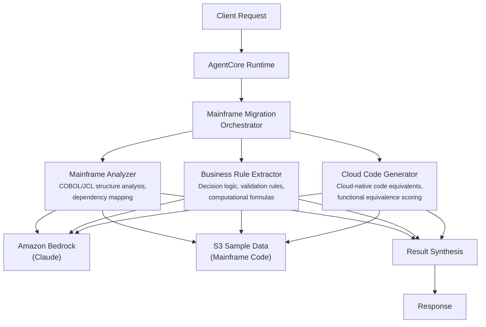

# Mainframe Migration

AI-powered mainframe migration system that analyzes COBOL/JCL programs, extracts business rules, and generates cloud-native code equivalents for financial institutions.

## Overview

The Mainframe Migration use case coordinates three specialist agents to assess and execute mainframe-to-cloud migrations. It analyzes COBOL programs, JCL jobs, and copybooks to map dependencies and complexity, extracts embedded business rules and computational formulas, and generates cloud-native code with functional equivalence scoring -- enabling financial institutions to modernize core systems while preserving critical business logic.

## Business Value

- **Preserved business logic** -- Automated extraction of decision logic, validation rules, and computational formulas ensures nothing is lost in translation
- **Risk quantification** -- Complexity assessment and dependency mapping surface migration risks before they become issues
- **Accelerated migration** -- Automated COBOL-to-cloud code generation with quality scoring reduces manual rewrite effort
- **Compliance continuity** -- Financial system-specific considerations ensure regulatory compliance is maintained post-migration
- **Data integrity** -- Transaction consistency and data mapping validation protect critical financial data

## Architecture



### Directory Structure

```
use_cases/mainframe_migration/
├── README.md
└── src/
    ├── __init__.py                              # Framework router + registry
    ├── strands/
    │   ├── __init__.py
    │   ├── config.py
    │   ├── models.py                            # MainframeMigrationRequest / MainframeMigrationResponse
    │   ├── orchestrator.py                      # MainframeMigrationOrchestrator
    │   └── agents/
    │       ├── __init__.py
    │       ├── mainframe_analyzer.py
    │       ├── business_rule_extractor.py
    │       └── cloud_code_generator.py
    └── langchain_langgraph/
        ├── __init__.py
        ├── config.py
        ├── models.py
        ├── orchestrator.py
        └── agents/
            ├── __init__.py
            ├── mainframe_analyzer.py
            ├── business_rule_extractor.py
            └── cloud_code_generator.py
```

## Agentic Design

The `MainframeMigrationOrchestrator` extends `StrandsOrchestrator` and uses a **parallel fan-out / synthesize** pattern with scope-dependent agent combinations:

1. **Fan-out** -- For `full` scope, all three agents run in parallel via `asyncio.gather`. The mainframe analyzer always runs as a prerequisite.
2. **Targeted modes** -- `mainframe_analysis` runs the analyzer alone; `rule_extraction` pairs analyzer + rule extractor; `code_generation` runs all three agents (analysis is required for generation context).
3. **Synthesis** -- Agent results are assembled into section-labeled markdown and the orchestrator LLM produces a final migration summary with overall complexity, readiness assessment, key risks, and actionable recommendations.

## Agents

### Mainframe Analyzer
- **Role**: Analyzes COBOL programs, JCL jobs, and copybooks to map structure, dependencies, and complexity
- **Data**: Project profile and mainframe source code from S3 (`data_type='profile'`)
- **Produces**: Programs analyzed, JCL jobs analyzed, copybooks found, total lines, complexity level (low/medium/high/critical), dependency graph, migration risks
- **Tool**: `s3_retriever_tool`

### Business Rule Extractor
- **Role**: Extracts business rules, decision logic, validation rules, and computational formulas embedded in mainframe code
- **Data**: Mainframe source code from S3
- **Produces**: Rules extracted count, validation rules, computational formulas, extraction confidence (0-1), items needing manual review
- **Tool**: `s3_retriever_tool`

### Cloud Code Generator
- **Role**: Generates cloud-native code equivalents with functional equivalence scoring and AWS service mapping
- **Data**: Mainframe source code and extracted rules from S3
- **Produces**: Files generated, target language, generation quality score (0-1), functional equivalence score (0-1), AWS services mapped
- **Tool**: `s3_retriever_tool`

## Data & Tools

| Resource | Description |
|----------|-------------|
| `s3_retriever_tool` | Retrieves project profiles, COBOL/JCL source code, and copybooks from S3 |
| S3 path | `data/samples/mainframe_migration/{project_id}/profile.json` |

## Request / Response

**`MainframeMigrationRequest`**
| Field | Type | Description |
|-------|------|-------------|
| `project_id` | `str` | Project identifier (e.g., `PROJECT001`) |
| `migration_scope` | `MigrationScope` | `full`, `mainframe_analysis`, `rule_extraction`, `code_generation` |
| `additional_context` | `str \| None` | Optional context |

**`MainframeMigrationResponse`**
| Field | Type | Description |
|-------|------|-------------|
| `project_id` | `str` | Project identifier |
| `migration_id` | `str` | Unique migration analysis UUID |
| `timestamp` | `datetime` | Analysis timestamp |
| `mainframe_analysis` | `MainframeAnalysisResult \| None` | Programs, JCL jobs, copybooks, complexity, dependencies |
| `business_rules` | `BusinessRuleResult \| None` | Rules extracted, validation rules, formulas, confidence |
| `cloud_code` | `CloudCodeResult \| None` | Files generated, quality score, equivalence score, services mapped |
| `summary` | `str` | Executive summary |
| `raw_analysis` | `dict` | Raw output from each agent |

**Example Request:**
```json
{
  "project_id": "PROJECT001",
  "migration_scope": "full"
}
```

**Example Response:**
```json
{
  "project_id": "PROJECT001",
  "migration_id": "uuid",
  "timestamp": "2026-03-25T00:00:00Z",
  "mainframe_analysis": {
    "programs_analyzed": 340,
    "jcl_jobs_analyzed": 125,
    "copybooks_found": 89,
    "total_lines": 520000,
    "complexity_level": "high",
    "dependencies": ["DB2", "CICS", "IMS", "MQ Series"],
    "risks": ["Complex CICS transaction flows", "Undocumented copybook hierarchies"]
  },
  "business_rules": {
    "rules_extracted": 45,
    "validation_rules": ["Account balance check", "Transaction limit validation"],
    "computational_formulas": ["Interest calculation", "Fee schedule computation"],
    "extraction_confidence": 0.82,
    "manual_review_items": ["Complex nested IF/EVALUATE in ACCTPROC"]
  },
  "cloud_code": {
    "files_generated": 120,
    "target_language": "Python",
    "generation_quality_score": 0.85,
    "functional_equivalence_score": 0.78,
    "services_mapped": ["AWS Lambda", "Amazon RDS", "Amazon SQS", "API Gateway"]
  },
  "summary": "High-complexity mainframe with 340 programs. 82% rule extraction confidence, 78% functional equivalence."
}
```

## Quick Start

```bash
USE_CASE_ID=mainframe_migration FRAMEWORK=strands AWS_REGION=us-east-1 \
  ./applications/fsi_foundry/scripts/deploy/full/deploy_agentcore.sh
```

## Sample Data

| Project ID | Profile | Description |
|-----------|---------|-------------|
| PROJECT001 | Core Banking | 340 COBOL programs, 125 JCL jobs, IBM z/OS to AWS Python |

## Related Documentation

- [Platform Overview](../../docs/foundations/README.md)
- [Architecture Patterns](../../docs/foundations/architecture/architecture_patterns.md)
- [Deployment Guide](../../docs/foundations/deployment/deployment_patterns.md)
