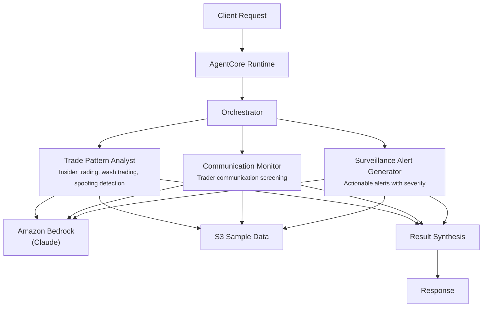

# Market Surveillance

## Overview

The Market Surveillance use case monitors trading activity for regulatory compliance by coordinating trade pattern analysis, trader communication screening, and surveillance alert generation. It detects insider trading, wash trading, spoofing, layering, and information barrier breaches, producing a surveillance decision (CLEAR / INVESTIGATE / ESCALATE / REPORT TO REGULATOR) with supporting evidence.

## Business Value

- **Multi-signal detection** -- combines trade pattern analysis with communication monitoring for higher-confidence findings than either signal alone
- **Regulatory alignment** -- agents reference MAR, Dodd-Frank, and MiFID II requirements when assessing violations
- **Prioritized escalation** -- four-tier decision framework (CLEAR/INVESTIGATE/ESCALATE/REPORT) reduces noise for compliance teams
- **Pre-announcement coverage** -- detects trading activity correlated with material non-public information (MNPI)
- **Communication screening** -- identifies information barrier concerns and external broker interactions alongside trade anomalies

## Architecture



### Directory Structure

```
use_cases/market_surveillance/
├── README.md
└── src/
    └── strands/
        ├── __init__.py
        ├── config.py          # SurveillanceSettings
        ├── models.py          # Pydantic request/response models
        ├── orchestrator.py    # SurveillanceOrchestrator + run_market_surveillance()
        └── agents/
            ├── __init__.py
            ├── trade_pattern_analyst.py
            ├── communication_monitor.py
            └── surveillance_alert_generator.py
```

## Agentic Design

The orchestrator uses a **parallel fan-out** pattern. In `full` mode, all three agents execute concurrently via `asyncio.gather`. Individual modes (`trade_only`, `comms_only`, `alert_only`) invoke a single agent. After agent execution, the orchestrator synthesizes findings into a surveillance decision with key findings and required actions. Post-synthesis, dedicated parser functions (`parse_trade_pattern`, `parse_comms_result`, `parse_alert_result`) extract structured fields from LLM output into typed Pydantic models.

## Agents

| Agent | Role | Data Used | Output |
|-------|------|-----------|--------|
| **Trade Pattern Analyst** | Detects insider trading, wash trading, spoofing, layering, front running, and pump-and-dump patterns; assesses risk scores | Surveillance profile (trades, market events, flags) via `s3_retriever_tool` | Patterns detected, risk score (0-100), anomalies, structured findings |
| **Communication Monitor** | Screens trader communications for compliance violations, MNPI sharing, information barrier breaches, and external counterparty concerns | Surveillance profile (communications) via `s3_retriever_tool` | Flagged communications, risk indicators, compliance concerns |
| **Surveillance Alert Generator** | Creates actionable alerts with severity ratings (LOW/MEDIUM/HIGH/CRITICAL), alert type classification, and escalation determination | Surveillance profile via `s3_retriever_tool` | Alert severity, alert type, recommended actions, escalation required flag |

## Data and Tools

- **Tool:** `s3_retriever_tool` -- retrieves surveillance case profiles including trades, communications, market events, and flags from S3
- **S3 data prefix:** `samples/market_surveillance/`
- **Model:** Claude Sonnet (via Amazon Bedrock), temperature 0.1, max 8192 tokens

## Request / Response

**Request** -- `SurveillanceRequest`:

| Field | Type | Description |
|-------|------|-------------|
| `customer_id` | `str` | Surveillance case or trader identifier (e.g., `SURV001`) |
| `surveillance_type` | `SurveillanceType` | `full`, `trade_only`, `comms_only`, `alert_only` |
| `additional_context` | `str \| None` | Optional context |

**Response** -- `SurveillanceResponse`:

| Field | Type | Description |
|-------|------|-------------|
| `customer_id` | `str` | Case identifier |
| `surveillance_id` | `str` | Unique surveillance UUID |
| `timestamp` | `datetime` | Surveillance timestamp |
| `trade_pattern` | `TradePatternResult \| None` | Patterns detected, risk score (0-100), anomalies, notes |
| `comms_monitor` | `CommsMonitorResult \| None` | Flagged communications, risk indicators, compliance concerns |
| `alert` | `AlertResult \| None` | Severity, alert type, recommended actions, escalation required |
| `summary` | `str` | Executive summary with CLEAR/INVESTIGATE/ESCALATE/REPORT decision |
| `raw_analysis` | `dict` | Raw agent output |

## Quick Start

```bash
# Deploy to AgentCore
USE_CASE_ID=market_surveillance ./scripts/deploy/full/deploy_agentcore.sh

# Test the deployment
./scripts/use_cases/market_surveillance/test/test_agentcore.sh
```

## Sample Data

Located at `data/samples/market_surveillance/`

| Entity ID | Trader | Desk | Description |
|-----------|--------|------|-------------|
| SURV001 | Michael Chen | Equities | Pre-announcement ACME trades (125K shares bought before earnings), external broker communication discussing earnings expectations, receipt of non-public revenue forecast, stock rose 8% after-hours |
| SURV002 | Sarah Williams | Fixed Income | Standard UST10Y trading activity with no flags -- internal sales communication only, no pre-announcement trading or unusual volume |

## Related Documentation

- [FSI Foundry Overview](../../../README.md)
- [Architecture Patterns](../../docs/foundations/architecture/architecture_patterns.md)
- [Deployment Guide](../../docs/foundations/deployment/deployment_patterns.md)
- [Implementation Details](../../docs/use_cases/market_surveillance/implementation.md)
