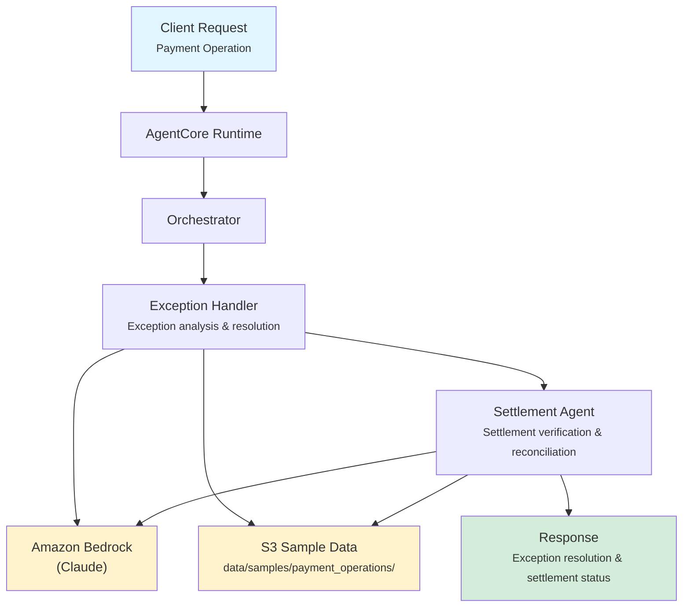

# Payment Operations

AI-powered payment exception handling and settlement verification for banking operations, automating the resolution of failed transactions and the confirmation of payment settlements.

## Overview

The Payment Operations application processes payment exceptions by analyzing root causes and severity, then verifies settlement readiness through amount reconciliation and compliance clearance. The orchestrator synthesizes findings into an operational decision: PROCEED, HOLD, REJECT, or ESCALATE.

## Business Value

- **Faster Exception Resolution** -- Automated root cause analysis and severity assessment accelerate exception handling
- **Reduced Settlement Delays** -- Proactive settlement readiness checks identify blockers before they cause failures
- **Improved Reconciliation** -- AI-driven amount matching and compliance verification reduce manual effort
- **Operational Risk Reduction** -- Consistent severity classification and escalation rules prevent critical exceptions from being overlooked
- **Higher STP Rates** -- Automation of routine exception handling increases straight-through processing

## Architecture



### Directory Structure

```
use_cases/payment_operations/
├── README.md
└── src/
    ├── __init__.py                              # Framework router
    ├── strands/
    │   ├── __init__.py
    │   ├── config.py                            # Operations settings
    │   ├── models.py                            # OperationsRequest / OperationsResponse
    │   ├── orchestrator.py                      # PaymentOpsOrchestrator
    │   └── agents/
    │       ├── exception_handler.py             # ExceptionHandler agent
    │       └── settlement_agent.py              # SettlementAgent agent
    └── langchain_langgraph/                     # LangGraph implementation (same structure)
```

## Agentic Design

The `PaymentOpsOrchestrator` extends `StrandsOrchestrator` and implements a **parallel fan-out** pattern:

1. **Operation Type Routing** -- `full` runs both agents in parallel; `exception_only` runs just the Exception Handler; `settlement_only` runs just the Settlement Agent.
2. **Parallel Execution** -- For full operations, both agents run concurrently via `asyncio.gather()`.
3. **Structured Synthesis** -- Uses `build_structured_synthesis_prompt` to produce JSON with exception severity, resolution actions, settlement status, and an executive recommendation.

## Agents

### Exception Handler

| Field | Detail |
|-------|--------|
| **Class** | `ExceptionHandler(StrandsAgent)` |
| **Role** | Analyzes payment exceptions (failed transactions, mismatches, compliance holds) |
| **Data** | Payment data via `s3_retriever_tool` |
| **Produces** | Exception severity (LOW/MEDIUM/HIGH/CRITICAL), root cause analysis, resolution actions, escalation flag |

### Settlement Agent

| Field | Detail |
|-------|--------|
| **Class** | `SettlementAgent(StrandsAgent)` |
| **Role** | Verifies settlement readiness, reconciles payment amounts, tracks timelines |
| **Data** | Payment data via `s3_retriever_tool` |
| **Produces** | Settlement status (PENDING/SETTLED/FAILED/REQUIRES_ACTION), settlement date, reconciliation status, notes on issues or delays |

## Data and Tools

- **Tool:** `s3_retriever_tool` -- Retrieves payment data from S3 by payment/customer ID
- **S3 Path:** `data/samples/payment_operations/{customer_id}/`
- **Data Files:** `profile.json` (payment details, exception info, settlement data)

## Request / Response

### Request (`OperationsRequest`)

```python
class OperationsRequest(BaseModel):
    customer_id: str                               # e.g. "PAY001"
    operation_type: OperationType = "full"          # full | exception_only | settlement_only
    additional_context: str | None = None
```

### Response (`OperationsResponse`)

```python
class OperationsResponse(BaseModel):
    customer_id: str
    operation_id: str                              # UUID
    timestamp: datetime
    exception_resolution: ExceptionResolution | None  # severity, resolution, actions_taken, requires_escalation
    settlement_result: SettlementResult | None        # status, settlement_date, reconciled, notes
    summary: str                                   # Executive summary with PROCEED/HOLD/REJECT/ESCALATE
    raw_analysis: dict
```

## Quick Start

```bash
# Deploy to AgentCore
USE_CASE_ID=payment_operations ./scripts/deploy/full/deploy_agentcore.sh

# Test
./scripts/use_cases/payment_operations/test/test_agentcore.sh
```

## Sample Data

| Payment ID | Type | Description |
|------------|------|-------------|
| `PAY001` | Wire | Wire transfer with address mismatch exception (medium severity) |

## Related Documentation

- [Platform Overview](../../docs/foundations/README.md)
- [Architecture Patterns](../../docs/foundations/architecture/architecture_patterns.md)
- [Deployment Guide](../../docs/foundations/deployment/deployment_patterns.md)
