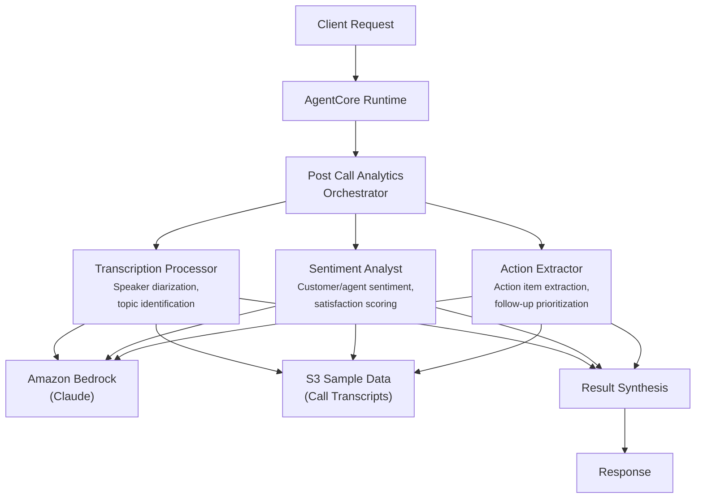

# Post Call Analytics

AI-powered post-call analysis system that processes transcripts, tracks sentiment, and extracts action items for financial services contact centers.

## Overview

The Post Call Analytics use case coordinates three specialist agents to automate call analysis after completion. It processes transcripts with speaker diarization, tracks customer and agent sentiment through the conversation with satisfaction scoring, and extracts prioritized action items with assignees and deadlines -- enabling supervisors and quality teams to review calls efficiently and ensure follow-through.

## Business Value

- **Automated analysis** -- Eliminates manual call review for transcript processing, sentiment assessment, and action tracking
- **Customer satisfaction visibility** -- Real-time sentiment tracking with emotional shift detection identifies at-risk interactions
- **Accountability** -- Extracted action items with assignees, priorities, and deadlines ensure commitments are fulfilled
- **Quality assurance** -- Consistent evaluation methodology across all calls with structured output for QA dashboards
- **Compliance documentation** -- Full transcript processing with topic identification creates an audit-ready record

## Architecture



### Directory Structure

```
use_cases/post_call_analytics/
├── README.md
└── src/
    ├── __init__.py                              # Framework router + registry
    ├── strands/
    │   ├── __init__.py
    │   ├── config.py
    │   ├── models.py                            # PostCallRequest / PostCallResponse
    │   ├── orchestrator.py                      # PostCallAnalyticsOrchestrator
    │   └── agents/
    │       ├── __init__.py
    │       ├── transcription_processor.py
    │       ├── sentiment_analyst.py
    │       └── action_extractor.py
    └── langchain_langgraph/
        ├── __init__.py
        ├── config.py
        ├── models.py
        ├── orchestrator.py
        └── agents/
            ├── __init__.py
            ├── transcription_processor.py
            ├── sentiment_analyst.py
            └── action_extractor.py
```

## Agentic Design

The `PostCallAnalyticsOrchestrator` extends `StrandsOrchestrator` and uses a **parallel fan-out / synthesize** pattern:

1. **Fan-out** -- For `full` analysis, all three agents run in parallel via `asyncio.gather` (async) or `run_parallel` (sync), each retrieving call data from S3.
2. **Targeted modes** -- `transcription`, `sentiment`, and `action_extraction` run individual agents for focused analysis.
3. **Synthesis** -- Agent results are combined using `build_structured_synthesis_prompt` with a schema covering transcription (speaker count, topics), sentiment (overall/customer/agent sentiment, satisfaction score, emotional shifts), and action items (description, assignee, priority, deadline). The orchestrator LLM produces the final call quality assessment.

## Agents

### Transcription Processor
- **Role**: Processes call recordings with speaker diarization, topic identification, and transcript generation
- **Data**: Call recording/transcript data from S3 (`data_type='profile'`)
- **Produces**: Speaker count, call duration, key topics discussed, transcript summary
- **Tool**: `s3_retriever_tool`

### Sentiment Analyst
- **Role**: Tracks customer and agent sentiment throughout the conversation with satisfaction scoring
- **Data**: Call transcript from S3
- **Produces**: Overall/customer/agent sentiment levels (very_negative to very_positive), satisfaction score (0-1), emotional shifts during the call
- **Tool**: `s3_retriever_tool`

### Action Extractor
- **Role**: Extracts action items, commitments, and follow-ups with priority and deadline tracking
- **Data**: Call transcript from S3
- **Produces**: Action items with description, assignee, priority (low/medium/high/critical), deadline, and status (pending/in_progress/completed)
- **Tool**: `s3_retriever_tool`

## Data & Tools

| Resource | Description |
|----------|-------------|
| `s3_retriever_tool` | Retrieves call recordings, transcripts, and metadata from S3 |
| S3 path | `data/samples/post_call_analytics/{call_id}/profile.json` |

## Request / Response

**`PostCallRequest`**
| Field | Type | Description |
|-------|------|-------------|
| `call_id` | `str` | Call identifier (e.g., `CALL001`) |
| `analysis_type` | `AnalysisType` | `full`, `transcription`, `sentiment`, `action_extraction` |
| `additional_context` | `str \| None` | Optional context |

**`PostCallResponse`**
| Field | Type | Description |
|-------|------|-------------|
| `call_id` | `str` | Call identifier |
| `analytics_id` | `str` | Unique analytics UUID |
| `timestamp` | `datetime` | Analysis timestamp |
| `transcription` | `TranscriptionResult \| None` | Speaker count, duration, key topics, summary |
| `sentiment` | `SentimentResult \| None` | Overall/customer/agent sentiment, satisfaction score |
| `action_items` | `list[ActionItem]` | Extracted action items with assignees and priorities |
| `summary` | `str` | Executive summary |
| `raw_analysis` | `dict` | Raw output from each agent |

**Example Request:**
```json
{
  "call_id": "CALL001",
  "analysis_type": "full"
}
```

**Example Response:**
```json
{
  "call_id": "CALL001",
  "analytics_id": "uuid",
  "timestamp": "2026-03-25T00:00:00Z",
  "transcription": {
    "speaker_count": 2,
    "duration_seconds": 480,
    "key_topics": ["fraud dispute", "card replacement", "alert setup"],
    "transcript_summary": "Customer reported unauthorized charges and requested card replacement."
  },
  "sentiment": {
    "overall_sentiment": "positive",
    "customer_sentiment": "positive",
    "agent_sentiment": "positive",
    "satisfaction_score": 0.85,
    "emotional_shifts": ["Frustrated at start, relieved after resolution confirmation"]
  },
  "action_items": [
    {
      "description": "Process dispute for $247.50 and $89.99 charges",
      "assignee": "disputes_team",
      "priority": "high",
      "deadline": "2026-03-28"
    },
    {
      "description": "Issue replacement card via expedited shipping",
      "assignee": "card_services",
      "priority": "high",
      "deadline": "2026-03-26"
    }
  ],
  "summary": "Fraud dispute resolved with positive customer sentiment. Two high-priority follow-ups pending."
}
```

## Quick Start

```bash
USE_CASE_ID=post_call_analytics FRAMEWORK=strands AWS_REGION=us-east-1 \
  ./applications/fsi_foundry/scripts/deploy/full/deploy_agentcore.sh
```

## Sample Data

| Entity ID | Description |
|-----------|-------------|
| CALL001 | Retail banking fraud dispute call -- unauthorized charges, card replacement, alert setup |

## Related Documentation

- [Platform Overview](../../docs/foundations/README.md)
- [Architecture Patterns](../../docs/foundations/architecture/architecture_patterns.md)
- [Deployment Guide](../../docs/foundations/deployment/deployment_patterns.md)
- [Implementation Details](../../docs/use_cases/post_call_analytics/implementation.md)
