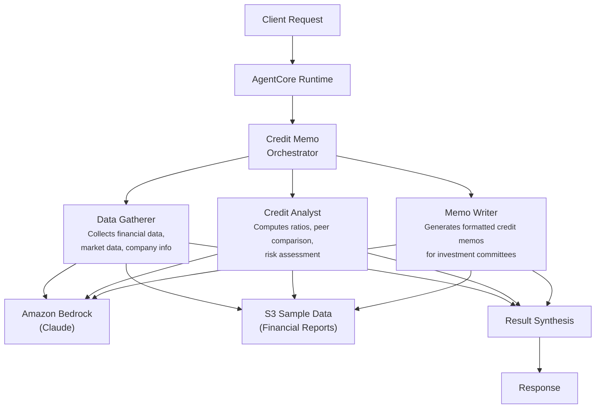

# Research Credit Memo

## Overview

The Research Credit Memo use case generates comprehensive credit research memos by coordinating financial data gathering, credit analysis, and professional memo writing. It collects data from annual reports, SEC filings, and market sources, performs ratio analysis and peer comparison, assigns credit ratings with supporting rationale, and produces investment-committee-ready credit memos with structured sections.

## Business Value

- **End-to-end memo generation** -- from raw data collection through analysis to formatted output in a single workflow
- **Rigorous credit analysis** -- automated computation of leverage, coverage, liquidity, and profitability ratios with peer comparison
- **Rating recommendation** -- credit rating assigned on the AAA-D scale with confidence score and supporting evidence
- **Committee-ready output** -- professionally structured memos with executive summary, financial analysis, credit assessment, and recommendations
- **Data quality tracking** -- data gatherer assesses completeness and flags gaps for analyst review

## Architecture



### Directory Structure

```
use_cases/research_credit_memo/
├── README.md
└── src/
    └── strands/
        ├── __init__.py
        ├── config.py          # ResearchCreditMemoSettings
        ├── models.py          # Pydantic request/response models
        ├── orchestrator.py    # ResearchCreditMemoOrchestrator + run_research_credit_memo()
        └── agents/
            ├── __init__.py
            ├── data_gatherer.py
            ├── credit_analyst.py
            └── memo_writer.py
```

## Agentic Design

The orchestrator uses a **parallel fan-out** pattern with mode-dependent agent combinations. In `full` mode, all three agents execute concurrently via `asyncio.gather`. In `credit_analysis` mode, the data gatherer and credit analyst run in parallel. In `memo_generation` mode, all three agents run in parallel (same as full). In `data_gathering` mode, only the data gatherer runs. The orchestrator synthesizes results through a structured prompt that produces JSON with credit rating, confidence score, key ratios, risk factors, peer comparison notes, and recommendations.

## Agents

| Agent | Role | Data Used | Output |
|-------|------|-----------|--------|
| **Data Gatherer** | Gathers financial data from annual reports and SEC filings; collects market data (stock prices, bond yields, credit spreads); retrieves company info (structure, management, segments) and peer data; assesses data completeness | Entity profile, financials, and market data via `s3_retriever_tool` | Company profile, financial data, market data, credit history, peer companies, data quality notes |
| **Credit Analyst** | Computes financial ratios (debt/EBITDA, interest coverage, current ratio, ROE); conducts peer comparison against benchmarks; assesses credit risk factors (business, financial, industry); provides rating recommendation | Entity profile and financials via `s3_retriever_tool` | Credit rating (AAA-D), confidence score (0-1), key ratios, risk factors, peer comparison notes, rating rationale |
| **Memo Writer** | Generates professionally formatted credit memos with executive summary, company overview, financial analysis, credit assessment, recommendation, and appendix sections; targets credit committees and institutional investors | Entity profile and financial data via `s3_retriever_tool` | Structured credit memo with all standard sections, supporting data tables, and methodology notes |

## Data and Tools

- **Tool:** `s3_retriever_tool` -- retrieves entity profiles, financial statements, market data, and peer information from S3
- **S3 data prefix:** `samples/research_credit_memo/`
- **Model:** Claude Sonnet (via Amazon Bedrock), temperature 0.1, max 8192 tokens
- **Config thresholds:** `min_data_completeness_score=0.8`, `credit_confidence_threshold=0.7`, `max_memo_generation_time_seconds=120`

## Request / Response

**Request** -- `MemoRequest`:

| Field | Type | Description |
|-------|------|-------------|
| `entity_id` | `str` | Entity/company identifier (e.g., `ENTITY001`) |
| `analysis_type` | `AnalysisType` | `full`, `data_gathering`, `credit_analysis`, `memo_generation` |
| `additional_context` | `str \| None` | Optional context |

**Response** -- `MemoResponse`:

| Field | Type | Description |
|-------|------|-------------|
| `entity_id` | `str` | Entity identifier |
| `memo_id` | `str` | Unique memo UUID |
| `timestamp` | `datetime` | Generation timestamp |
| `credit_analysis` | `CreditAnalysisDetail \| None` | Rating (AAA-D), memo format, confidence score, key ratios, risk factors, peer comparison notes |
| `recommendations` | `list[str]` | Credit recommendations |
| `summary` | `str` | Executive summary |
| `raw_analysis` | `dict` | Raw agent output |

## Quick Start

```bash
# Deploy to AgentCore
USE_CASE_ID=research_credit_memo ./scripts/deploy/full/deploy_agentcore.sh

# Test the deployment
./scripts/use_cases/research_credit_memo/test/test_agentcore.sh
```

## Sample Data

Located at `data/samples/research_credit_memo/`

| Entity ID | Company | Sector | Current Rating | Description |
|-----------|---------|--------|---------------|-------------|
| ENTITY001 | Acme Industrial Corp | Industrials / Diversified Manufacturing | BBB (S&P, stable outlook) | Revenue $12.5B, EBITDA $2.1B, total debt $8.5B, cash $1.2B, interest expense $425M; peer group: GMI (BBB+), ISL (BBB), PIC (BBB-); upgraded from BB+ in 2022 |

## Related Documentation

- [FSI Foundry Overview](../../../README.md)
- [Architecture Patterns](../../docs/foundations/architecture/architecture_patterns.md)
- [Deployment Guide](../../docs/foundations/deployment/deployment_patterns.md)
- [Implementation Details](../../docs/use_cases/research_credit_memo/implementation.md)
