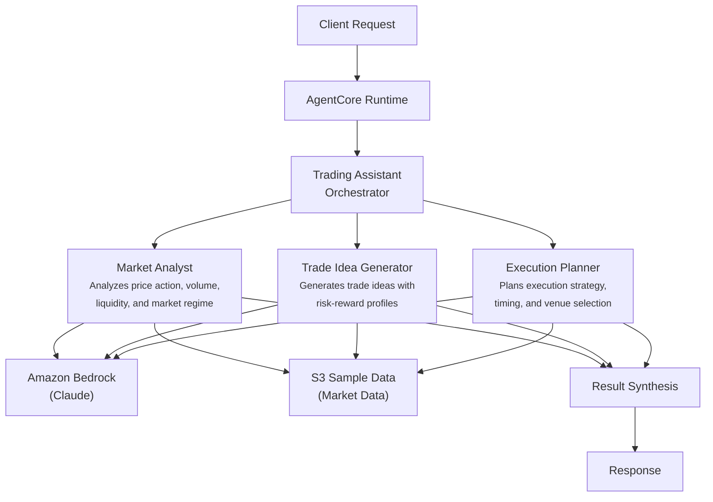

# Trading Assistant

## Overview

The Trading Assistant use case provides comprehensive trading intelligence for equity trading desks by coordinating market analysis, trade idea generation, and execution planning. It assesses market regime and conditions, generates trade ideas with risk-reward profiles and specific price levels, and plans optimal execution strategies including timing, venue selection, and order slicing -- producing actionable trading recommendations for desk traders.

## Business Value

- **End-to-end trading workflow** -- covers the full cycle from market analysis through idea generation to execution planning in a single request
- **Execution cost awareness** -- execution planner estimates spread, impact, and timing costs with specific venue selection rationale
- **Risk-reward precision** -- trade ideas include explicit entry, target, and stop levels with conviction scoring
- **Market regime classification** -- market analyst provides objective regime assessment (bullish/bearish/neutral/volatile) grounded in data
- **Portfolio context** -- trade ideas consider existing positions and correlation risk before recommending new exposure

## Architecture



### Directory Structure

```
use_cases/trading_assistant/
├── README.md
└── src/
    └── strands/
        ├── __init__.py
        ├── config.py          # TradingAssistantSettings
        ├── models.py          # Pydantic request/response models
        ├── orchestrator.py    # TradingAssistantOrchestrator + run_trading_assistant()
        └── agents/
            ├── __init__.py
            ├── market_analyst.py
            ├── trade_idea_generator.py
            └── execution_planner.py
```

## Agentic Design

The orchestrator uses a **parallel fan-out** pattern with mode-dependent agent combinations. In `full` mode, all three agents execute concurrently via `asyncio.gather`. In `trade_idea` mode, the market analyst and trade idea generator run in parallel. In `execution_plan` mode, the market analyst and execution planner run in parallel. In `market_analysis` mode, only the market analyst runs. After agent execution, dedicated parser functions (`parse_market_analysis`) extract structured fields (market condition, urgency, confidence, key levels, trade ideas, execution notes) from LLM output into typed Pydantic models.

## Agents

| Agent | Role | Data Used | Output |
|-------|------|-----------|--------|
| **Market Analyst** | Analyzes real-time market data including price action, volume, and volatility; assesses order flow and institutional positioning; evaluates liquidity; identifies support/resistance levels and technical patterns; classifies market regime | Trading profile and market data snapshot via `s3_retriever_tool` | Market condition (BULLISH/BEARISH/NEUTRAL/VOLATILE), key price levels, volume/liquidity assessment, technical patterns |
| **Trade Idea Generator** | Generates trade ideas based on market conditions and strategy parameters; evaluates risk-reward profiles with entry/target/stop levels; considers portfolio context and correlation risk; assesses conviction and sizing | Trading profile and current positions via `s3_retriever_tool` | Trade ideas with entry/target/stop, risk-reward ratio, conviction level, sizing recommendation, portfolio impact |
| **Execution Planner** | Plans optimal execution considering market impact and order size; recommends timing based on liquidity patterns; suggests venue selection and order routing; designs slicing strategies (TWAP, VWAP, implementation shortfall) | Trading profile and market conditions via `s3_retriever_tool` | Execution strategy, timing/scheduling, venue selection, expected costs, risk mitigation |

## Data and Tools

- **Tool:** `s3_retriever_tool` -- retrieves trading desk profiles, positions, market data snapshots, and risk limits from S3
- **S3 data prefix:** `samples/trading_assistant/`
- **Model:** Claude Sonnet (via Amazon Bedrock), temperature 0.1, max 8192 tokens
- **Config thresholds:** `market_impact_threshold=0.05`, `min_confidence_score=0.7`, `max_execution_slippage=0.02`

## Request / Response

**Request** -- `TradingRequest`:

| Field | Type | Description |
|-------|------|-------------|
| `entity_id` | `str` | Trading request identifier (e.g., `TRADE001`) |
| `analysis_type` | `AnalysisType` | `full`, `market_analysis`, `trade_idea`, `execution_plan` |
| `additional_context` | `str \| None` | Optional context |

**Response** -- `TradingResponse`:

| Field | Type | Description |
|-------|------|-------------|
| `entity_id` | `str` | Trading request identifier |
| `analysis_id` | `str` | Unique analysis UUID |
| `timestamp` | `datetime` | Analysis timestamp |
| `market_analysis` | `MarketAnalysisDetail \| None` | Condition, urgency, confidence score (0-1), key levels, trade ideas, execution notes |
| `recommendations` | `list[str]` | Trading recommendations |
| `summary` | `str` | Executive summary |
| `raw_analysis` | `dict` | Raw agent output |

## Quick Start

```bash
# Deploy to AgentCore
USE_CASE_ID=trading_assistant ./scripts/deploy/full/deploy_agentcore.sh

# Test the deployment
./scripts/use_cases/trading_assistant/test/test_agentcore.sh
```

## Sample Data

Located at `data/samples/trading_assistant/`

| Entity ID | Desk | Strategy | Description |
|-----------|------|----------|-------------|
| TRADE001 | Equity Trading | Systematic Momentum | Current positions in AAPL (5K shares, +$34K PnL), SPY (-2K shares short, +$5K PnL), NVDA (1.5K shares, +$38.7K PnL); SPX at 4783, VIX 13.2, 10Y yield 4.05%; risk limits: 5% max position, 20% max sector, $500K daily VaR, 10% max drawdown |

## Related Documentation

- [FSI Foundry Overview](../../../README.md)
- [Architecture Patterns](../../docs/foundations/architecture/architecture_patterns.md)
- [Deployment Guide](../../docs/foundations/deployment/deployment_patterns.md)
- [Implementation Details](../../docs/use_cases/trading_assistant/implementation.md)
