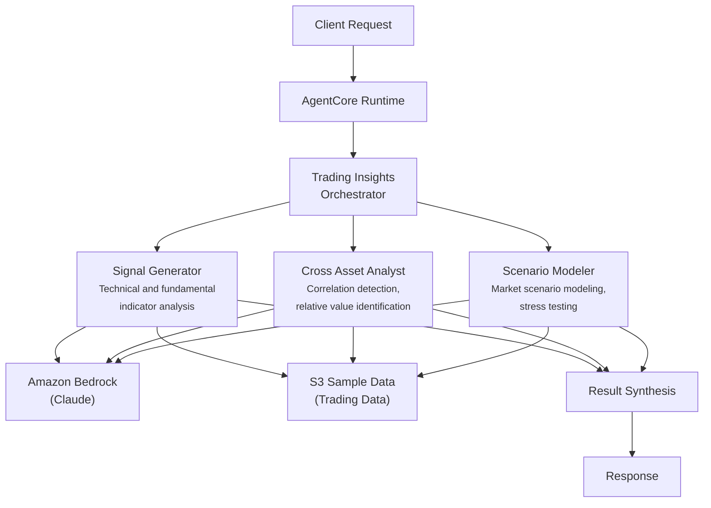

# Trading Insights

AI-powered trading insights system that generates signals, analyzes cross-asset relationships, and models market scenarios for capital markets professionals.

## Overview

The Trading Insights use case coordinates three specialist agents to deliver comprehensive trading assessments. It combines technical and fundamental signal generation with cross-asset correlation analysis and probability-weighted scenario modeling, producing actionable trade recommendations with risk/reward profiles and hedging guidance.

## Business Value

- **Signal quality** -- Multi-dimensional signal generation combining technical indicators (RSI, MACD, Bollinger Bands) with fundamental data
- **Cross-asset awareness** -- Identifies relative value opportunities and regime changes across equities, fixed income, commodities, and FX
- **Scenario discipline** -- Probability-weighted base/bull/bear/tail risk scenarios with portfolio impact and drawdown estimates
- **Hedging guidance** -- Integrated protective strategy recommendations with effectiveness evaluation
- **Faster decision-making** -- Parallel agent execution delivers full-spectrum insights in a single request

## Architecture



### Directory Structure

```
use_cases/trading_insights/
├── README.md
└── src/
    ├── __init__.py                              # Framework router + registry
    ├── strands/
    │   ├── __init__.py
    │   ├── config.py
    │   ├── models.py                            # InsightsRequest / InsightsResponse
    │   ├── orchestrator.py                      # TradingInsightsOrchestrator
    │   └── agents/
    │       ├── __init__.py
    │       ├── signal_generator.py
    │       ├── cross_asset_analyst.py
    │       └── scenario_modeler.py
    └── langchain_langgraph/
        ├── __init__.py
        ├── config.py
        ├── models.py
        ├── orchestrator.py
        └── agents/
            ├── __init__.py
            ├── signal_generator.py
            ├── cross_asset_analyst.py
            └── scenario_modeler.py
```

## Agentic Design

The `TradingInsightsOrchestrator` extends `StrandsOrchestrator` and uses a **parallel fan-out / synthesize** pattern:

1. **Fan-out** -- For `full` assessments, all three agents run in parallel via `run_parallel` (sync) or `asyncio.gather` (async).
2. **Targeted modes** -- `signal_generation` runs the signal generator alone; `cross_asset_analysis` pairs signal generator + cross-asset analyst; `scenario_modeling` pairs cross-asset analyst + scenario modeler.
3. **Synthesis** -- Agent outputs are assembled into section-labeled markdown and the orchestrator LLM produces a final JSON with signal strength, cross-asset opportunities, scenario outcomes, and actionable recommendations.

## Agents

### Signal Generator
- **Role**: Generates trading signals from technical indicators (moving averages, RSI, MACD, Bollinger Bands) and fundamental data (earnings, valuations, macro releases)
- **Data**: Portfolio/position profile from S3 (`data_type='profile'`)
- **Produces**: Signal strength classification (STRONG_BUY to STRONG_SELL), confidence scores, entry/exit points, conflicting signal flags
- **Tool**: `s3_retriever_tool`

### Cross Asset Analyst
- **Role**: Analyzes cross-asset correlations across equities, fixed income, commodities, and FX to identify relative value opportunities
- **Data**: Portfolio profile from S3
- **Produces**: Cross-asset opportunities, correlation regime assessment, pair/spread trade recommendations with risk/reward, liquidity observations
- **Tool**: `s3_retriever_tool`

### Scenario Modeler
- **Role**: Models market scenarios (base, bull, bear, tail risk) with probability-weighted outcomes and stress tests against historical analogues
- **Data**: Portfolio profile from S3
- **Produces**: Scenario outcomes with probabilities, position/portfolio impact, stress test results (2008 crisis, COVID, rate shock), hedging recommendations, max drawdown estimates
- **Tool**: `s3_retriever_tool`

## Data & Tools

| Resource | Description |
|----------|-------------|
| `s3_retriever_tool` | Retrieves trading portfolio profiles and market data from S3 |
| S3 path | `data/samples/trading_insights/{entity_id}/profile.json` |

## Request / Response

**`InsightsRequest`**
| Field | Type | Description |
|-------|------|-------------|
| `entity_id` | `str` | Portfolio/position identifier (e.g., `TRADE001`) |
| `assessment_type` | `AssessmentType` | `full`, `signal_generation`, `cross_asset_analysis`, `scenario_modeling` |
| `additional_context` | `str \| None` | Optional context |

**`InsightsResponse`**
| Field | Type | Description |
|-------|------|-------------|
| `entity_id` | `str` | Portfolio/position identifier |
| `insights_id` | `str` | Unique assessment UUID |
| `timestamp` | `datetime` | Assessment timestamp |
| `insights_detail` | `InsightsDetail \| None` | Signal strength, scenario likelihood, signals, cross-asset opportunities, confidence score |
| `recommendations` | `list[str]` | Trading recommendations |
| `summary` | `str` | Executive summary |
| `raw_analysis` | `dict` | Raw output from each agent |

**Example Request:**
```json
{
  "entity_id": "TRADE001",
  "assessment_type": "full",
  "additional_context": "Focus on rate-sensitive positions"
}
```

**Example Response:**
```json
{
  "entity_id": "TRADE001",
  "insights_id": "uuid",
  "timestamp": "2026-03-25T00:00:00Z",
  "insights_detail": {
    "signal_strength": "buy",
    "scenario_likelihood": "medium",
    "signals_identified": ["RSI oversold on US 10Y", "MACD bullish crossover on IG credit"],
    "cross_asset_opportunities": ["Equity-bond decorrelation trade"],
    "scenario_outcomes": ["Base case: +2.3% portfolio return", "Bear case: -1.5% drawdown"],
    "confidence_score": 0.75
  },
  "recommendations": ["Increase duration exposure", "Consider IG credit overweight"],
  "summary": "Moderate buy signal with favorable risk/reward in fixed income..."
}
```

## Quick Start

```bash
USE_CASE_ID=trading_insights FRAMEWORK=strands AWS_REGION=us-east-1 \
  ./applications/fsi_foundry/scripts/deploy/full/deploy_agentcore.sh
```

## Sample Data

| Entity ID | Profile | Description |
|-----------|---------|-------------|
| TRADE001 | Global Macro | Multi-asset macro relative value fund |

## Related Documentation

- [Platform Overview](../../docs/foundations/README.md)
- [Architecture Patterns](../../docs/foundations/architecture/architecture_patterns.md)
- [Deployment Guide](../../docs/foundations/deployment/deployment_patterns.md)
- [Implementation Details](../../docs/use_cases/trading_insights/implementation.md)
