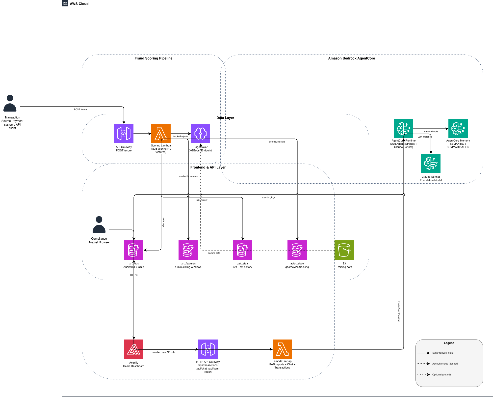

# Case Management System

AI-powered fraud detection and case management platform built with AWS serverless architecture, React, and Claude AI.

## Features

- **Real-time Fraud Detection**: Analyze transactions with ML-based scoring and pattern detection
- **AI-Powered Investigation**: Natural language chat interface powered by Claude Sonnet 4 on Bedrock
- **Pattern Recognition**: Automatically detects:
  - Smurfing (structuring transactions below reporting thresholds)
  - High-velocity patterns (rapid successive transactions)
  - Mule accounts (fan-in patterns from multiple sources)
  - Large transaction anomalies
- **Decision Engine**: Three-tier fraud response (APPROVE, STEP_UP_REVIEW, HOLD_AND_CASE)
- **Secure Architecture**: CloudFront CDN + Origin Access Control for enterprise security

## Architecture



### Infrastructure
- **Frontend**: React UI hosted on S3 + CloudFront
- **API**: API Gateway + 4 Lambda functions (Python)
- **Storage**: 5 DynamoDB tables for transaction data & analytics
- **AI**: Bedrock (Claude Sonnet 4) for conversational investigation
- **Optional**: AgentCore for advanced SAR report generation

### Tech Stack
- **Frontend**: React, TypeScript, Cloudscape Design System
- **Backend**: Python, AWS Lambda, DynamoDB
- **AI/ML**: Amazon Bedrock (Claude), optional SageMaker for custom models
- **IaC**: Bash scripts for deployment automation

## Prerequisites

1. **AWS Account** with:
   - Bedrock access (Claude Sonnet 4 model enabled)
   - IAM permissions for Lambda, DynamoDB, API Gateway, S3, CloudFront
   
2. **Local Requirements**:
   ```bash
   # AWS CLI configured
   aws --version
   
   # Node.js 18+ for React build
   node --version
   
   # jq for JSON processing (cleanup script)
   brew install jq  # macOS
   ```

3. **AWS Credentials**: Create `.env` file in project root:
   ```bash
   AWS_REGION=us-east-1
   AWS_ACCESS_KEY_ID=your-access-key
   AWS_SECRET_ACCESS_KEY=your-secret-key
   BEDROCK_MODEL_ID=us.anthropic.claude-sonnet-4-20250514-v1:0
   ```

## Quick Start

### 1. Deploy Infrastructure

Deploy everything (DynamoDB, Lambda, API Gateway, S3, CloudFront):

```bash
bash deploy.sh
```

**Deployment includes:**
- 5 DynamoDB tables
- 4 Lambda functions with IAM roles
- API Gateway with CORS enabled
- React UI build + upload to S3
- CloudFront distribution (secure, HTTPS)
- AgentCore (optional, skipped if CLI not installed)

**Output:**
```
Frontend:   https://xxxxx.cloudfront.net
API:        https://xxxxx.execute-api.us-east-1.amazonaws.com/prod
```

CloudFront deployment takes **5-10 minutes** to propagate globally.

### 2. Load Sample Data

Load 41 realistic transactions with fraud patterns:

```bash
bash load_sample_data.sh
```

**Includes:**
- 20 normal transactions (APPROVE)
- 5 smurfing patterns (STEP_UP_REVIEW)
- 8 high-velocity patterns (STEP_UP_REVIEW)
- 5 mule account patterns (HOLD_AND_CASE)
- 3 large transactions (STEP_UP_REVIEW)

### 3. Access the Application

Open the CloudFront URL from deploy output:
```
https://xxxxx.cloudfront.net
```

**Note**: If you see a 403 error initially, wait 2-3 minutes for CloudFront to fully deploy.

## Testing the AI Chat

Test the fraud investigation chat with these queries:

### Investigate Suspicious Accounts
```
Tell me about account A705. What suspicious activity do you see?
```
*Expected: Identifies smurfing pattern - 5 transactions just below $100*

### Detect High Velocity
```
Analyze account A305 transactions. Is there any unusual behavior?
```
*Expected: Detects 8 transactions in 32 minutes*

### Mule Account Investigation
```
What's happening with account A801? Show me all incoming transactions.
```
*Expected: Identifies fan-in pattern from 5 different sources*

### Pattern Analysis
```
Show me a summary of all HOLD_AND_CASE transactions and why they were flagged.
```
*Expected: Lists transactions with reason tags (FAN_IN_TO_DST, MULE_DESTINATION)*

### Risk Assessment
```
What are the top 3 highest risk transactions in the database?
```
*Expected: Returns transactions with fraud scores ~0.96*

## Project Structure

```
.
├── deploy.sh                    # Main deployment script
├── cleanup.sh                   # Delete all AWS resources
├── load_sample_data.sh          # Load test data
├── .env                         # AWS credentials (create this)
│
├── backend/                     # Lambda functions
│   ├── lambda_function_12f.py   # Fraud scoring engine
│   ├── lambda_dynamodb.py       # Transaction reader
│   ├── sar_api.py              # SAR report generation
│   ├── bedrock_chat.py         # AI chat interface
│   └── *_policy.json           # IAM policies
│
├── UI/                          # React frontend
│   ├── src/
│   │   ├── components/         # UI components
│   │   ├── services/           # API integration
│   │   └── config.js           # Runtime config
│   └── public/
│       └── config.json         # API URLs (auto-generated)
│
└── agentcore_sars/             # Optional: AgentCore integration
    └── app/SARAgent/           # SAR generation agent
```

## Core Components

### Lambda Functions

1. **fraud-scoring** - Transaction scoring & feature engineering
   - Input: Transaction with src, dst, amount, timestamp, geo, device_id
   - Output: Fraud score (0-1), decision, reason tags
   - Features: 12-dimensional feature vector for ML scoring

2. **txn-reader** - DynamoDB transaction queries
   - Endpoint: `GET /api/transactions`
   - Returns: All transactions with fraud scores and decisions

3. **sar-api** - SAR report generation (requires AgentCore)
   - Endpoint: `POST /api/sars-report`
   - Generates: Suspicious Activity Report with AI analysis

4. **bedrock-chat** - Conversational investigation
   - Endpoint: `POST /api/bedrock-chat`
   - Uses: Claude Sonnet 4 with full transaction context

### DynamoDB Tables

1. **txn_logs** - All scored transactions (main data source)
2. **txn_features** - Real-time feature store (1-hour windows)
3. **pair_stats** - Historical src→dst transaction counts
4. **dst_src_window** - Destination activity tracking
5. **actor_state** - User geo/device state for anomaly detection

## Security

- **No Public S3 Access**: Bucket secured with block public access
- **CloudFront OAC**: Origin Access Control for secure S3 access
- **HTTPS Only**: CloudFront enforces HTTPS with redirect
- **CORS Configured**: API Gateway allows frontend origin
- **IAM Least Privilege**: Each Lambda has minimal required permissions

## Cleanup

**WARNING: This permanently deletes ALL resources and data.**

```bash
bash cleanup.sh
```

Removes:
- All DynamoDB tables (data is lost)
- All Lambda functions + IAM roles
- API Gateway
- S3 bucket + CloudFront distribution
- AgentCore resources (if deployed)

The script will prompt for confirmation before deletion.

## Fraud Detection Features

### Decision Types

| Decision | Threshold | Action |
|----------|-----------|--------|
| **APPROVE** | Score < 0.85 | Execute normally, minimal logging |
| **STEP_UP_REVIEW** | 0.85 ≤ Score < 0.95 | Pause 5-10min, require OTP/3DS |
| **HOLD_AND_CASE** | Score ≥ 0.95 | Hold funds, create analyst case |

### Reason Tags

- `SMURFING` - Multiple transactions just below $100
- `HIGH_VELOCITY` - 12+ transactions in 1 hour
- `FAN_IN_TO_DST` - 5+ sources to one destination
- `MULE_DESTINATION` - 20+ transactions or $2000+ in 1 hour
- `LARGE_AMOUNT` - Transaction ≥ $5000
- `NEW_BENEFICIARY` - First transaction to recipient ≥ $500
- `GEO_SUDDEN_HOP` - Location change within 30 minutes
- `RAPID_DEVICE_CHANGE` - Device change within 30 minutes

## Advanced Configuration

### Optional: Deploy with AgentCore

For advanced SAR report generation:

```bash
# Install AgentCore CLI
pip install agentcore-cli

# Deploy with AgentCore support
bash deploy.sh
```

### Optional: SageMaker Endpoint

If you have a custom fraud model:

1. Deploy SageMaker endpoint
2. Set `ENDPOINT_NAME` in deploy.sh or as environment variable:
   ```bash
   export ENDPOINT_NAME=your-endpoint-name
   bash deploy.sh
   ```

### Custom Configuration

Edit `UI/public/config.json` after deployment:

```json
{
  "API_BASE_URL": "https://your-api.execute-api.us-east-1.amazonaws.com/prod/api/transactions",
  "SAR_API_URL": "https://your-api.execute-api.us-east-1.amazonaws.com/prod",
  "ENABLE_API_CALLS": true,
  "DEV_SETTINGS": {
    "LOG_API_CALLS": true,
    "TIMEOUT": 30000,
    "USE_CORS_PROXY": false
  }
}
```

Re-upload and invalidate CloudFront cache:
```bash
cd UI
aws s3 cp public/config.json s3://case-management-ui-ACCOUNT_ID/config.json
aws cloudfront create-invalidation --distribution-id YOUR_DIST_ID --paths "/config.json"
```

## Troubleshooting

### CloudFront 403 Error
**Cause**: Distribution still deploying  
**Solution**: Wait 2-3 minutes, hard refresh browser (Cmd+Shift+R)

### "No transaction data found"
**Cause**: Tables are empty  
**Solution**: Run `bash load_sample_data.sh`

### CORS Errors in Browser
**Cause**: API Gateway CORS not configured  
**Solution**: Re-run `bash deploy.sh` - it configures CORS automatically

### Chat Not Working
**Cause**: Bedrock model access not enabled  
**Solution**: Enable Claude Sonnet 4 in AWS Bedrock console

### Lambda Cold Starts
**Cause**: First request after inactivity  
**Solution**: Normal behavior, subsequent requests are fast

## Resources

- [Amazon Bedrock Documentation](https://docs.aws.amazon.com/bedrock/)
- [Cloudscape Design System](https://cloudscape.design/)
- [AgentCore Documentation](https://docs.agentcore.aws.dev/)
- [AWS Lambda Best Practices](https://docs.aws.amazon.com/lambda/latest/dg/best-practices.html)

## License

This is a demo/reference implementation. Review AWS service pricing before deploying.

## Support

For issues with:
- **Deployment**: Check AWS IAM permissions and region configuration
- **Frontend**: Clear browser cache, check CloudFront status
- **AI Chat**: Verify Bedrock model access in target region
- **Data Loading**: Ensure AWS credentials in .env are valid

---

Built with AWS serverless + Claude AI
