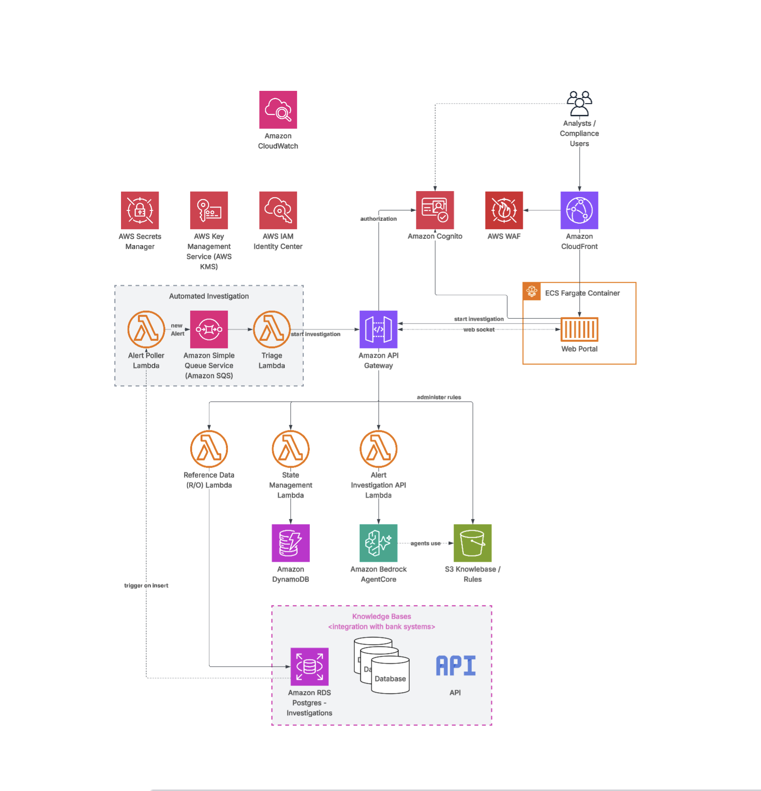

# Market Surveillance Multi-Agent System

AI-powered market surveillance system for detecting and investigating suspicious trading patterns in Fixed Income markets using AWS Bedrock AgentCore.

## Overview

This system provides automated trade alert investigation using specialized AI agents that analyze trading patterns, evaluate regulatory compliance rules, and generate audit-ready disposition reports.

### Key Capabilities

- **Multi-Agent Architecture**: Coordinator orchestrates specialized agents for data discovery, enrichment, and rule evaluation
- **Trade Pattern Detection**: 29 decision tree rules for identifying suspicious trading patterns
- **Configuration-Driven**: All workflows, rules, and schemas loaded from S3 for easy updates
- **Audit Trail**: Complete logging of agent decisions and state transitions
- **Enterprise Security**: Cognito authentication, VPC isolation, encrypted data, read-only database access

## Architecture

The system uses a multi-tier architecture with CloudFront CDN, Next.js web application, and AWS Bedrock AgentCore for AI agent orchestration.




### Key Components

- **Frontend**: Next.js web app on EC2 with ALB, served via CloudFront
- **Agent System**: AWS Bedrock AgentCore Runtime with specialized agents
- **Data Layer**: PostgreSQL (RDS Aurora) with read-only access
- **Storage**: S3 for agent configurations, DynamoDB for conversations
- **Security**: Cognito authentication, VPC isolation, WAF protection

## Project Structure

```
.
├── infrastructure/
│   ├── modules/                 # Shared Terraform module definitions
│   │   ├── agentcore-runtime/   # AgentCore deployment
│   │   ├── agentcore-memory/    # Persistent memory
│   │   ├── agentcore-gateway/   # MCP Gateway for tools
│   │   ├── ec2-webapp/          # Web app hosting
│   │   ├── alb/                 # Load balancer
│   │   ├── cloudfront/          # CDN distribution
│   │   ├── rds/                 # PostgreSQL database
│   │   ├── lambda/              # API functions
│   │   ├── cognito/             # Authentication
│   │   └── ...                  # kms, acm, firewall, etc.
│   │
│   ├── foundations/             # ROOT MODULE 1 — deploys first
│   │   ├── main.tf             # VPC, KMS, RDS, Cognito, ALB, etc.
│   │   ├── networking.tf       # VPC, subnets, security groups
│   │   ├── variables.tf        # Foundation-scoped variables
│   │   ├── outputs.tf          # Exports consumed by app-infra
│   │   ├── terraform.tfvars    # Foundation values
│   │   └── backend.tf          # S3 backend (key: foundations/)
│   │
│   ├── app-infra/            # ROOT MODULE 2 — deploys second
│   │   ├── main.tf             # ECR, Lambda, AgentCore, API GW, etc.
│   │   ├── data.tf             # terraform_remote_state bridge
│   │   ├── variables.tf        # Agent-infra-scoped variables
│   │   ├── outputs.tf          # Agent-infra outputs
│   │   ├── terraform.tfvars    # Agent-infra values
│   │   └── backend.tf          # S3 backend (key: app-infra/)
│   │
│   └── backend.hcl.example     # Template for backend config
│
├── agent-backend/               # Python agent system
│   ├── agents/                  # Agent implementations
│   │   ├── coordinator.py       # Main orchestrator
│   │   ├── data_discovery.py    # Data retrieval
│   │   ├── data_enrichment.py   # Data augmentation
│   │   └── trade_analyst.py     # Trade analyst - rule evaluation
│   ├── configs/                 # Workflow and rule configs
│   └── Dockerfile               # Container image
│
├── trade-alerts-app/            # Next.js frontend
│   ├── app/                     # Pages and API routes
│   ├── lib/                     # Auth and API client
│   └── Dockerfile               # Container image
│
├── seeding_scripts/             # Database seeding pipeline (data gen, CSV loading, schema mgmt)
│
├── docs/
│   └── diagram/                 # Architecture diagrams
│
└── scripts/                     # Deployment utilities
```

## Quick Start

### Prerequisites

- AWS CLI configured with credentials
- Terraform >= 1.0
- [Docker](https://www.docker.com/products/docker-desktop/) (for container builds)
- Node.js >= 18 (for local development)

> **⚠️ One-Time AWS Account Setup: Enable CloudWatch Transaction Search**
>
> Before Bedrock AgentCore can emit traces of agent activity, you must enable **CloudWatch Transaction Search** in the AWS account and region where you're deploying. Per the [AgentCore observability docs](https://docs.aws.amazon.com/bedrock-agentcore/latest/devguide/observability-configure.html): *"To view metrics, spans, and traces generated by the AgentCore service, you first need to complete a one-time setup to turn on Amazon CloudWatch Transaction Search."*
>
> This is a **one-time per-account, per-region setup** — once enabled, all subsequent deployments will work without additional configuration.
>
> **Option A — Enable via the AWS Console (recommended):**
> 1. Open the [CloudWatch console](https://console.aws.amazon.com/cloudwatch/) in the target region.
> 2. In the left navigation, go to **Application Signals (APM)** → **Transaction search**.
> 3. Click **Enable Transaction Search**, check *"Ingest spans as structured logs"*, and **Save**.
>
> **Option B — Enable via the AWS CLI:**
> ```bash
> # 1. Grant X-Ray permission to write spans to CloudWatch Logs
> aws logs put-resource-policy \
>   --policy-name "TransactionSearchXRayAccess" \
>   --policy-document '{
>     "Version": "2012-10-17",
>     "Statement": [{
>       "Sid": "TransactionSearchXRayAccess",
>       "Effect": "Allow",
>       "Principal": { "Service": "xray.amazonaws.com" },
>       "Action": "logs:PutLogEvents",
>       "Resource": [
>         "arn:aws:logs:us-east-1:<ACCOUNT_ID>:log-group:aws/spans:*",
>         "arn:aws:logs:us-east-1:<ACCOUNT_ID>:log-group:/aws/application-signals/data:*"
>       ]
>     }]
>   }'
>
> # 2. Set the trace segment destination to CloudWatch Logs
> aws xray update-trace-segment-destination --destination CloudWatchLogs --region us-east-1
> ```
>
> If you skip this step, deployment will still succeed, but no agent traces will appear in CloudWatch or X-Ray.

### 1. Deploy Infrastructure

The infrastructure is split into two independent Terraform root modules with a one-way dependency flow:

| Stack | Contains | Deploys |
|---|---|---|
| **foundations** | VPC, KMS, RDS, Cognito, ALB, CloudFront, WAF, DynamoDB, Bastion | First |
| **app-infra** | ECR, Lambda, AgentCore, API Gateway, S3 configs, EC2 webapp | Second (reads foundations outputs) |

#### Using Make (Recommended)

```bash
# Deploy full stack (infrastructure + webapp)
make deploy ENV=dev

# Deploy infrastructure only
make deploy-infra ENV=dev

# Deploy foundations only
make deploy-foundations ENV=dev

# Deploy app-infra only (requires foundations)
make deploy-app-infra ENV=dev

# Destroy infrastructure
make destroy ENV=dev
```

#### Using Scripts Directly

The deployment script handles everything automatically — including creating the S3 state bucket and DynamoDB lock table if they don't exist:

```bash
# Deploy full stack (foundations + app-infra)
scripts/deploy-backend.sh --environment dev

# Deploy with auto-approve (no Terraform prompts)
scripts/deploy-backend.sh --environment dev --auto-approve

# Deploy only foundations
scripts/deploy-backend.sh --environment dev --foundation-only

# Deploy only app-infra (foundations must already exist)
scripts/deploy-backend.sh --environment dev --app-infra-only
```

This creates:
- VPC with public/private subnets and NAT Gateway
- EC2 Auto Scaling + ALB for web app
- CloudFront CDN with WAF protection
- AgentCore Runtime with multi-agent system
- AgentCore Memory for persistent context
- AgentCore Gateway for MCP tools
- PostgreSQL database (RDS Aurora)
- DynamoDB tables for conversations
- Lambda functions for API endpoints
- Cognito user pool for authentication
- S3 bucket for agent configurations

### 2. Deploy Web Application

#### Using Make (Recommended)

```bash
# Deploy webapp to dev environment
make deploy-webapp ENV=dev

# Deploy to production
make deploy-webapp ENV=prod
```

#### Using Scripts Directly

```bash
scripts/deploy-webapp-ec2.sh --environment dev
```

This script:
- Builds the Next.js application as a container image for ARM64 (t4g instances)
- Pushes the image to ECR
- Triggers Auto Scaling Group instance refresh to deploy new instances
- Invalidates CloudFront cache

**Advanced deployment options:**

```bash
# Deploy with custom image tag
scripts/deploy-webapp-ec2.sh --environment prod --tag v1.0.0

# Skip build and just update infrastructure
scripts/deploy-webapp-ec2.sh --skip-build

# Skip Terraform operations (build and push only)
scripts/deploy-webapp-ec2.sh --skip-terraform
```

### 3. Create a User

Create a Cognito user that can sign in immediately:

```bash
# Set password and create user
COGNITO_USER_PASSWORD='<your-password' 
scripts/create-cognito-user.sh -e dev -m user@example.com
```

Password must be at least 8 characters and include an uppercase letter, lowercase letter, number, and symbol.

### 4. Update Frontend Environment Variables (For Local Development)

#### Using Make (Recommended)

```bash
make update-env
```

#### Using Script Directly

```bash
scripts/update-frontend-env.sh
```

This script:
- Retrieves latest values from Terraform outputs (Cognito, API Gateway, AgentCore endpoints)
- Updates `trade-alerts-app/.env.local` with current configuration
- Useful for local development after infrastructure redeployment

**Note:** This is only needed for local development. EC2 deployments get environment variables automatically during the container build process.

### 5. Access the Application

```bash
# Get CloudFront URL
terraform -chdir=infrastructure/foundations output cloudfront_domain
```

Visit `https://<cloudfront-domain>` and sign in with Cognito credentials.

### 6. Seeding Data

See [Seeding Scripts Documentation](seeding_scripts/README.md) for complete usage details.

The foundations stack deploys a Bastion host (EC2 instance) that provides secure access to the RDS database for seeding initial data. All `python -m seeding_scripts.*` commands must be run from the project root directory.

#### Connect to the Database

#### Using Make (Recommended)

```bash
make port-forward
```

#### Using Script Directly

```bash
scripts/aurora-port-forward.sh
```

This script:
- Retrieves the Aurora DB endpoint from Terraform outputs
- Establishes an SSM Session Manager tunnel through the Bastion host
- Forwards local port 5940 to the Aurora database port 5432
- Keeps the connection open for database access

#### Set Up the Python Environment

With the port forwarding active, open a new terminal and run:

```bash
cd seeding_scripts
python3 -m venv seeding_env
source seeding_env/bin/activate
pip install -r requirements.txt
cd ..
```

#### Set the Database Credentials

Retrieve the credentials from AWS Secrets Manager:

```bash
export DB_SECRET=$(aws secretsmanager get-secret-value --secret-id market-surveillance-db-dev --query SecretString --output text --region us-east-1)
export DB_PASSWORD=$(echo $DB_SECRET | jq -r '.PASSWORD')
export DB_NAME=$(echo $DB_SECRET | jq -r '.DBNAME')
export DB_USERNAME=$(echo $DB_SECRET | jq -r '.USERNAME')
```

#### Initialize the Database Schema

```bash
python -m seeding_scripts.db_ops.db_init \
    --database $DB_NAME --host localhost --port 5940 --user $DB_USERNAME
```

> **Note:** Use `--recreate` to drop all foreign keys and tables and recreate them from the schema YAML. This is useful after schema changes but will delete all existing data.

#### Generate Synthetic Data

The repo includes pre-existing data in `seeding_scripts/data/` (customer CSVs and eComm synthetic data). Run `data_gen` to process these into `seeding_scripts/synthetic_data/` and generate any additional synthetic records:

```bash
python -m seeding_scripts.data_gen \
    --seed 42 --output-dir ./seeding_scripts/synthetic_data
```

> **Tip:** Use `--seed <new_number>` to produce a different dataset.

> **Note:** eComm synthetic data (`fact_ecomm_synth.csv`) is pre-provided in `seeding_scripts/data/` and is not generated by `data_gen`. It is copied to `synthetic_data/` during generation, and the `database_seeding` module loads it into the `fact_ecomm` table.

#### Load Data into the Database

```bash
python -m seeding_scripts.database_seeding \
    --input-dir ./seeding_scripts/synthetic_data \
    --database $DB_NAME --host localhost --port 5940 --user $DB_USERNAME
```

> **Note:** Use `localhost` and port `5940` since you're connecting through the port forward tunnel.

#### Verify Seeding

Verify the seeded data by checking table row counts:

```bash
python -m seeding_scripts.db_ops.db_verify \
    --database $DB_NAME --host localhost --port 5940 --user $DB_USERNAME --counts
```

### Destroying Infrastructure

#### Using Make (Recommended)

```bash
make destroy ENV=dev
```

This will prompt for confirmation before destroying resources.

#### Using Script Directly

Tear down in reverse dependency order (app-infra first, then foundations):

```bash
scripts/deploy-backend.sh --environment dev --destroy --auto-approve
```

## Configuration

Agent configurations are stored in S3 and loaded at runtime:

- **Orchestrator Config**: Workflow states and transitions
- **Schema Config**: Database table and column metadata
- **Surveillance Rules**: 29 decision tree rules for market surveillance
- **Trade Analyst Config**: Evaluation strategy and thresholds

Update configs in `agent-backend/configs/` and redeploy to apply changes.

## Development


### Local Frontend Development

```bash
cd trade-alerts-app
npm install
npm run dev
```

## Deployment

### Quick Start with Make

```bash
# Show all available commands
make help

# Deploy full stack
make deploy ENV=dev

# Deploy with auto-approve (skip Terraform prompts)
make deploy ENV=dev APPROVE=1

# Deploy infrastructure only
make deploy-infra ENV=dev

# Deploy foundations only
make deploy-foundations ENV=dev APPROVE=1

# Deploy app-infra only
make deploy-app-infra ENV=dev

# Deploy webapp only
make deploy-webapp ENV=dev

# Show Terraform outputs
make outputs

# Destroy infrastructure
make destroy ENV=dev
```

**Note:** Add `APPROVE=1` to any deployment command to skip Terraform approval prompts (e.g., `make deploy-infra APPROVE=1`).

### Deployment Scripts

All deployment scripts are located in the `scripts/` directory:

- **deploy-backend.sh** - Bootstrap state backend, deploy foundations + app-infra
  - Supports `--environment`, `--auto-approve`, `--destroy`, `--foundation-only`, `--app-infra-only`
  - Automatically creates S3 state bucket and DynamoDB lock table if they don't exist
  - Deploys in dependency order (foundations first, then app-infra)
  - Destroys in reverse order (app-infra first, then foundations)

- **deploy-webapp-ec2.sh** - Build and deploy web application using Docker
  - Builds Next.js container for ARM64 architecture
  - Pushes to ECR and triggers Auto Scaling Group instance refresh
  - Invalidates CloudFront cache
  - Supports `--environment`, `--tag`, `--skip-build`, `--skip-terraform`

- **update-frontend-env.sh** - Update frontend environment variables for local development
  - Retrieves latest Terraform outputs (Cognito, API Gateway, AgentCore endpoints)
  - Updates `trade-alerts-app/.env.local` with current configuration
  - Only needed for local development (EC2 deployments get env vars during build)

- **aurora-port-forward.sh** - Establish secure tunnel to Aurora database
  - Sets up SSM Session Manager tunnel through Bastion host
  - Forwards local port 5940 to Aurora database port 5432
  - Required for database seeding and local database access

- **create-cognito-user.sh** - Create a Cognito user that can sign in immediately
  - Creates user with email as username, sets permanent password, bypasses invitation flow
  - Requires `COGNITO_USER_PASSWORD` environment variable
  - Supports `--environment`, `--email`, `--region`

## Security

- **Network Isolation**: 3-tier VPC with public/private subnets and NAT Gateway
- **Authentication**: AWS Cognito with JWT tokens
- **Encryption**: Data encrypted at rest (RDS, DynamoDB, S3) and in transit (TLS)
- **Database Access**: Read-only credentials with query validation
- **Secrets Management**: RDS credentials stored in AWS Secrets Manager
- **VPC Endpoints**: Private access to AWS services (S3, DynamoDB, Secrets Manager)
- **WAF Protection**: CloudFront with AWS WAF for DDoS and bot protection
- **Lambda Provisioned Concurrency**: Always-warm functions with 1GB memory

## Documentation

### Component Documentation
- [Agent Backend README](agent-backend/README.md) - Agent system details
- [Frontend README](trade-alerts-app/README.md) - Web application details
- [Seeding Scripts README](seeding_scripts/README.md) - Database seeding pipeline

## Architecture Decisions

- **AWS Bedrock AgentCore**: Managed runtime for multi-agent orchestration
- **ARM64 (Graviton2)**: t4g instances for ~20% cost savings
- **EC2 + ALB**: Dynamic environment variables and streaming support
- **CloudFront CDN**: Global content delivery with extended timeouts for streaming
- **Secrets Manager**: Automated credential rotation and secure storage
- **Terraform Modules**: Reusable infrastructure components
- **Lambda Provisioned Concurrency**: Eliminates cold starts for API functions