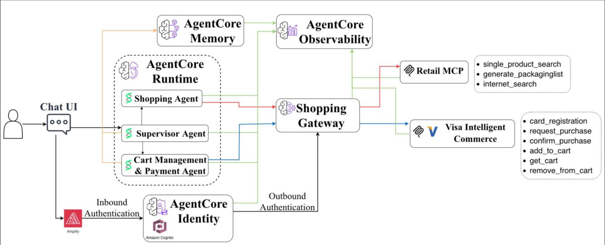

# Agent Infrastructure

CDK infrastructure for deploying the Concierge Agent system with AWS Bedrock AgentCore.

This directory contains three separate CDK applications that deploy the agent infrastructure:

## Infrastructure Components

### 1. MCP Servers (`mcp-servers/`)

Multiple MCP runtime stacks, each with:
- **AgentCore Runtime** - Containerized MCP server with OAuth authentication
- **IAM Role** - Permissions for Bedrock models, CloudWatch, SSM parameters, DynamoDB

**Stacks deployed**:
- **CartStack** - Shopping cart management
- **ShoppingStack** - Product search tools (SerpAPI integration)

### 2. Agent Stack (`agent-stack/`)

Main supervisor agent infrastructure:
- **AgentCore Runtime** - Supervisor agent with JWT authentication
- **Memory Resource** - Conversation persistence (short-term memory)
- **AgentCore Gateway** - MCP protocol gateway connecting to all MCP servers
- **OAuth2 Credential Provider** - Machine-to-machine authentication for gateway
- **IAM Roles** - Permissions for DynamoDB, Bedrock, Memory, Gateway invocation
- **SSM Parameters** - Gateway URL configuration

### 3. Frontend Stack (`frontend-stack/`)

Web UI hosting infrastructure:
- **Amplify Hosting App** - React web UI deployment
- **GitHub Integration** - Automatic builds from repository
- **Environment Variables** - Runtime configuration for agent connection

**Note**: These stacks depend on the Amplify backend (Cognito, DynamoDB) deployed from the project root via `npm run deploy:amplify`.

## Architecture



## Prerequisites

1. **AWS CLI Configured**
   ```bash
   aws configure
   ```

2. **Amplify Backend Deployed** - Must be deployed first from project root:
   ```bash
   npm run deploy:amplify
   ```
   This creates Cognito, DynamoDB, and CloudFormation exports required by these stacks.

3. **Node.js 18+** and npm installed

4. **Docker** installed and running

5. **API Keys Configured** (optional but recommended)
   ```bash
   cd ..
   ./scripts/set-api-keys.sh
   ```

## Deployment

Deploy from the project root using npm scripts:

```bash
# Deploy all infrastructure stacks
cd ..
npm run deploy:mcp       # Deploy MCP servers (~60 sec)
npm run deploy:agent     # Deploy main agent (~4 min)
npm run deploy:frontend  # Deploy web UI (optional, ~3 min)
```

## Project Structure

```
infrastructure/
├── agent-stack/              # Main supervisor agent
│   ├── lib/
│   │   ├── agent-stack.ts    # Main stack definition
│   │   └── constructs/
│   │       └── gateway-construct.ts  # Gateway with MCP targets
│   ├── lambdas/
│   │   └── oauth-provider/   # Custom resource for OAuth setup
│   ├── cdk.json
│   └── package.json
│
├── mcp-servers/              # MCP runtime stacks
│   ├── lib/
│   │   ├── app.ts            # CDK app entry point
│   │   ├── base-mcp-stack.ts # Base class for MCP stacks
│   │   ├── cart-stack.ts     # Cart & payment
│   │   └── shopping-stack.ts # Product search
│   ├── cdk.json
│   └── package.json
│
├── frontend-stack/           # Amplify Hosting
│   ├── lib/
│   │   └── frontend-stack.ts
│   ├── cdk.json
│   └── package.json
│
└── README.md                 # This file
```

## Stack Outputs

### MCP Stacks

Each MCP stack exports:
- `{StackName}-RuntimeArn` - MCP runtime ARN
- `{StackName}-RuntimeId` - MCP runtime ID

Example: `CartStack-shopping-RuntimeArn`

### Agent Stack

- `MainRuntimeArn` - Main agent runtime ARN
- `MainRuntimeId` - Main agent runtime ID
- `MemoryId` - Memory resource ID
- `GatewayUrl` - Gateway URL for MCP connections
- `GatewayId` - Gateway ID
- `GatewayArn` - Gateway ARN
- `OAuthProviderArn` - OAuth provider ARN

### Frontend Stack

- `AmplifyAppId` - Amplify app ID
- `AmplifyAppUrl` - Live application URL

## How It Works

### Cross-Stack Integration

These stacks import resources from the Amplify backend via CloudFormation exports:

```typescript
// Import from Amplify stack
const userPoolId = cdk.Fn.importValue(`ConciergeAgent-${DEPLOYMENT_ID}-Auth-UserPoolId`);
const machineClientId = cdk.Fn.importValue(`ConciergeAgent-${DEPLOYMENT_ID}-Auth-MachineClientId`);
const userProfileTable = cdk.Fn.importValue(`ConciergeAgent-${DEPLOYMENT_ID}-Data-UserProfileTableName`);
```

**Deployment order**:
1. Amplify backend (from project root)
2. MCP servers (imports Cognito config)
3. Agent stack (imports Cognito, DynamoDB, MCP runtime ARNs)
4. Frontend stack (optional)

### Authentication Flow

**User → Agent**:
- Frontend authenticates with Cognito web client
- Calls agent runtime with JWT token
- Agent validates JWT against Cognito

**Agent → Gateway → MCP Servers**:
- Agent requests M2M token from Cognito
- Agent calls gateway with M2M JWT
- Gateway validates JWT and obtains OAuth token
- Gateway calls MCP servers with OAuth token
- MCP servers validate OAuth token

## Configuration

### Deployment ID

All stacks read the deployment ID from `../deployment-config.json`:

```json
{
  "deploymentId": "shopping",
  "description": "Unique identifier for this deployment"
}
```

This allows multiple deployments in the same AWS account.

### Environment Variables

**MCP Servers** automatically receive:
- `AWS_REGION` - Current AWS region
- `USER_PROFILE_TABLE_NAME` - DynamoDB table (CartStack only)
- `WISHLIST_TABLE_NAME` - DynamoDB table (CartStack only)

**Agent Stack** automatically receives:
- `MEMORY_ID` - Memory resource ID
- `USER_PROFILE_TABLE_NAME` - DynamoDB table name
- `WISHLIST_TABLE_NAME` - DynamoDB table name
- `FEEDBACK_TABLE_NAME` - DynamoDB table name
- `DEPLOYMENT_ID` - Deployment identifier
- `GATEWAY_CLIENT_ID` - Cognito machine client ID
- `GATEWAY_USER_POOL_ID` - Cognito user pool ID
- `GATEWAY_SCOPE` - OAuth scope

Gateway URL is stored in SSM Parameter Store at `/concierge-agent/{DEPLOYMENT_ID}/gateway-url`.

## Updating Infrastructure

### Update Agent Code

```bash
npm run deploy:agent
```

Rebuilds and deploys the supervisor agent container.

### Update MCP Server Code

```bash
npm run deploy:mcp
```

Rebuilds and deploys all MCP server containers.

### Update Frontend

```bash
npm run deploy:frontend
```

Deploys latest web UI code to Amplify Hosting.

## Troubleshooting

### CloudFormation Export Not Found

**Error**: `Export ConciergeAgent-shopping-Auth-UserPoolId not found`

**Solution**: Deploy Amplify backend first from project root:

```bash
cd .. && npm run deploy:amplify
```

Verify exports:

```bash
aws cloudformation list-exports --query "Exports[?contains(Name, 'ConciergeAgent')]"
```

### Docker Build Failures

**Solutions**:
- Ensure Docker is running: `docker ps`
- Check Dockerfile in `../concierge_agent/*/`
- Verify `requirements.txt` dependencies
- Check ECR permissions

### Gateway Connection Errors

**Solutions**:

1. Verify gateway URL in SSM:
   ```bash
   aws ssm get-parameter --name /concierge-agent/shopping/gateway-url
   ```

2. Enable gateway debug logging:
   ```bash
   aws bedrock-agentcore-control update-gateway \
     --gateway-identifier <GATEWAY_ID> \
     --exception-level DEBUG
   ```

### MCP Authentication Failures

**Solutions**:
- Verify OAuth provider exists
- Check M2M client scopes in Cognito
- Ensure MCP servers use correct client ID

### Agent Stack Deployment Fails

**Error**: `Cannot import MCP runtime ARN`

**Solution**: Ensure MCP stacks are deployed first:

```bash
npm run deploy:mcp
```

Verify MCP exports:

```bash
aws cloudformation list-exports --query "Exports[?contains(Name, 'RuntimeArn')]"
```

## Cleanup

Remove infrastructure from project root:

```bash
cd ..
npm run clean:frontend  # Delete Amplify Hosting
npm run clean:agent     # Delete agent stack
npm run clean:mcp       # Delete MCP stacks
```

**Note**: Some resources may require manual deletion:
- CloudWatch log groups
- SSM parameters
- Secrets Manager secrets

## Additional Resources

- [AWS CDK Documentation](https://docs.aws.amazon.com/cdk/)
- [Bedrock AgentCore Documentation](https://docs.aws.amazon.com/bedrock-agentcore/)
- [Main Project README](../README.md)
- [Deployment Guide](../DEPLOYMENT.md)
