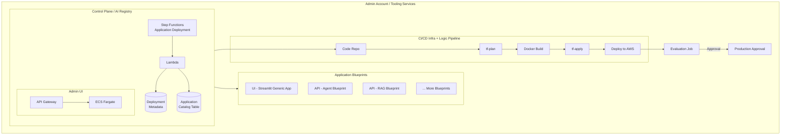

# Platform

The platform layer provides tooling services for deploying, managing, and operating AI agent applications on AWS.

---

## Architecture

The platform runs in an admin account and provides centralized services for the agent application lifecycle — from template selection through deployment, evaluation, and approval.



---

## Components

### Control Plane (Available)

The control plane is the central hub for browsing, configuring, and deploying agent applications.

| Component | Description |
|-----------|-------------|
| [Backend](control_plane/backend/) | FastAPI API — template catalog, bootstrap engine, deployment orchestration |
| [Frontend](control_plane/frontend/) | React + TypeScript UI for browsing and deploying templates |
| [Infrastructure](control_plane/infrastructure/) | Terraform modules for the full control plane stack |
| [Templates](control_plane/templates/) | Starter blueprints for agent applications |

**AWS Services:**
- API Gateway — HTTP API with VPC Link
- ECS Fargate — containerized backend with auto-scaling
- DynamoDB — application catalog and deployment metadata
- S3 — project archives and frontend static hosting
- Step Functions — deployment orchestration state machine
- CloudFront — CDN for frontend distribution
- Cognito — user authentication and authorization
- ECR — container registry for backend images
- CloudWatch — logs, metrics, alarms, dashboards

**Starter templates:**

| Template | Description |
|----------|-------------|
| Tool-Calling Agent | Single agent with tool use on EC2 |
| RAG Application | Retrieval-augmented generation with knowledge base |
| Strands AgentCore | Strands agent deployed to Bedrock AgentCore |
| LangGraph AgentCore | LangGraph agent deployed to Bedrock AgentCore |
| Multi-Agent Orchestration | Multi-agent workflow with orchestrator pattern |

### CI/CD Pipeline (Coming Soon)

Automated infrastructure and application deployment pipeline.

- Code repository integration (CodeCommit, GitHub, GitLab)
- Terraform plan and apply stages
- Docker image build and push
- Automated deployment to target environments

### Evaluation (Coming Soon)

Agent performance testing and quality benchmarks.

- Automated evaluation jobs post-deployment
- Quality scoring and regression detection
- Approval gates for production promotion

### Observability (Coming Soon)

Monitoring, tracing, and dashboards for agent systems.

- Agent invocation metrics and latency tracking
- Distributed tracing across multi-agent workflows
- Operational dashboards and alerting

### Environment Management (Coming Soon)

Multi-environment provisioning and promotion.

- Dev, staging, production environment isolation
- Promotion workflows with approval gates
- Environment-specific configuration management

---

## Quick Start

### Deploy the Control Plane

```bash
cd control_plane/infrastructure

# Configure
cp .env.example .env
# Edit .env with your AWS configuration

# Deploy
./deploy.sh
```

### Access the UI

After deployment, the frontend is available via the CloudFront distribution URL output by Terraform.

---

## Related

- [Applications](../applications/) — Multi-agent use cases deployed through the platform
- [FSI Foundry](../applications/fsi_foundry/) — POC implementations on shared foundations
- [Strategy](../strategy/) — Executive AI strategy frameworks
