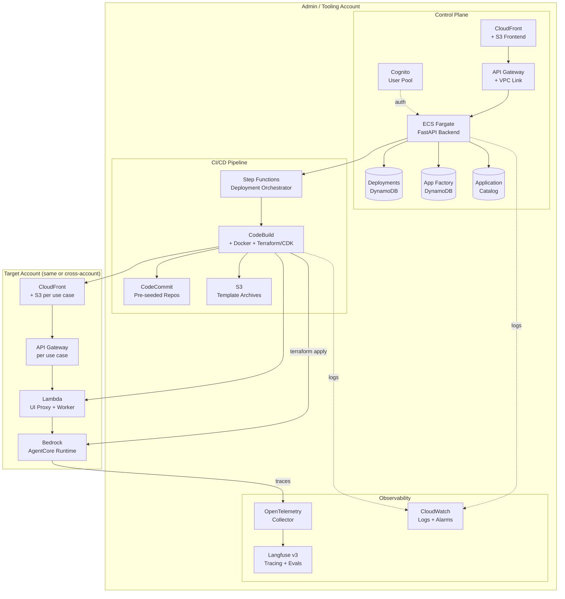

# Platform

The platform layer is the unified tooling surface that operators use to deploy, manage, observe, and govern AI agent applications on AWS. It fronts a CI/CD pipeline, a catalog of starter templates, a per-use-case deploy history, and managed AgentCore runtimes — all accessible from one web UI.

---

## Architecture

The platform runs in an admin (tooling) account and orchestrates deployments into the same account or into separate target accounts via cross-account role assumption.



---

## Components

### Control Plane

The React + FastAPI web UI for browsing, deploying, testing, and managing every agent application.

| Component | Description |
|-----------|-------------|
| [Backend](control_plane/backend/) | FastAPI API — template catalog, deployment orchestration, App Factory code generation, per-use-case Langfuse project provisioning |
| [Frontend](control_plane/frontend/) | React + TypeScript UI — template catalog, FSI Foundry catalog, App Factory questionnaire, deployment history, per-deployment logs + outputs, Observability iframe |
| [Infrastructure](control_plane/infrastructure/) | Terraform modules — full control plane stack with ECS/API Gateway/CloudFront/Cognito/CodeBuild/Step Functions/DynamoDB |
| [Templates](control_plane/templates/) | Eight starter blueprints operators can deploy from the UI |
| [AaaS Registry](control_plane/aaas/frontier_agents.json) | Catalog of Amazon-managed Frontier Agents (AWS DevOps Agent, Security Agent, Kiro) that deploy into the operator's account |

**Starter templates:**

| Template | Pattern | Description |
|----------|---------|-------------|
| Foundation Stack | Foundation | **Langfuse deployment** — provisions the Langfuse v3 observability server (plus required networking) that every other template and use case sends traces to. Deploy once per account/region; accessible afterwards from the Observability tab. |
| Strands AgentCore | Managed Runtime | Strands agent deployed to Bedrock AgentCore |
| LangGraph AgentCore | Managed Runtime | LangGraph agent deployed to Bedrock AgentCore |
| Tool-Calling Agent | Single Agent | Agent with dynamic tool invocation |
| RAG Application | Retrieval | Retrieval-augmented generation with vector search |
| Multi-Agent Orchestration | Multi-Agent | Orchestrator pattern with specialized sub-agents |

### CI/CD Pipeline

Every deployment initiated from the UI flows through the same pipeline.

| Stage | What happens |
|-------|--------------|
| Packaging | Backend zips the template (Quick Deploy) or reads CodeCommit (Deploy from Git), uploads artifact to S3 |
| Orchestration | Step Functions execution invokes CodeBuild with the packaged source and per-deployment parameters |
| Infrastructure | CodeBuild runs `terraform apply` (or `cdk deploy`) — provisions AgentCore runtime, UI Lambda proxy, CloudFront, per-use-case API Gateway |
| Image build | Docker image for the agent is built and pushed to ECR, then consumed by AgentCore runtime |
| UI build | React frontend is built with runtime config (API endpoint, Cognito IDs) injected and synced to the per-use-case S3 bucket |
| Outputs capture | CodeBuild writes deployment outputs (UI URL, API endpoint, Cognito pool, etc.) back to the control plane's DynamoDB so the UI can surface them |

Supports two source paths: **Quick Deploy (S3 archive)** for business users and **Deploy from Git (CodeCommit)** for developers who want to customize source before deploying. Cross-account deployments are supported via an assumable IAM role.

### Observability

First-class Langfuse + OpenTelemetry integration.

- The **Foundation Stack** starter template provisions Langfuse v3 on ECS Fargate with managed PostgreSQL (Aurora), Redis (ElastiCache), and ClickHouse — along with the networking required to support it. It is the sole Langfuse deployment path and must be deployed once per account/region before any use case wants tracing.
- When a use case is deployed on top of a live Foundation Stack, the control plane auto-provisions a **per-use-case Langfuse project** (e.g. `fsi-kyc_banking`), stores its API keys in Secrets Manager, and injects the keys into the AgentCore runtime as env vars.
- The Observability tab in the control plane embeds the Langfuse UI directly (iframe), so operators can inspect traces without switching tools.
- CloudWatch Logs capture ECS + CodeBuild + Lambda output; alarms fire on ECS CPU/memory and Step Functions failures.

### App Factory

Declarative app generation. Operators answer a guided questionnaire (problem, users, data inputs/outputs, compliance), and the pipeline uses Claude Code (via Bedrock) to generate agents, sample data, IaC, and a UI — then deploys the whole thing to AgentCore. Same CodeBuild pipeline as every other deployment.

### Agent-as-a-Service

Managed agent space for Amazon's Frontier Agents. Operators deploy AWS DevOps Agent, AWS Security Agent, or Kiro into their own AWS account with one click; the control plane provisions the Agent Space, operator IAM role, and primary-account association. Status and operator sign-in link surface on the deployment detail page.

### Evaluation *(Coming Soon)*

Automated agent performance testing and quality benchmarks. Post-deployment evaluation jobs with quality scoring, regression detection, and approval gates for production promotion.

### Environment Management *(Coming Soon)*

Multi-environment provisioning and promotion — dev, staging, production isolation with promotion workflows and approval gates.

---

## Quick Start

### Deploy the Control Plane

```bash
cd control_plane/infrastructure/scripts

# One-time credential setup
cp ../.env.example ../.env
# Edit ../.env with your AWS account + region

# Full deploy (infra + backend image + frontend build + Cognito user)
./deploy-full.sh
```

### Seed the Git Deploy Path *(optional)*

```bash
cd control_plane/infrastructure/scripts
./seed-codecommit.sh init   # creates one CodeCommit repo per FSI Foundry use case
```

### Access the UI

After deployment, the frontend URL is printed in the Terraform outputs (or surfaces as `frontend_url`). Sign in with the Cognito admin user created by the deploy script, then start deploying templates, use cases, or agent applications from the UI.

---

## Related

- [Applications](../applications/) — Multi-agent use cases deployed through the platform
- [FSI Foundry](../applications/fsi_foundry/) — 34 POC implementations on shared foundations
- [Reference Implementations](../applications/reference_implementations/) — Full-stack reference apps (Market Surveillance, Shopping Concierge, Case Management, Agent Safety)
- [App Factory](../applications/app_factory/) — Blueprint-driven app generation
- [Plan](../plan/) — Executive AI strategy frameworks
