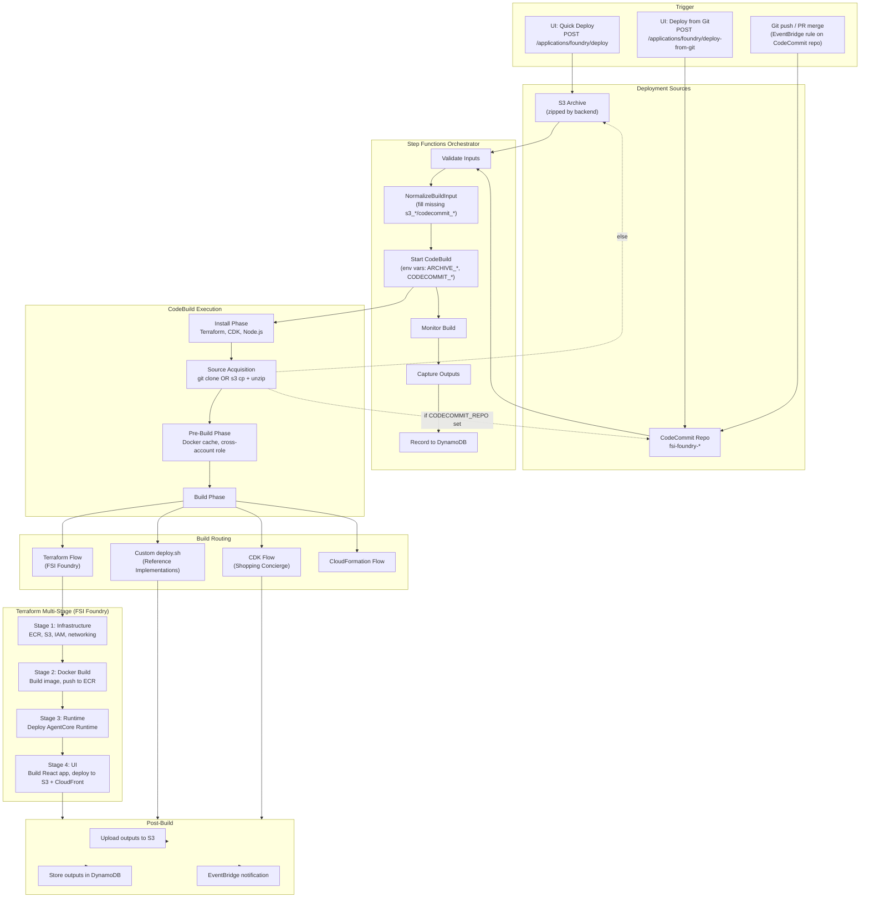
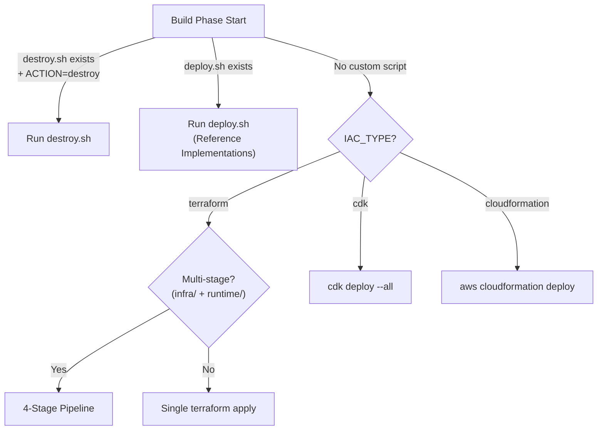
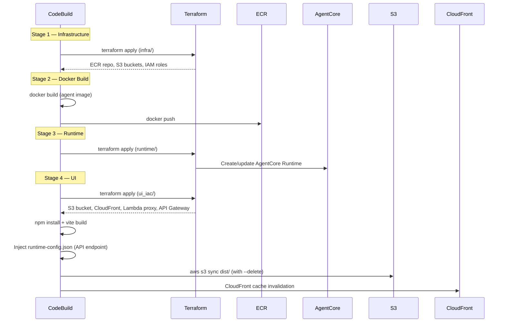

# AVA CI/CD Pipeline Architecture

The AVA platform uses AWS CodeBuild orchestrated by Step Functions to automate the full deployment lifecycle for agent applications.

## Pipeline Overview



## Build Phases

### Install Phase

Installs tools required for deployment:

- **Terraform** >= 1.5.7 (ARM64)
- **AWS CDK** + TypeScript
- **Node.js** 22+ (upgraded at runtime if needed for Vite 8)
- **jq** for JSON processing

### Source Acquisition Phase

Runs before the main build. Detects which source type the Step Functions input supplied and populates `/tmp/workspace` accordingly:

```bash
if [ -n "$CODECOMMIT_REPO" ] && [ -n "$CODECOMMIT_BRANCH" ]; then
  # Git path — clone from CodeCommit
  git config --global credential.helper '!aws codecommit credential-helper $@'
  git config --global credential.UseHttpPath true
  REPO_URL=$(aws codecommit get-repository --repository-name "$CODECOMMIT_REPO" \
    --query 'repositoryMetadata.cloneUrlHttp' --output text)
  git clone --depth 1 --branch "$CODECOMMIT_BRANCH" "$REPO_URL" /tmp/workspace
elif [ -n "$ARCHIVE_BUCKET" ] && [ -n "$ARCHIVE_KEY" ]; then
  # S3 path — download + unzip archive
  aws s3 cp "s3://$ARCHIVE_BUCKET/$ARCHIVE_KEY" /tmp/template.zip
  unzip -o /tmp/template.zip -d /tmp/workspace
else
  echo "ERROR: No valid source specified (neither CodeCommit nor S3 archive)"
  exit 1
fi
```

CodeCommit takes precedence when both sets of variables are present. The Step Functions `NormalizeBuildInput` state guarantees all four variables are always defined — empty strings when not in use — so the `-n` checks work reliably.

### Pre-Build Phase

After source acquisition, prepares the build environment:

1. **Docker cache** — Pre-pulls base images from ECR to avoid Docker Hub rate limits
2. **Cross-account support** — Assumes target IAM role if `TARGET_ROLE_ARN` is set
3. **Output merger** — Writes a Python script to merge outputs from multiple Terraform stages

### Build Phase — Routing

The build phase routes to the appropriate deployment strategy:



### Terraform Multi-Stage Pipeline (FSI Foundry)



### Post-Build Phase

1. Outputs uploaded to `s3://{state-bucket}/{deployment-id}/outputs.json`
2. Outputs stored in DynamoDB `deployments` table
3. EventBridge event emitted for lifecycle tracking

## Error Handling

| Stage | Guard | Behavior |
|-------|-------|----------|
| Step Functions input | `NormalizeBuildInput` Pass state injects empty defaults via `States.JsonMerge` | Keeps `InvokeCodeBuild` JSONPath lookups from failing when a caller only sets the S3 *or* the CodeCommit fields |
| Source acquisition | `if [ -n "$CODECOMMIT_REPO" ]…elif [ -n "$ARCHIVE_BUCKET" ]…else exit 1` | Fails fast with "No valid source specified" if both source sets are empty |
| Git clone | `git clone --depth 1 --branch` exit code | Non-zero exit propagates through `set -e` and fails the phase |
| S3 download | `aws s3 cp` exit code | Non-zero exit fails the phase |
| Docker build | `\|\| { echo "ERROR"; exit 1; }` | Fails build immediately |
| Terraform apply | `\|\| { echo "ERROR"; exit 1; }` | Fails build immediately |
| UI build (npm) | `\|\| { echo "ERROR"; exit 1; }` | Prevents empty S3 sync |
| UI dist check | `if [ ! -f dist/index.html ]` | Prevents deploying empty build |
| Stage 4 gating | `if [ -d ui_iac ] && [ -d ui ]` | Skips UI stage when the bundle doesn't include a frontend |
| deploy.sh | Exit code check | Captures error in outputs |

## Environment Variables

| Variable | Source | Description |
|----------|--------|-------------|
| `DEPLOYMENT_ID` | Backend API | Unique deployment identifier |
| `TEMPLATE_ID` | Backend API | Template or use case identifier |
| `USE_CASE_ID` | Backend API | FSI Foundry use case name |
| `FRAMEWORK` | Backend API | `langchain_langgraph` or `strands` |
| `IAC_TYPE` | Backend API | `terraform`, `cdk`, or `cloudformation` |
| `AWS_TARGET_REGION` | Backend API | Target AWS region |
| `ARCHIVE_BUCKET` | Backend API (Quick Deploy) | S3 bucket containing deployment zip; empty string for Git path |
| `ARCHIVE_KEY` | Backend API (Quick Deploy) | S3 key for deployment zip; empty string for Git path |
| `CODECOMMIT_REPO` | Backend API (Deploy from Git) | CodeCommit repository name (e.g. `fsi-foundry-fraud_detection`); empty string for S3 path |
| `CODECOMMIT_BRANCH` | Backend API (Deploy from Git) | Branch to clone (defaults to `main`); empty string for S3 path |
| `ACTION` | Backend API | `deploy` or `destroy` |
| `STATE_BUCKET` | Infrastructure | Terraform remote state bucket |
| `LOCK_TABLE` | Infrastructure | DynamoDB lock table for Terraform |
| `DEPLOYMENTS_TABLE` | Infrastructure | DynamoDB table for deployment metadata |

All four source fields (`ARCHIVE_*` + `CODECOMMIT_*`) are always passed to CodeBuild. Step Functions' `NormalizeBuildInput` fills in empty strings for whichever pair the caller didn't set, so the source-acquisition script can reliably use `-n` checks to decide which path to take.

## Infrastructure

The CodeBuild project is provisioned via Terraform:

- **Compute**: ARM64 (`BUILD_GENERAL1_LARGE`), Linux container
- **Timeout**: 60 minutes
- **Logging**: CloudWatch Logs (14-day retention)
- **Permissions**: IAM role with S3, ECR, DynamoDB, Terraform, CloudFormation, Bedrock, Lambda, CloudFront access. Also `codecommit:GitPull` + `codecommit:GetRepository` so Stage 0 can clone any `fsi-foundry-*` repo. The ECS task role that runs the backend API gets `codecommit:ListRepositories` + `codecommit:GetRepository` so `GET /api/v1/codecommit/repositories` can enumerate seeded repos for the UI
- **Buildspec**: Inline (managed via Terraform `file()` function); source-acquisition prelude selects Git vs S3 based on env vars
