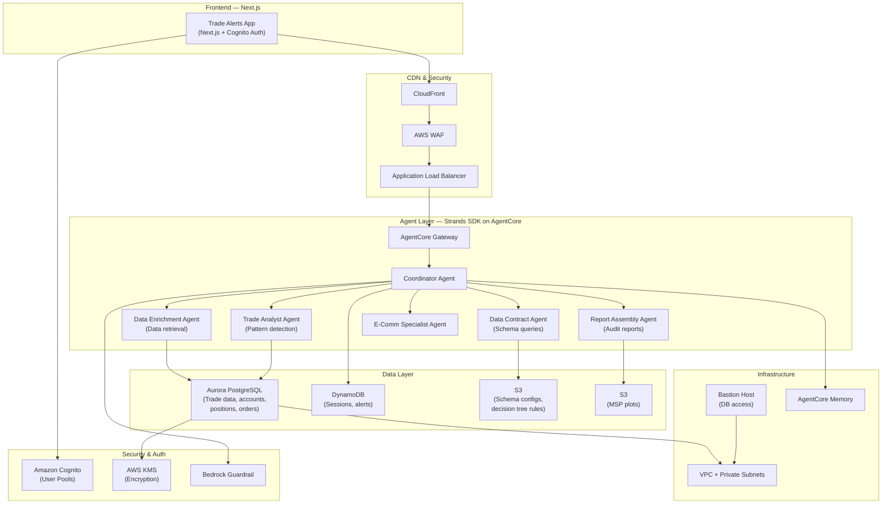
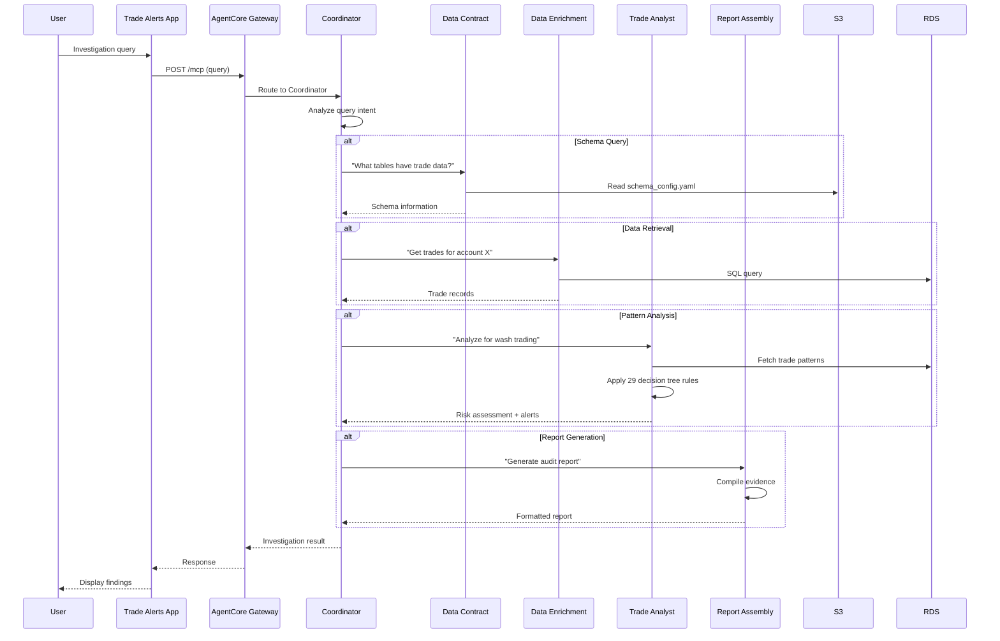

# Market Surveillance Architecture

An AI-powered surveillance system for detecting and investigating suspicious trading patterns in Fixed Income markets using multi-agent orchestration on AWS Bedrock AgentCore.

## System Architecture

## Multi-Agent Coordination

The system uses a **coordinator pattern** where a central agent routes queries to specialized sub-agents:

## Agents

| Agent | Role | Data Sources |
|-------|------|-------------|
| **Coordinator** | Routes queries, manages workflow, maintains conversation | DynamoDB, AgentCore Memory |
| **Data Contract** | Answers schema questions, maps table relationships | S3 schema config (YAML) |
| **Data Enrichment** | Retrieves and joins trade data from database | Aurora PostgreSQL |
| **Trade Analyst** | Detects suspicious patterns using 29 decision tree rules | Aurora PostgreSQL |
| **Report Assembly** | Compiles audit-ready investigation reports | S3 (plots and evidence) |
| **E-Comm Specialist** | Analyzes electronic communication patterns | Aurora PostgreSQL |

## Infrastructure Modules

The Terraform infrastructure is split into **foundations** (deployed once) and **app-infra** (per-deployment):

| Module | Layer | Purpose |
|--------|-------|---------|
| `cognito` | Foundations | User authentication and authorization |
| `rds` | Foundations | Aurora PostgreSQL for trade data |
| `kms` | Foundations | Encryption keys |
| `ecr` | Foundations | Container registry |
| `s3-agent-configs` | Foundations | Schema configs and decision tree rules |
| `s3-msp-plots` | Foundations | Generated surveillance plots |
| `foundations-output-params` | Foundations | SSM parameters for cross-stack references |
| `agentcore-runtime` | App Infra | Bedrock AgentCore runtime for agents |
| `agentcore-gateway` | App Infra | AgentCore Gateway endpoint |
| `agentcore-memory` | App Infra | Agent conversation memory |
| `bedrock-guardrail` | App Infra | Content filtering and safety |
| `ec2-webapp` | App Infra | Next.js frontend hosting |
| `cloudfront` | App Infra | CDN distribution |
| `alb` | App Infra | Application load balancer |
| `api-gateway` | App Infra | HTTP API |
| `firewall` | App Infra | AWS WAF rules |
| `lambda` | App Infra | Data seeding and utilities |
| `dynamodb` | App Infra | Session and alert storage |
| `bastion` | App Infra | Secure database access |
| `parameters` | App Infra | Runtime configuration |

## Technology Stack

| Component | Technology |
|-----------|-----------|
| **Frontend** | Next.js, React, TypeScript, Tailwind CSS |
| **Agent Framework** | Strands Agents SDK |
| **Agent Hosting** | AWS Bedrock AgentCore (Runtime + Gateway + Memory) |
| **Database** | Amazon Aurora PostgreSQL |
| **Auth** | Amazon Cognito |
| **CDN** | Amazon CloudFront + WAF |
| **IaC** | Terraform (multi-module) |
| **Container** | Docker on ECR |
| **Safety** | Bedrock Guardrails |
