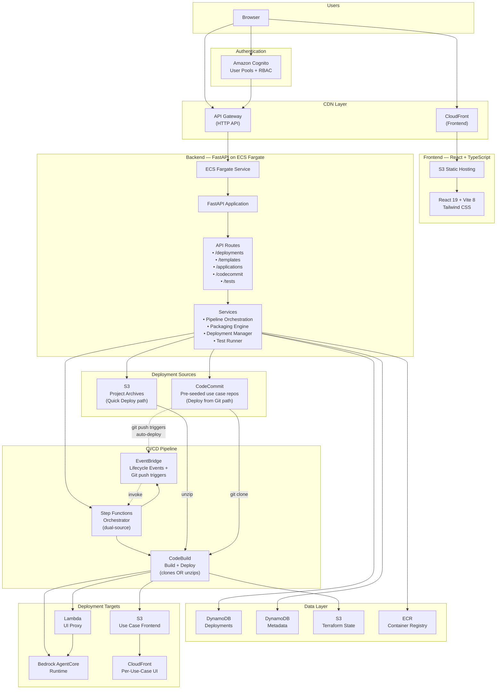
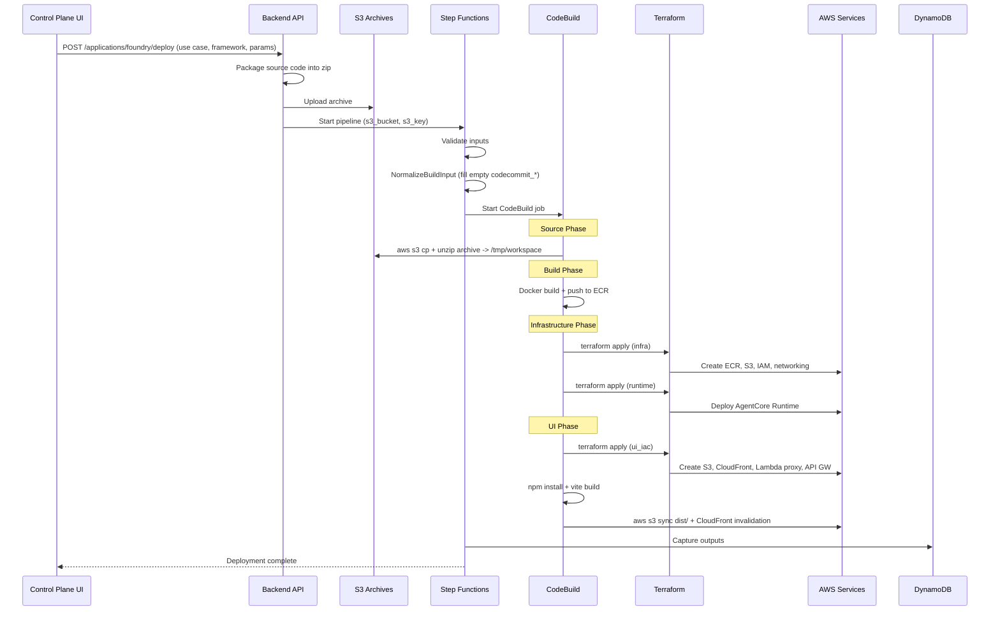
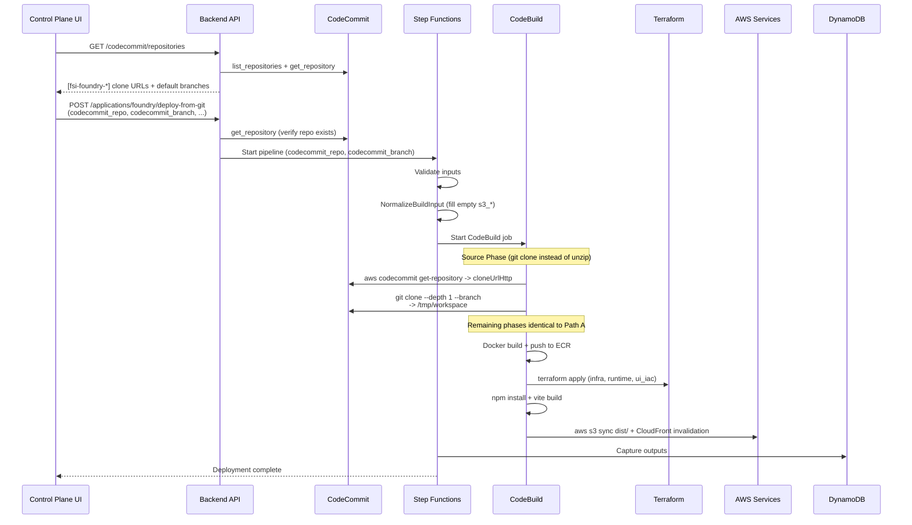
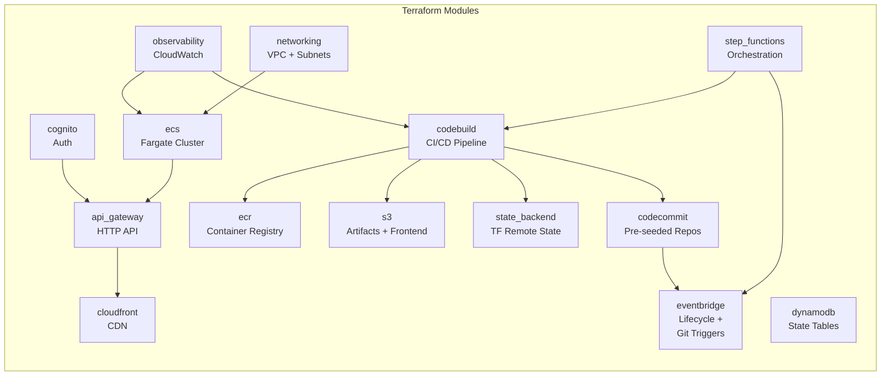
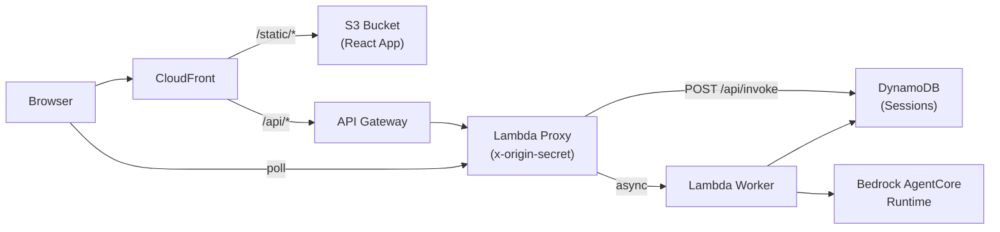

# AVA Platform Architecture

The AVA Control Plane is the central management layer for deploying, operating, and testing AI agent applications on AWS.

## System Architecture

## Deployment Pipeline

The pipeline is **dual-source** — the same Step Functions / CodeBuild stages run whether the user picked "Quick Deploy (S3)" or "Deploy from Git (CodeCommit)" in the UI. Only the source-acquisition step differs.

### Path A — Quick Deploy (S3)

### Path B — Deploy from Git (CodeCommit)

**Auto-deploy on git push** — EventBridge rules on each seeded CodeCommit repo can also trigger Step Functions automatically when a push lands on `main` or a PR is merged, so developers who clone and modify a repo can just `git push` to redeploy.

## Component Details

### Frontend

| Technology | Purpose |
|------------|---------|
| React 19 | UI framework |
| TypeScript | Type safety |
| Vite 8 | Build tooling |
| Tailwind CSS 4 | Styling |
| React Router 7 | Client-side routing |
| Axios | API client |
| Amazon Cognito | Authentication + RBAC |

**Key pages:** Template Catalog, FSI Foundry Use Cases, Reference Implementations, Deployment Detail (with logs, test drawer, pipeline visualization), Documentation

### Backend

| Technology | Purpose |
|------------|---------|
| FastAPI | REST API framework |
| Python 3.11 | Runtime |
| ECS Fargate | Container hosting |
| Pydantic | Request/response validation |
| Boto3 | AWS SDK for Python |

**Key services:**
- **Pipeline Service** — Orchestrates Step Functions execution for deployments (both S3 and CodeCommit sources)
- **Packaging Service** — Zips use case source, IaC, UI, Docker, and sample data into deployment archives (S3 path)
- **CodeCommit Service** — Lists pre-seeded `fsi-foundry-*` repositories and validates selections for the Git deploy path
- **Deployment Manager** — CRUD for deployment lifecycle, status tracking, output capture
- **Test Runner** — Invokes AgentCore runtimes and polls for async results

### Infrastructure (Terraform)

### Per-Use-Case UI Architecture

Each FSI Foundry use case gets its own isolated frontend deployment:

## AWS Services Used

| Service | Role |
|---------|------|
| **ECS Fargate** | Backend API hosting with auto-scaling |
| **API Gateway** | HTTP API with VPC Link for private integration |
| **CloudFront** | CDN for frontend + per-use-case UIs |
| **S3** | Static hosting, artifacts, Terraform state |
| **DynamoDB** | Deployment state, metadata, session tracking |
| **Cognito** | User authentication with RBAC (admin/viewer) |
| **CodeBuild** | CI/CD build execution in isolated containers (dual-source: S3 archive or Git clone) |
| **CodeCommit** | Pre-seeded `fsi-foundry-*` repositories for the "Deploy from Git" path |
| **Step Functions** | Deployment pipeline orchestration (source-agnostic after input normalization) |
| **EventBridge** | Deployment lifecycle events with DLQ + Git push / PR-merge triggers per repo |
| **ECR** | Docker image registry |
| **Lambda** | Per-use-case UI proxy and async worker |
| **Bedrock AgentCore** | Managed agent runtime hosting |
| **CloudWatch** | Logs, metrics, alarms, dashboards |
