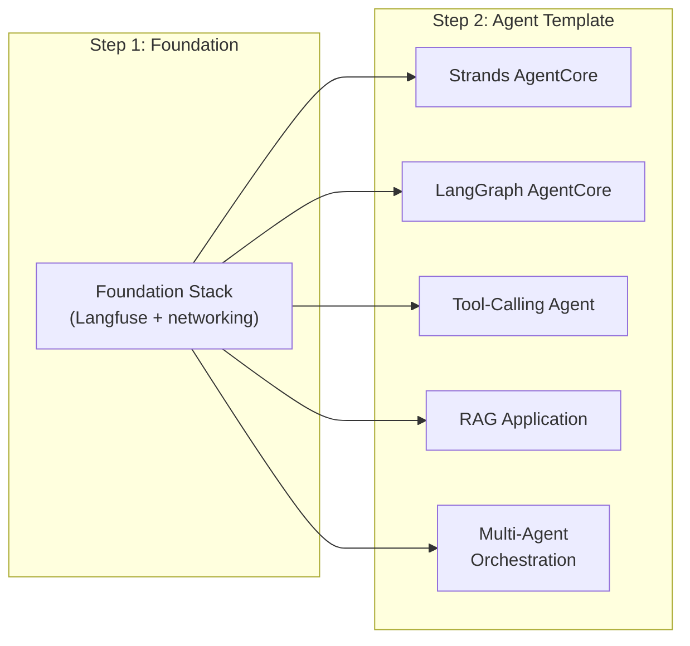

# AVA Starter Templates

The AVA Control Plane includes 6 deployable starter templates that provide pre-configured infrastructure and application patterns for building AI agent systems on AWS. Templates are deployed directly from the Control Plane UI with one click.

## How Templates Work

1. Browse templates in the **Control Plane UI** under Templates
2. Click **Deploy** and configure parameters (project name, region, etc.)
3. The CI/CD pipeline provisions all infrastructure via Terraform/CDK
4. Your agent application is ready to use

Templates are organized into two categories:

- **Foundation Template** — Shared infrastructure deployed once per account/region (Langfuse observability)
- **Agent Templates** — Application patterns that consume the foundation

---

## Foundation Template

The Foundation Stack is the sole Langfuse deployment path. Deploy it first, once per account/region.

| Template | Description | Deploy Order |
|----------|-------------|:------------:|
| [**Foundation Stack**](foundation-stack.md) | **Langfuse deployment** — provisions the Langfuse v3 observability server (plus required networking) that every other template and use case sends traces to. Accessible afterwards from the Observability tab. | 1st |

---

## Agent Templates

Agent templates deploy application patterns on top of the Foundation Stack.

| Template | Framework | Description |
|----------|-----------|-------------|
| [**Strands AgentCore**](strands-agentcore.md) | Strands Agents SDK | Single agent on Bedrock AgentCore with Langfuse observability |
| [**LangGraph AgentCore**](langgraph-agentcore.md) | LangGraph / LangChain | Single agent on Bedrock AgentCore with Langfuse observability |
| [**Tool-Calling Agent**](tool-calling-agent.md) | Framework-agnostic | Agent with dynamic tool invocation, registration, and error handling |
| [**RAG Application**](rag-application.md) | Framework-agnostic | Retrieval-augmented generation with vector search and knowledge base |
| [**Multi-Agent Orchestration**](multi-agent-orchestration.md) | Framework-agnostic | Orchestrator pattern with configurable number of specialized sub-agents |

---

## Deployment Flow

---

## Common Parameters

All templates share these parameters:

| Parameter | Required | Description |
|-----------|:--------:|-------------|
| `project_name` | Yes | Unique name for the deployment (used in resource naming) |
| `aws_region` | Yes | Target AWS region |

Agent templates additionally accept (auto-injected by the control plane when a Foundation Stack is live):

| Parameter | Required | Description |
|-----------|:--------:|-------------|
| `langfuse_host` | No | Langfuse server URL (from Foundation Stack) |
| `langfuse_secret_name` | No | AWS Secrets Manager secret with Langfuse API keys |
| `llm_model` | No | Bedrock model ID (defaults to Claude Sonnet) |
