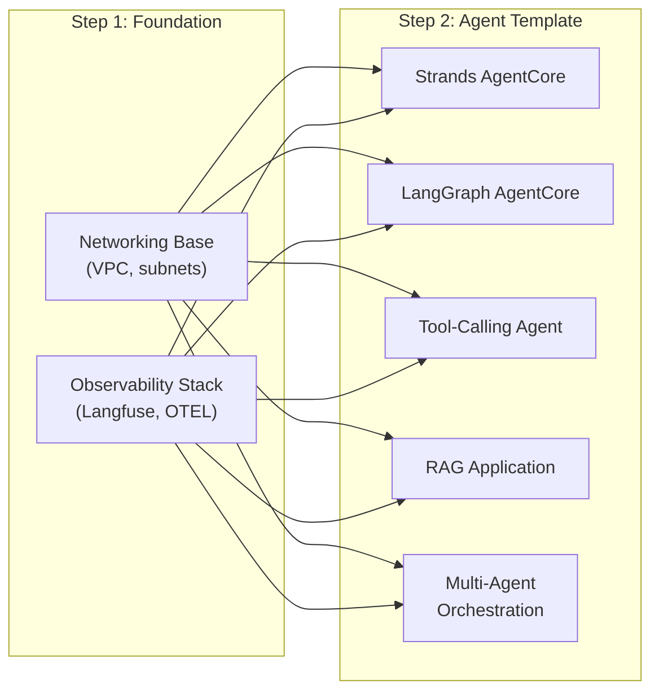

# AVA Starter Templates

The AVA Control Plane includes 8 deployable starter templates that provide pre-configured infrastructure and application patterns for building AI agent systems on AWS. Templates are deployed directly from the Control Plane UI with one click.

## How Templates Work

1. Browse templates in the **Control Plane UI** under Templates
2. Click **Deploy** and configure parameters (project name, region, etc.)
3. The CI/CD pipeline provisions all infrastructure via Terraform/CDK
4. Your agent application is ready to use

Templates are organized into two categories:

- **Foundation Templates** — Shared infrastructure deployed once per account/region (networking, observability)
- **Agent Templates** — Application patterns that build on top of foundations

---

## Foundation Templates

Foundation templates provide shared infrastructure that agent templates consume. Deploy these first.

| Template | Description | Deploy Order |
|----------|-------------|:------------:|
| [**Observability Stack**](observability-stack.md) | Langfuse v3 + OpenTelemetry for agent tracing, monitoring, and prompt management | 1st |
| [**Foundation Stack**](foundation-stack.md) | Combined networking + observability in a single deployment | 1st (alternative) |
| [**Networking Base**](networking-base.md) | VPC, private subnets, and security groups | 1st (minimal) |

> **Tip:** Use **Foundation Stack** for the simplest setup — it combines networking and observability in one deployment. Use individual templates if you need more control.

---

## Agent Templates

Agent templates deploy application patterns on top of foundation infrastructure.

| Template | Framework | Description |
|----------|-----------|-------------|
| [**Strands AgentCore**](strands-agentcore.md) | Strands Agents SDK | Single agent on Bedrock AgentCore with Langfuse observability |
| [**LangGraph AgentCore**](langgraph-agentcore.md) | LangGraph / LangChain | Single agent on Bedrock AgentCore with Langfuse observability |
| [**Tool-Calling Agent**](tool-calling-agent.md) | Framework-agnostic | Agent with dynamic tool invocation, registration, and error handling |
| [**RAG Application**](rag-application.md) | Framework-agnostic | Retrieval-augmented generation with vector search and knowledge base |
| [**Multi-Agent Orchestration**](multi-agent-orchestration.md) | Framework-agnostic | Orchestrator pattern with configurable number of specialized sub-agents |

---

## Deployment Flow

---

## Common Parameters

All templates share these parameters:

| Parameter | Required | Description |
|-----------|:--------:|-------------|
| `project_name` | Yes | Unique name for the deployment (used in resource naming) |
| `aws_region` | Yes | Target AWS region |

Agent templates additionally accept:

| Parameter | Required | Description |
|-----------|:--------:|-------------|
| `langfuse_host` | No | Langfuse server URL (from Observability Stack) |
| `langfuse_secret_name` | No | AWS Secrets Manager secret with Langfuse API keys |
| `llm_model` | No | Bedrock model ID (defaults to Claude Sonnet) |
