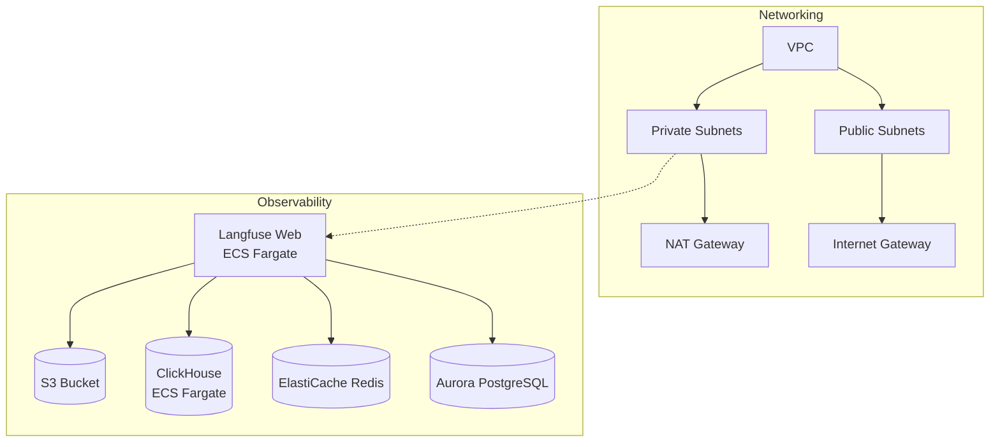

# Foundation Stack

**Combined networking and observability foundation for all agent deployments**

## Overview

The Foundation Stack combines networking infrastructure (VPC, subnets, security groups) with Langfuse observability in a single deployment. This all-in-one foundation template eliminates the need to deploy networking-base and observability-stack separately. Deploy once per AWS account/region, and all agent use cases consume these shared resources.

## Architecture

**Foundation Components:**
- **VPC**: Isolated network with public/private subnet architecture
- **Security Groups**: Pre-configured for agent workloads
- **Langfuse**: Full observability stack (web, worker, databases)
- **Network Auto-Injection**: Exports VPC IDs and subnet IDs for agent templates

## Parameters

| Name | Required | Default | Description |
|------|----------|---------|-------------|
| `project_name` | Yes | `foundation` | Project name for resource tagging |
| `aws_region` | No | `us-east-1` | AWS region for deployment |
| `vpc_cidr` | No | `10.0.0.0/16` | VPC CIDR block for network isolation |
| `environment` | No | `dev` | Deployment environment (dev/staging/prod) |
| `langfuse_admin_email` | Yes | - | Email for Langfuse admin user |
| `langfuse_admin_password` | Yes | - | Password for Langfuse admin user |
| `existing_vpc_id` | No | - | Use an existing VPC (leave empty to create new) |

## Deployment

Deploy this template from the Control Plane UI:

1. Navigate to **Templates** → **Foundation Templates**
2. Select **Foundation Stack**
3. Choose deployment pattern: **Langfuse on ECS** (recommended)
4. Set required parameters: `langfuse_admin_email` and `langfuse_admin_password`
5. Click **Deploy**

The deployment creates:
- VPC with public and private subnets across 2 AZs
- Internet Gateway and NAT Gateway
- Security groups for ALB, Langfuse, and databases
- Langfuse observability stack on ECS Fargate
- Aurora PostgreSQL, ElastiCache Redis, ClickHouse, and S3

## Outputs

After deployment, use these outputs when deploying agent templates:

- `vpc_id`: VPC identifier
- `private_subnet_ids`: Private subnet IDs for agent workloads
- `security_group_id`: Default security group
- `langfuse_host`: Langfuse server URL
- `langfuse_secret_name`: Secrets Manager secret with API keys

## Links

- [View template source](../../../platform/control_plane/templates/foundation-stack/template.json)
- [Back to Templates Overview](README.md)
