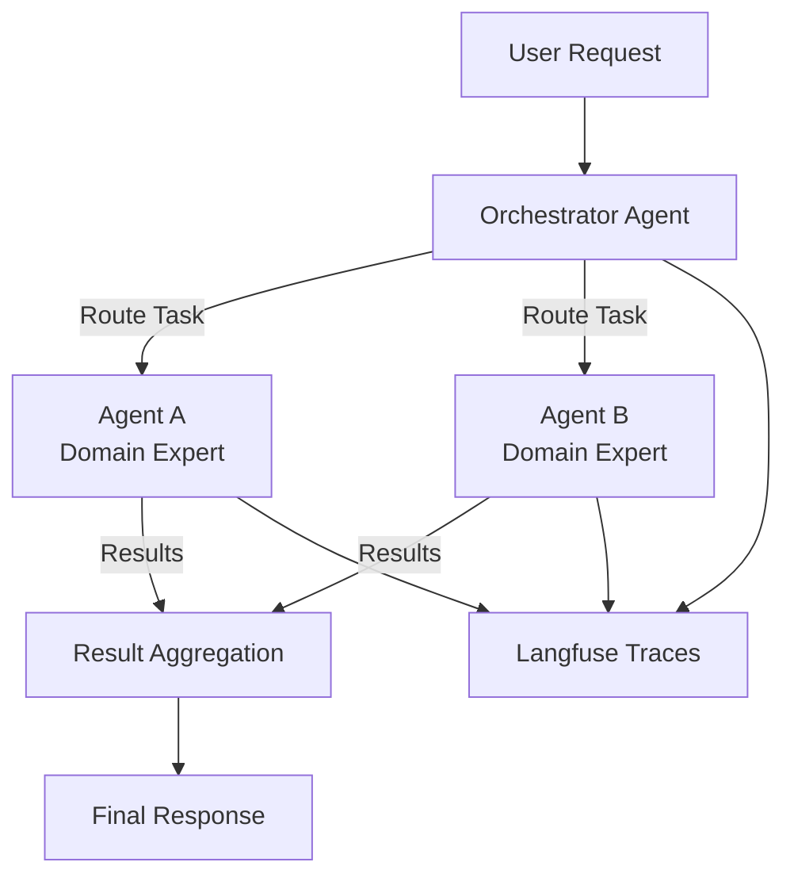

# Multi-Agent Orchestration

**Orchestrator pattern with specialized agents collaborating on complex tasks**


## Overview

The Multi-Agent Orchestration template implements a system where specialized agents collaborate under an orchestrator to solve complex tasks. Each agent focuses on a specific domain (e.g., credit analysis, compliance checking), and the orchestrator routes tasks, aggregates results, and manages the workflow.

**Ideal for**: KYC analysis, multi-step compliance workflows, document processing pipelines, collaborative decision-making

## Architecture



**Orchestration Patterns:**
- **Sequential**: Agent A → Agent B (dependencies)
- **Parallel**: Agent A || Agent B → Aggregate (independent tasks)
- **Conditional**: Route based on task type or intermediate results

## Parameters

| Name | Required | Default | Description |
|------|----------|---------|-------------|
| `project_name` | Yes | - | Project name for resource naming |
| `aws_region` | No | `us-east-1` | AWS region for deployment |
| `num_agents` | No | `2` | Number of specialized agents (2-5 recommended) |
| `langfuse_host` | Yes | - | Langfuse server URL (from observability-stack) |
| `langfuse_secret_name` | Yes | - | Secrets Manager secret with Langfuse API keys |
| `llm_model` | No | `anthropic.claude-3-5-sonnet-20241022-v2:0` | Bedrock model for all agents |

## Deployment

Deploy this template from the Control Plane UI:

1. Navigate to **Templates** → **Agent Patterns**
2. Select **Multi-Agent Orchestration**
3. Choose framework: **LangGraph** (recommended)
4. Set required parameters: `project_name`, `langfuse_host`, `langfuse_secret_name`
5. Click **Deploy**

The deployment creates:
- ECS Fargate service with orchestrator and agent containers
- Application Load Balancer for API access
- IAM roles for Bedrock access
- Shared state store (DynamoDB or Redis)
- Langfuse integration for multi-agent tracing

## Customization

Define agent responsibilities in `src/langraph/agents/`:

**Agent A** (`agent_a.py`): Customize for your first domain (e.g., credit analysis, document extraction).

**Agent B** (`agent_b.py`): Customize for your second domain (e.g., compliance checking, risk assessment).

Configure orchestration strategy in `src/langraph/orchestrator.py`:

```python
# Sequential workflow
result_a = agent_a.execute(task)
result_b = agent_b.execute(result_a)

# Parallel workflow
results = await asyncio.gather(
    agent_a.execute(task),
    agent_b.execute(task)
)

# Conditional routing
if task_type == "credit":
    return agent_a.execute(task)
else:
    return agent_b.execute(task)
```

## Example Use Cases

Inspired by the FSI Kit KYC Banking application:

1. **KYC Analysis**: Credit Analyst agent + Compliance Officer agent + Orchestrator
2. **Document Processing**: Extraction agent + Validation agent + Storage agent
3. **Customer Support**: Routing agent + Product Specialist agents
4. **Research Pipeline**: Data Collection agent + Analysis agent + Report Generation agent

## Monitoring

View multi-agent traces in Langfuse:
- End-to-end orchestration flow
- Individual agent performance
- Task routing decisions
- Result aggregation logic
- Agent collaboration patterns

## Links

- [View template source](../../../platform/control_plane/templates/multi-agent-orchestration/README.md)
- [Back to Templates Overview](README.md)
