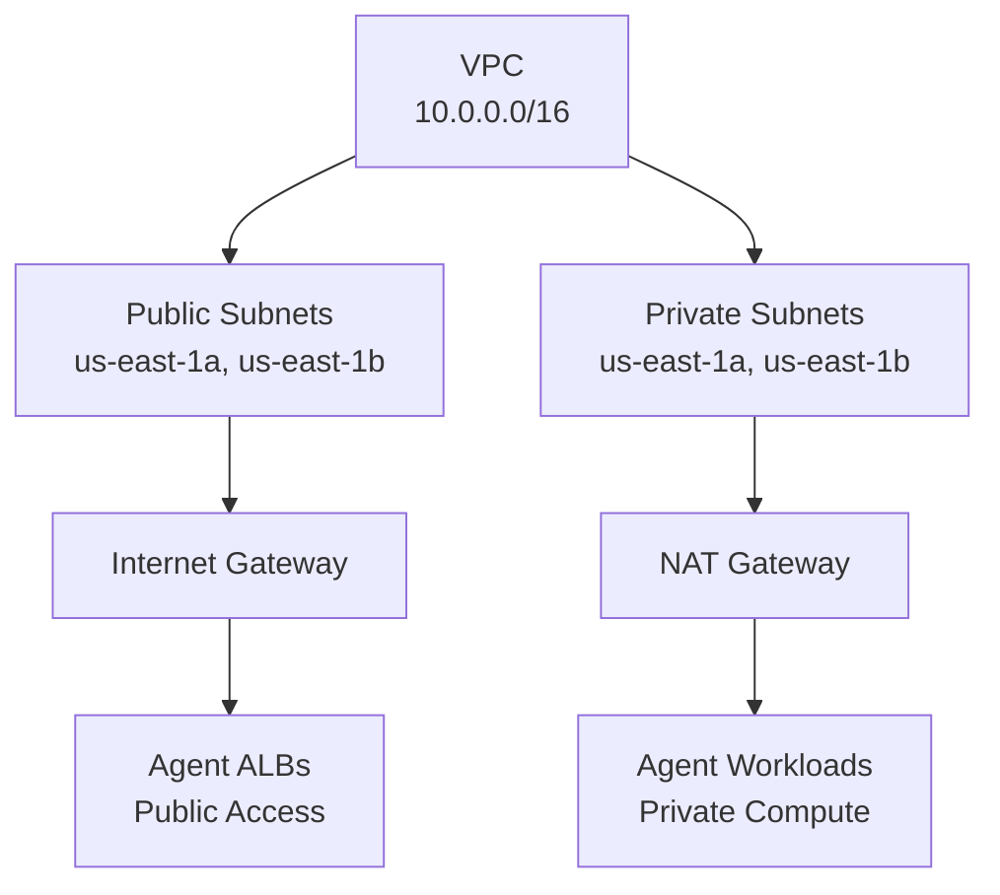

# Networking Base

**VPC, subnets, and security groups for secure agent deployments**

## Overview

The Networking Base template provides isolated network infrastructure for agent workloads. It creates a VPC with public and private subnets, Internet Gateway, NAT Gateway, and security groups. Deploy this foundation first, then connect agent use cases to the shared network.

This is a lightweight alternative to the full Foundation Stack when you only need networking without bundled observability.

## Architecture

**Network Components:**
- **Public Subnets**: For Application Load Balancers and ingress
- **Private Subnets**: For agent compute (ECS, Lambda, Fargate)
- **Internet Gateway**: Outbound internet access for public subnets
- **NAT Gateway**: Outbound internet access for private subnets (pulling images, API calls)

## Parameters

| Name | Required | Default | Description |
|------|----------|---------|-------------|
| `project_name` | Yes | `networking-base` | Project name for resource tagging |
| `aws_region` | No | `us-east-1` | AWS region for deployment |
| `vpc_cidr` | No | `10.0.0.0/16` | VPC CIDR block (adjust for peering or hybrid cloud) |

## Deployment

Deploy this template from the Control Plane UI:

1. Navigate to **Templates** → **Foundation Templates**
2. Select **Networking Base**
3. Configure parameters (all have defaults)
4. Click **Deploy**

The deployment creates:
- VPC with public and private subnets across 2 Availability Zones
- Internet Gateway for public subnet internet access
- NAT Gateway for private subnet outbound access
- Route tables and subnet associations
- Default security group

## Outputs

After deployment, use these outputs when deploying agent templates:

- `vpc_id`: VPC identifier
- `private_subnet_ids`: Comma-separated private subnet IDs
- `public_subnet_ids`: Comma-separated public subnet IDs
- `security_group_id`: Default security group ID

The template automatically writes `network.auto.tfvars.json` files into observability-stack and agent template directories for seamless integration.

## Links

- [View template source](../../../platform/control_plane/templates/networking-base/README.md)
- [Back to Templates Overview](README.md)
