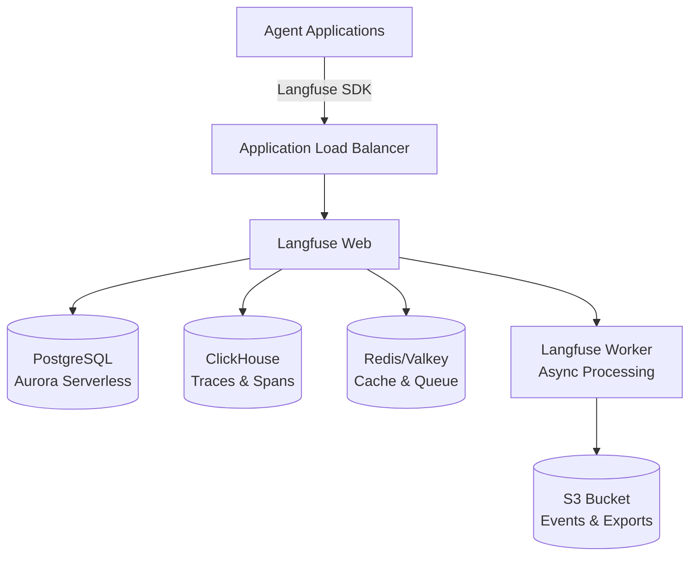

# Observability Stack

**Langfuse v3 with OpenTelemetry for agent tracing, monitoring, and evaluation**


## Overview

The Observability Stack provides comprehensive tracing and monitoring for all agent workloads. Built on Langfuse v3, it captures LLM calls, spans, traces, and metrics from any agent framework via OpenTelemetry. Deploy once per region and connect all your agent use cases.

## Architecture



**Key Components:**
- **Langfuse Web**: UI and API on ECS Fargate (port 3000)
- **PostgreSQL**: Aurora Serverless v2 for metadata storage
- **ClickHouse**: High-performance trace and span storage on ECS Fargate
- **Redis**: ElastiCache Valkey for caching and job queues
- **S3**: Storage for exports, events, and media

## Parameters

| Name | Required | Default | Description |
|------|----------|---------|-------------|
| `project_name` | Yes | `langfuse` | Project name for resource tagging |
| `aws_region` | No | `us-east-1` | AWS region for deployment |
| `langfuse_version` | No | `latest` | Langfuse version to deploy |
| `environment` | No | `dev` | Deployment environment (dev/staging/prod) |
| `langfuse_cpu` | No | `2048` | CPU units for Langfuse tasks |
| `langfuse_memory` | No | `4096` | Memory (MB) for Langfuse tasks |
| `postgres_min_capacity` | No | `0.5` | Aurora minimum ACU |
| `postgres_max_capacity` | No | `2.0` | Aurora maximum ACU |

## Deployment

Deploy this template from the Control Plane UI:

1. Navigate to **Templates** → **Foundation Templates**
2. Select **Observability Stack**
3. Choose deployment pattern: **ECS Fargate** (recommended)
4. Configure parameters (all have defaults)
5. Click **Deploy**

Access Langfuse at the `langfuse_host` output URL after 2-3 minutes (initial DB migrations).

**Default credentials**: `admin@langfuse.local` / `Password123!`

Override credentials by setting `langfuse_init_user_email` and `langfuse_init_user_password` parameters.

## Connecting Agents

Retrieve API keys from AWS Secrets Manager:

```bash
aws secretsmanager get-secret-value \
  --secret-id langfuse-secrets \
  --query SecretString --output text
```

Configure agents with the Langfuse host and API keys. All LangGraph, Strands, and custom agents support Langfuse integration.

## Links

- [View template source](../../../platform/control_plane/templates/observability-stack/README.md)
- [Back to Templates Overview](README.md)
