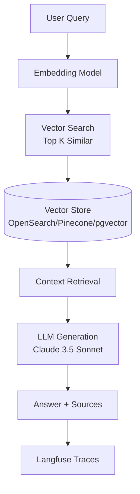

# RAG Application

**Retrieval Augmented Generation with vector search for knowledge-based AI**


## Overview

The RAG Application template provides a complete Retrieval Augmented Generation system for building knowledge-based AI applications. Ingest documents, generate embeddings, store in a vector database, and query with LLM-generated answers grounded in your knowledge base.

**Ideal for**: Customer support, documentation Q&A, research assistants, legal case retrieval, technical documentation

## Architecture



**RAG Pipeline:**
1. User submits query
2. Query is embedded using the same embedding model
3. Vector search retrieves top K similar documents
4. Retrieved context is passed to LLM
5. LLM generates grounded answer with citations
6. Full pipeline traced in Langfuse

## Parameters

| Name | Required | Default | Description |
|------|----------|---------|-------------|
| `project_name` | Yes | - | Project name for resource naming |
| `aws_region` | No | `us-east-1` | AWS region for deployment |
| `vector_store` | No | `opensearch` | Vector store (opensearch, pinecone, pgvector) |
| `embedding_model` | No | `amazon.titan-embed-text-v2:0` | Bedrock embedding model |
| `chunk_size` | No | `1000` | Document chunk size (characters) |
| `langfuse_host` | Yes | - | Langfuse server URL (from observability-stack) |
| `langfuse_secret_name` | Yes | - | Secrets Manager secret with Langfuse API keys |
| `llm_model` | No | `anthropic.claude-3-5-sonnet-20241022-v2:0` | Bedrock model for generation |

## Deployment

Deploy this template from the Control Plane UI:

1. Navigate to **Templates** → **Agent Patterns**
2. Select **RAG Application**
3. Choose vector store: **OpenSearch** (recommended) or **Pinecone** or **pgvector**
4. Set required parameters: `project_name`, `langfuse_host`, `langfuse_secret_name`
5. Click **Deploy**

The deployment creates:
- Vector store (OpenSearch domain or PostgreSQL with pgvector)
- ECS Fargate service for RAG pipeline
- Application Load Balancer for API access
- S3 bucket for document storage
- Langfuse integration for RAG tracing

## Document Ingestion

After deployment, ingest documents:

```bash
python -m src.ingestion.ingest_docs --source ./data/documents/
```

Supported formats: PDF, TXT, Markdown, DOCX, HTML, CSV

## Querying

Query the RAG system via API:

```bash
curl -X POST http://<alb-dns>/api/query \
  -H "Content-Type: application/json" \
  -d '{"query": "What is the return policy?"}'
```

Response includes generated answer and source citations.

## Customization

**Chunk Strategy**: Adjust `chunk_size` and `chunk_overlap` in configuration for your document type.

**Retrieval**: Modify similarity threshold, implement hybrid search, or add reranking in `src/retrieval/retriever.py`.

**Generation Prompts**: Customize prompts in `src/generation/generator.py` for citation formatting and response style.

## Monitoring

View RAG performance in Langfuse:
- Query latency per stage (embedding, retrieval, generation)
- Retrieval quality (number of documents, similarity scores)
- Token usage and cost per query
- User feedback and evaluation metrics

## Links

- [View template source](../../../platform/control_plane/templates/rag-application/README.md)
- [Back to Templates Overview](README.md)
