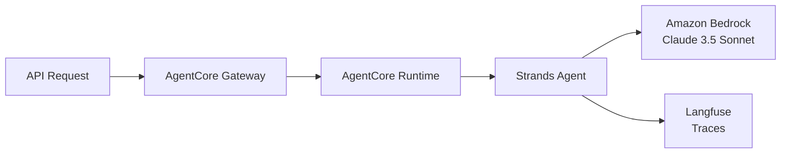

# Strands AgentCore

**Action-based agent on AWS Bedrock AgentCore with Langfuse observability**


## Overview

The Strands AgentCore template deploys action-based agents using the Strands SDK. Strands provides a simple action-oriented framework for building agents with explicit workflows. This template demonstrates deploying a Strands agent on AWS Bedrock AgentCore runtime with built-in Langfuse tracing.

**Ideal for**: Task-driven workflows, step-by-step execution, explicit control flow

## Architecture



**AgentCore Components:**
- **Gateway**: API Gateway for agent invocations
- **Runtime**: Managed container runtime for agent code
- **Strands Agent**: Action-based agent logic
- **Bedrock**: LLM inference (Claude 3.5 Sonnet)
- **Langfuse**: OpenTelemetry-based observability

## Parameters

| Name | Required | Default | Description |
|------|----------|---------|-------------|
| `project_name` | Yes | - | Project name for resource naming |
| `aws_region` | No | `us-east-1` | AWS region for deployment |
| `langfuse_host` | Yes | - | Langfuse server URL (from observability-stack) |
| `langfuse_secret_name` | Yes | - | Secrets Manager secret with Langfuse API keys |
| `llm_model` | No | `anthropic.claude-3-5-sonnet-20241022-v2:0` | Bedrock model ID |

## Deployment

Deploy this template from the Control Plane UI:

1. Navigate to **Templates** → **Agent Patterns**
2. Select **Strands AgentCore**
3. Choose framework: **Strands SDK**
4. Set required parameters: `project_name`, `langfuse_host`, `langfuse_secret_name`
5. Click **Deploy**

The deployment creates:
- AgentCore Gateway with HTTPS endpoint
- AgentCore Runtime with IAM role for Bedrock access
- ECR repository and container image
- Langfuse OpenTelemetry integration

## Testing

Invoke the agent via the AgentCore Gateway:

```bash
curl -X POST https://<gateway-endpoint>/invoke \
  -H "Content-Type: application/json" \
  -d '{"user_input": "Hello, how are you?"}'
```

View traces in the Langfuse dashboard at your `langfuse_host` URL.

## Customization

Extend the agent with custom actions in `src/hello_agent.py`:

```python
class MyCustomAction(Action):
    def __init__(self):
        super().__init__(
            name="my_action",
            description="My custom action"
        )

    def execute(self, context: Context, **kwargs) -> str:
        # Your logic here
        return "result"
```

## Links

- [View template source](../../../platform/control_plane/templates/strands-agentcore/README.md)
- [Back to Templates Overview](README.md)
