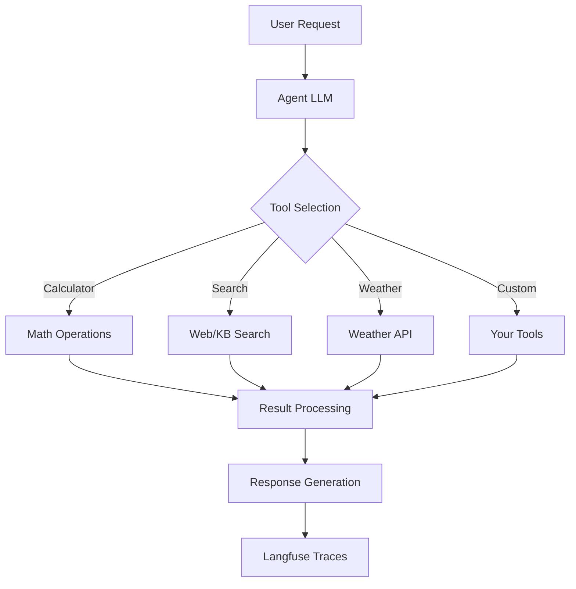

# Tool-Calling Agent

**Dynamic tool invocation agent for multi-step workflows**


## Overview

The Tool-Calling Agent template enables AI agents to dynamically discover, select, and invoke external tools to accomplish tasks. Agents can chain multiple tool calls together, handle errors gracefully, and return structured results. This pattern is ideal for agents that need to interact with external systems, APIs, databases, or perform calculations.

**Ideal for**: API integrations, data retrieval, calculations, multi-step workflows, external system interactions

## Architecture



**Tool Calling Flow:**
1. Agent analyzes user request
2. Selects appropriate tools from registry
3. Extracts parameters for tool invocation
4. Executes tools with error handling
5. Processes results and generates response

## Parameters

| Name | Required | Default | Description |
|------|----------|---------|-------------|
| `project_name` | Yes | - | Project name for resource naming |
| `aws_region` | No | `us-east-1` | AWS region for deployment |
| `llm_model` | No | `anthropic.claude-3-5-sonnet-20241022-v2:0` | Bedrock model ID for tool selection |
| `langfuse_host` | Yes | - | Langfuse server URL (from observability-stack) |
| `langfuse_secret_name` | Yes | - | Secrets Manager secret with Langfuse API keys |
| `max_iterations` | No | `10` | Maximum tool invocations per request |

## Deployment

Deploy this template from the Control Plane UI:

1. Navigate to **Templates** → **Agent Patterns**
2. Select **Tool-Calling Agent**
3. Choose framework: **LangGraph** (recommended) or **Strands**
4. Set required parameters: `project_name`, `langfuse_host`, `langfuse_secret_name`
5. Click **Deploy**

The deployment creates:
- ECS Fargate service with agent container
- Application Load Balancer for API access
- IAM roles for Bedrock and tool access
- Langfuse integration for tool call tracing

## Example Tools Included

The template includes mock implementations for common tool types:

- **Calculator**: Mathematical calculations
- **Search**: Web or knowledge base search (mock)
- **Weather**: Weather information retrieval (mock)
- **Timer**: Set reminders and timers (mock)

**Note**: Replace mock implementations with real API integrations.

## Adding Custom Tools

Define new tools in `src/<framework>/tools.py`:

```python
@tool
def my_custom_tool(param1: str, param2: int) -> str:
    """
    Clear description of what this tool does.
    
    Args:
        param1: Description of parameter 1
        param2: Description of parameter 2
    
    Returns:
        Description of return value
    """
    # TODO: Implement your tool logic
    result = perform_operation(param1, param2)
    return result
```

Register the tool with the agent:

```python
tools = [calculator, search, weather, my_custom_tool]
agent = create_tool_calling_agent(llm, tools)
```

## Testing

Test the agent with a tool-calling query:

```bash
curl -X POST http://<alb-dns>/api/agent/invoke \
  -H "Content-Type: application/json" \
  -d '{"query": "What is 15 * 23?", "max_iterations": 5}'
```

View tool invocation traces in Langfuse to debug tool selection and parameter extraction.

## Links

- [View template source](../../../platform/control_plane/templates/tool-calling-agent/README.md)
- [Back to Templates Overview](README.md)
