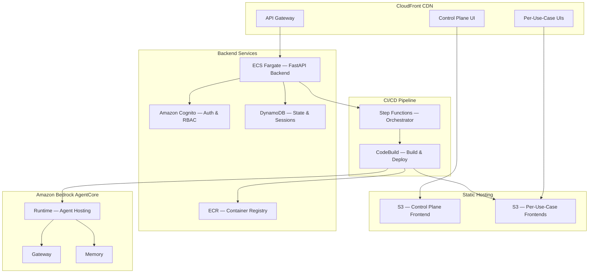

# AVA — Well-Architected Review

## Agentic Value Accelerator (AVA) — AWS Well-Architected Framework Alignment

This document describes how the AVA platform aligns with the [AWS Well-Architected Framework](https://aws.amazon.com/architecture/well-architected/) across all six pillars, with specific consideration for the [Financial Services Industry (FSI) Lens](https://docs.aws.amazon.com/wellarchitected/latest/financial-services-industry-lens/financial-services-industry-lens.html).

### Solution Overview

AVA is an open-source platform for building, deploying, and managing AI agents for financial services on AWS. The platform consists of:

- **Control Plane** — React frontend, FastAPI backend on ECS Fargate, Terraform infrastructure
- **FSI Foundry** — 34 multi-agent use cases deployed to Amazon Bedrock AgentCore
- **CI/CD Pipeline** — CodeBuild-based automated deployment with Step Functions orchestration
- **Per-Use-Case Frontend UIs** — 34 React applications served via CloudFront + S3
- **Observability** — Langfuse integration for agent tracing and monitoring

### Architecture Diagram

## Pillar 1: Operational Excellence

The Operational Excellence pillar focuses on running and monitoring systems to deliver business value and continually improve processes and procedures.

### Infrastructure as Code

All AVA infrastructure is defined and managed through Terraform:

- **Control Plane Infrastructure** — 13 Terraform modules covering ECS, API Gateway, DynamoDB, S3, CloudFront, Cognito, ECR, CodeBuild, Step Functions, EventBridge, networking, observability, and state backend
- **Per-Use-Case Infrastructure** — Each FSI Foundry deployment provisions isolated resources (AgentCore Runtime, S3 bucket, CloudFront distribution, Lambda proxy, API Gateway) via Terraform applied in CodeBuild
- **Remote State Management** — Terraform state stored in S3 with DynamoDB locking, ensuring consistent state across deployments and preventing concurrent modification conflicts
- **Workspace Isolation** — Each use case/framework combination gets its own Terraform workspace (`{USE_CASE_ID}-{FRAMEWORK_SHORT}-{AWS_REGION}`), enabling independent lifecycle management

### CI/CD Pipeline

AVA implements a fully automated deployment pipeline:

- **Step Functions Orchestration** — Deployment lifecycle managed by AWS Step Functions with states for validation, packaging, building, monitoring, output capture, and recording
- **CodeBuild Execution** — Multi-stage buildspec handles infrastructure provisioning, Docker image building, AgentCore runtime deployment, and frontend UI deployment in a single pipeline run
- **Build Error Handling** — Pipeline includes validation gates: `npm run build || { echo "ERROR"; exit 1; }` and `if [ ! -f dist/index.html ]; then exit 1; fi` to prevent deploying broken artifacts
- **EventBridge Integration** — Deployment lifecycle events published to EventBridge with dead-letter queue for failure handling

### Monitoring and Observability

- **CloudWatch Logs** — All ECS tasks, Lambda functions, and CodeBuild projects log to CloudWatch with 14-day retention
- **CloudWatch Alarms** — Configured for ECS service health, API Gateway latency, and error rates
- **Langfuse Integration** — All FSI Foundry agents automatically send traces to Langfuse for LLM observability, including token usage, latency breakdown, and input/output inspection
- **OpenTelemetry** — Observability Stack template deploys an OpenTelemetry collector for distributed tracing across agent invocations
- **Health Checks** — ECS backend includes `/health` endpoint with S3, DynamoDB, and Cognito connectivity checks; ALB health checks configured with 30-second intervals

### Deployment Automation

- **One-Click Deployment** — Users deploy any of 34 use cases from the Control Plane UI; the backend packages source code, uploads to S3, and triggers the CodeBuild pipeline
- **Automated Sample Data Upload** — Deployment scripts automatically upload sample data from `data/samples/{USE_CASE_ID}/` to the provisioned S3 bucket
- **Runtime Config Injection** — API endpoints are injected into frontend `runtime-config.json` during build, ensuring the UI connects to the correct backend
- **CloudFront Cache Invalidation** — Automated `/*` invalidation after every frontend deployment ensures users see the latest version

## Pillar 2: Security

The Security pillar focuses on protecting information and systems through risk assessments, mitigation strategies, and security best practices.

### Identity and Access Management

- **Amazon Cognito** — User authentication with User Pools, supporting email-based sign-up, password policies (minimum 8 characters, numbers, symbols, mixed case), and MFA capability
- **Role-Based Access Control (RBAC)** — Two user roles: `admin` (full deploy permissions) and `viewer` (read-only, deploy buttons disabled). Permissions enforced both in the frontend UI and backend API via JWT claims
- **JWT Token Validation** — All API requests authenticated via Cognito-issued JWT tokens, validated in the FastAPI middleware with automatic 401 responses for expired or invalid tokens
- **IAM Least Privilege** — Each AWS service uses dedicated IAM roles with minimal required permissions:
  - ECS task role: DynamoDB, S3, Step Functions, CodeBuild, ECR access
  - CodeBuild role: Terraform provisioning, ECR push, S3 sync, CloudFront invalidation
  - Lambda proxy role: DynamoDB session management, Lambda worker invocation
  - AgentCore runtime role: Bedrock model invocation, S3 data access

### Data Protection

- **Encryption at Rest** — All S3 buckets use SSE-S3 or SSE-KMS encryption. DynamoDB tables encrypted with AWS-managed keys. ECR repositories encrypted at rest
- **Encryption in Transit** — All external communication over HTTPS/TLS 1.2+. CloudFront enforces `redirect-to-https` viewer protocol policy. API Gateway endpoints are HTTPS-only
- **S3 Bucket Policies** — Frontend S3 buckets accessible only via CloudFront Origin Access Control (OAC), preventing direct bucket access. Per-use-case UI buckets use the same OAC pattern
- **Origin Secret Header** — Per-use-case APIs use a CloudFront custom origin header (`x-origin-secret`) validated by Lambda proxy, ensuring API Gateway is only accessible through CloudFront

### Network Security

- **VPC Isolation** — ECS Fargate backend runs in private subnets within a VPC. API Gateway uses VPC Link for private integration with the backend
- **Security Groups** — Configured to allow only necessary traffic: ALB ingress on HTTPS, ECS ingress from ALB only, no direct internet access to compute resources
- **CloudFront as Entry Point** — All user traffic routes through CloudFront, providing DDoS protection via AWS Shield Standard and geographic restriction capabilities

### Secrets Management

- **No Hardcoded Secrets** — `.env.production` files excluded from git via `.gitignore` patterns (`.env.*` with `!.env.example` exception)
- **Environment Variables** — Sensitive configuration (Cognito pool IDs, API endpoints, state machine ARNs) injected via ECS task definition environment variables, managed through Terraform
- **Langfuse API Keys** — Stored in AWS Secrets Manager and referenced by secret name in agent configurations

### Compliance Considerations (FSI Lens)

- **Audit Trail** — All deployments recorded in DynamoDB with status history timestamps, enabling reconstruction of deployment events
- **Agent Safety** — Bedrock Guardrails integration available for content filtering, PII detection, and toxicity monitoring
- **Data Residency** — All resources deployed within a single AWS region, configurable per deployment

## Pillar 3: Reliability

The Reliability pillar focuses on ensuring a workload performs its intended function correctly and consistently.

### Fault Tolerance

- **ECS Fargate** — Backend service configured with desired count and automatic task replacement on failure. Health checks ensure unhealthy tasks are replaced within 30 seconds
- **Amazon Bedrock AgentCore** — Fully managed runtime with built-in fault tolerance, automatic scaling, and session isolation in dedicated microVMs
- **DynamoDB** — On-demand capacity mode with automatic scaling. Deployment state and session tables handle variable load without provisioning
- **S3 Durability** — Amazon S3 provides 99.999999999% (11 9s) durability for all stored objects including Terraform state, deployment archives, and frontend assets

### State Management

- **Terraform Remote State** — Stored in S3 with DynamoDB locking, preventing concurrent modifications and enabling state recovery
- **Deployment State** — All deployment metadata stored in DynamoDB with TTL for automatic cleanup of stale records
- **Session Management** — Per-use-case DynamoDB session tables with 1-hour TTL for agent invocation sessions, preventing state accumulation

### Error Recovery

- **Build Error Handling** — CodeBuild pipeline includes explicit error checks that prevent deploying broken artifacts (empty `dist/` directory, failed `npm run build`)
- **Deployment Rollback** — Each deployment is versioned; previous model versions can be restored through the Control Plane UI
- **Dead Letter Queue** — EventBridge deployment events include a DLQ for failed event processing
- **CloudFront Invalidation** — Automated cache invalidation ensures users always see the latest deployed version, even after failed deployments are corrected

### Disaster Recovery

- **Infrastructure Reproducibility** — All infrastructure defined in Terraform; entire environment can be recreated from code in any supported region
- **Deployment Archives** — All deployment packages (zip files) stored in S3 with the deployment ID, enabling re-deployment from any point in time
- **Git as Source of Truth** — All application code, infrastructure definitions, and configuration templates version-controlled in Git

## Pillar 4: Performance Efficiency

The Performance Efficiency pillar focuses on using computing resources efficiently to meet system requirements.

### Compute Optimization

- **Amazon Bedrock AgentCore** — Serverless agent hosting with automatic scaling based on demand. No capacity planning required; agents scale from zero to handle concurrent invocations
- **ECS Fargate** — Serverless container hosting for the backend API. Right-sized task definitions (CPU/memory) based on workload characteristics, avoiding over-provisioning
- **Lambda Functions** — Per-use-case UI proxy and async worker functions use ARM64 (Graviton) architecture for improved price-performance
- **CodeBuild ARM64** — Build jobs run on ARM64 (`BUILD_GENERAL1_LARGE`) instances for faster builds at lower cost

### Caching and Content Delivery

- **CloudFront CDN** — Static frontend assets (React bundles, CSS, images) cached at edge locations worldwide. Default TTL of 3600 seconds for static content, 0 seconds for API proxying
- **S3 Static Hosting** — Frontend assets served from S3 through CloudFront OAC, leveraging S3's high throughput for concurrent requests
- **SPA Rewrite** — CloudFront Function handles SPA routing by rewriting non-file requests to `index.html`, eliminating unnecessary origin requests

### Agent Performance

- **Dual Framework Support** — Each use case implemented in both Strands Agents SDK and LangGraph/LangChain, allowing teams to choose the framework that best fits their performance requirements
- **Parallel Agent Execution** — Orchestrators use `ThreadPoolExecutor` for concurrent agent invocations (e.g., Credit Analyst and Compliance Officer run in parallel for KYC assessments)
- **Async Invocation Pattern** — Per-use-case UIs use an async pattern: POST `/api/invoke` returns immediately with a session ID; the frontend polls GET `/api/status/{sessionId}` for results. This prevents HTTP timeouts for long-running agent workflows

### Build Performance

- **Docker Layer Caching** — ECR-based Docker image caching in CodeBuild pre-pulls base images to avoid Docker Hub rate limits
- **Node.js Runtime Upgrade** — Build pipeline automatically upgrades to Node.js 22+ when needed for Vite 8 / React 19 builds
- **Vite Build Tooling** — Frontend builds use Vite 8 for fast development server and optimized production bundles

## Pillar 5: Cost Optimization

The Cost Optimization pillar focuses on avoiding unnecessary costs and understanding spending.

### Serverless-First Architecture

- **Amazon Bedrock AgentCore** — Pay-per-invocation pricing; no idle compute costs when agents are not being invoked. Eliminates the need for always-on EC2 instances or ECS services for agent hosting
- **ECS Fargate** — Pay for actual CPU and memory used by the backend service. No cluster management overhead or unused capacity
- **Lambda Functions** — Per-use-case proxy and worker functions billed per invocation with sub-second granularity
- **DynamoDB On-Demand** — Pay-per-request pricing mode for all tables, automatically adapting to variable traffic patterns without capacity planning
- **S3 Standard** — Cost-effective storage for deployment archives, frontend assets, and sample data with automatic lifecycle management

### Resource Tagging

- **Consistent Tagging** — All Terraform-provisioned resources tagged with `Project`, `Environment`, and `UseCaseId` for cost allocation
- **Per-Use-Case Isolation** — Resource naming convention (`ava-{USE_CASE_ID}-{FRAMEWORK_SHORT}-{RESOURCE_TYPE}`) enables per-use-case cost tracking through AWS Cost Explorer

### Cost Controls

- **Session TTL** — DynamoDB session records automatically expire after 1 hour, preventing unbounded storage growth
- **CloudWatch Log Retention** — Log groups configured with 14-day retention to balance observability with storage costs
- **Build Timeout** — CodeBuild projects configured with 60-minute timeout to prevent runaway builds
- **Spot-Compatible Architecture** — AgentCore's serverless model eliminates spot/on-demand decisions; Fargate Spot can be enabled for the backend service for additional savings

### Right-Sizing Guidance

- **Template-Based Deployment** — Pre-configured resource sizes in Terraform modules prevent over-provisioning by new teams
- **Starter Templates** — Foundation templates (Networking, Observability) deployed once per account/region and shared across all use cases, avoiding duplicate infrastructure

## Pillar 6: Sustainability

The Sustainability pillar focuses on minimizing environmental impact of cloud workloads.

### Efficient Compute

- **ARM64 / Graviton** — Lambda functions and CodeBuild jobs configured to use Graviton (ARM64) processors, providing up to 20% better price-performance and lower energy consumption compared to x86
- **Serverless Scaling** — AgentCore, Lambda, and Fargate scale to zero when not in use, eliminating idle resource consumption
- **Right-Sized Containers** — ECS task definitions specify minimum required CPU and memory, preventing wasteful over-allocation

### Data Efficiency

- **Compressed Storage** — Frontend build assets are minified and gzip-compressed by CloudFront. Vite production builds optimize bundle sizes through tree-shaking and code splitting
- **TTL-Based Cleanup** — DynamoDB session records and deployment artifacts include TTL for automatic expiration, preventing indefinite storage accumulation
- **Shared Infrastructure** — Foundation templates (VPC, Observability) deployed once and shared across all 34 use cases, minimizing duplicate resource provisioning

### Development Efficiency

- **Shared Foundations** — Common base classes, adapters, Terraform modules, and Docker configurations shared across all 34 use cases, reducing code duplication and maintenance overhead
- **Template Reuse** — 8 starter templates enable teams to start with pre-optimized configurations rather than building from scratch
- **Automated Deployment** — One-click deployment from the Control Plane UI eliminates manual provisioning steps, reducing time and potential for misconfigured resources

## AWS Services Used

| Service | Purpose | Pillar Relevance |
|---------|---------|-----------------|
| Amazon Bedrock AgentCore | Agent runtime hosting | Performance, Cost, Reliability |
| Amazon ECS Fargate | Backend API hosting | Operational Excellence, Reliability |
| Amazon S3 | Static hosting, artifacts, state | Reliability, Cost |
| Amazon CloudFront | CDN, DDoS protection | Performance, Security |
| Amazon Cognito | Authentication, RBAC | Security |
| Amazon DynamoDB | Deployment state, sessions | Reliability, Cost |
| Amazon ECR | Container registry | Operational Excellence |
| AWS CodeBuild | CI/CD pipeline execution | Operational Excellence |
| AWS Step Functions | Deployment orchestration | Operational Excellence, Reliability |
| Amazon EventBridge | Lifecycle events | Operational Excellence |
| Amazon API Gateway | HTTP API for backend | Security, Performance |
| AWS Lambda | UI proxy, async workers | Cost, Performance |
| Amazon CloudWatch | Logs, metrics, alarms | Operational Excellence |
| AWS IAM | Access control | Security |
| Langfuse (on ECS) | LLM observability | Operational Excellence |
| Terraform | Infrastructure as Code | Operational Excellence |

## Conclusion

AVA's architecture is designed around AWS Well-Architected best practices with specific attention to financial services requirements. The serverless-first approach (AgentCore, Lambda, Fargate, DynamoDB on-demand) minimizes operational overhead and costs while maintaining high availability. Comprehensive security controls (Cognito RBAC, VPC isolation, encryption, origin secrets) address FSI regulatory requirements. The fully automated CI/CD pipeline with error handling and monitoring ensures operational excellence across all 34 deployed use cases.

## References

- [AWS Well-Architected Framework](https://aws.amazon.com/architecture/well-architected/)
- [AWS Well-Architected — FSI Lens](https://docs.aws.amazon.com/wellarchitected/latest/financial-services-industry-lens/financial-services-industry-lens.html)
- [Amazon Bedrock AgentCore Documentation](https://docs.aws.amazon.com/bedrock/latest/userguide/agentcore.html)
- [AVA Platform Architecture](../architecture/platform-architecture.md)
- [AVA CI/CD Pipeline Architecture](../architecture/cicd-pipeline.md)
- [AVA Security Documentation](../../applications/fsi_foundry/docs/foundations/security/threat-model.md)

